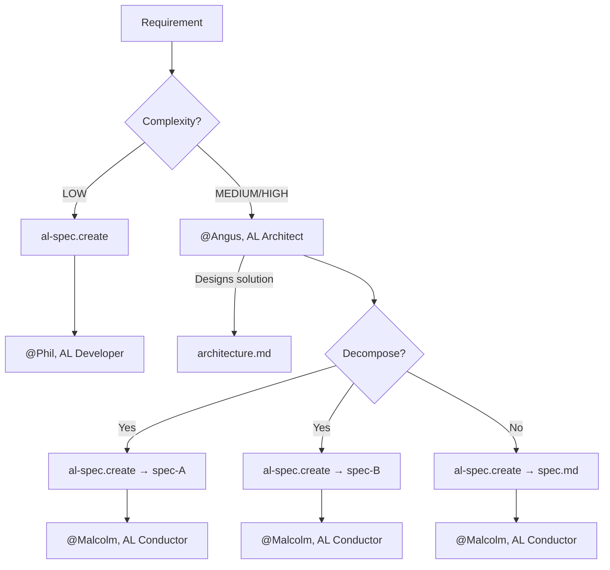
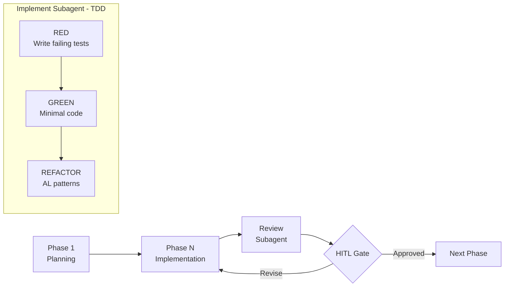
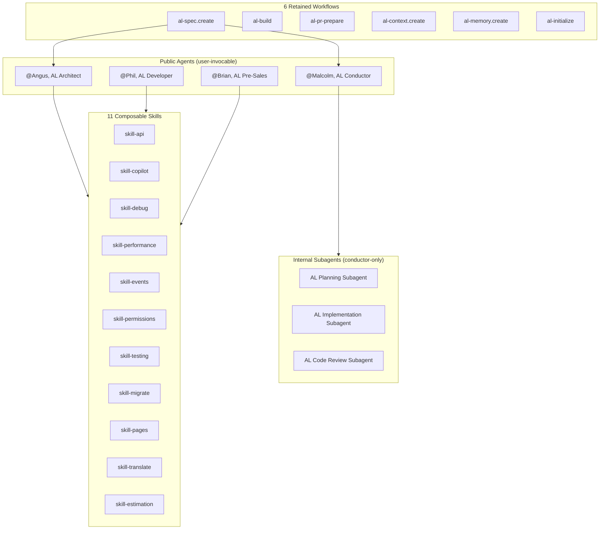

# ALDC — AL Development Collection

> **ALDC** — Skills-based, spec-driven, TDD-orchestrated development framework for Microsoft Dynamics 365 Business Central.
>
> From vibe coding to controlled engineering.
>
> **Now available for both GitHub Copilot and Claude Code.**

[](docs/framework/ALDC-Core-Spec-v1.2.md)
[](CHANGELOG.md)
[](claude-plugin/)
[](https://danielmeppiel.github.io/awesome-ai-native/)
[](./LICENSE)
[](https://github.com/javiarmesto/AL-Development-Collection-for-GitHub-Copilot/issues)
[](https://github.com/javiarmesto/AL-Development-Collection-for-GitHub-Copilot/stargazers)

---

## What's New in 4.2.0

Conformance release: the framework now enforces its own spec in CI.

- **Core Spec v1.2** — normalizes the real tier model: 4 core agents + 2 on-demand (`al-triage`, `dredd`) + 3 subagents + 1 extension (`al-agent-builder`); 16 skills; 11 workflows. Everything that ships is declared.
- **Conformance tooling** — `scripts/check-conformance.js` (counters, cross-references, links, frontmatter) and `scripts/sync-foundation.js --check` (zero drift between the canonical trees and `packages/foundation/`, the VSIX packaging source) run on every push and PR.
- **`ARCHITECTURE.md`** — one-page map of what is source, what is generated, and which distribution channel consumes each tree.
- Fixed: truncated `skill-manifest` in `packages/foundation/`, broken README links, undeclared primitives in `aldc.yaml`, contradictory counters.

## What's New in 4.1.0

### ⚡ Lower token / AIC cost per interaction

4.1.0 reduces token/AIC consumption per interaction without losing capabilities:

- **Trimmed always-on entrypoint (~31% lighter)** — less context injected on every request.
- **Narrow instruction globs** (`applyTo` by object type) — only the rules for the file you're editing load.
- **Curated context passing** — the Conductor passes extracted context excerpts to subagents instead of whole files.
- **Condensed primitives** (agents, instructions, skills) — behavior and orchestration preserved.
- **BCQuality task-context built once and passed inline** — no re-derivation on every call.

### 📚 Cited reviews & audits with BCQuality (optional)

Agents back findings with a pinned, externally-consumed BC knowledge base. Absent by default — graceful native fallback (never blocks). See [Using BCQuality (optional)](#using-bcquality-optional) below.

### Also in 4.1.0

- **`@AL Triage`** (reactive diagnosis) and **`@Bon, AL Auditor`** (independent auditor) — read-only on-demand specialists.
- **`skill-contribution-assistant`** — guided contribution workflow.
- **Restored full architecture & spec templates** with authoring guidance.

See [CHANGELOG.md](CHANGELOG.md) for details.

---

## What is ALDC?

ALDC (AL Development Collection) transforms how you develop Business Central extensions. Instead of ad-hoc code generation, ALDC provides **structured, contract-driven development** with human-in-the-loop gates.

**Works with:**
- **GitHub Copilot** — Agents, skills, prompts, and instructions in `.github/` and `agents/`
- **Claude Code** — Agents, skills, rules, and hooks in `.claude/` + official plugin in `claude-plugin/`

---

## Key Features

**4 Public Agents** — Specialized roles for every development phase

- `@Angus, AL Architect` — Solution Architect: designs solutions, information flows, technical decisions
- `@Phil, AL Developer` — Developer: implements, debugs, quick adjustments
- `@Malcolm, AL Conductor` — Conductor: orchestrates TDD implementation with subagents
- `@Brian, AL Pre-Sales` — Pre-sales: estimation and scoping

**3 Internal Subagents** — Autonomous specialists within the conductor

- `AL Planning Subagent` — Research and context gathering
- `AL Implementation Subagent` — TDD-only implementation (tests FIRST, code SECOND)
- `AL Code Review Subagent` — Code review against spec + architecture

**2 On-demand Specialists** — User-invocable, outside the TDD loop (read-only on code)

- `@AL Triage` — Reactive diagnosis: reproduce → root-cause → minimal-fix recommendation
- `@Bon, AL Auditor` — Independent auditor: BCQuality-cited static audit with an advisory verdict

**BCQuality (optional)** — External, citable BC knowledge layer for reviews & audits

- An externally-consumed BC knowledge base (multi-root) — defaults to the canonical upstream [`microsoft/BCQuality`](https://github.com/microsoft/BCQuality), configurable to your own fork. Agents cite findings to real knowledge files, with a graceful native fallback when it is absent. See [`docs/bcquality.md`](docs/bcquality.md).

**11 Composable Skills** — Domain knowledge loaded on demand

- Required: api, copilot, debug, performance, events, permissions, testing
- Recommended: migrate, pages, translate, estimation
- Plus `skill-contribution-assistant` — guided workflow for contributing back to ALDC

**6 Workflows** — Automated processes

- `al-spec.create`, `al-build`, `al-pr-prepare`, `al-context.create`, `al-memory.create`, `al-initialize`

**9 Instructions** — Auto-applied coding standards (always active)

- al-guidelines, al-code-style, al-naming-conventions, al-performance, al-error-handling, al-events, al-testing, copilot-instructions, index

**Contracts per Requirement** — Structured documentation in `.github/plans/{req_name}/`

- `{req_name}.architecture.md` — Solution design (from architect)
- `{req_name}.spec.md` — Technical blueprint (from spec.create)
- `{req_name}.test-plan.md` — Test strategy
- `memory.md` — Global context across sessions (in `.github/plans/`)

---

## Development Flow

```text
LOW complexity:
  al-spec.create → @Phil, AL Developer

MEDIUM/HIGH complexity:
  @Angus, AL Architect → al-spec.create → @Malcolm, AL Conductor
```

The architect designs the solution and can decompose complex requirements into multiple specs, each implemented independently by the conductor.



---

## TDD Orchestration

The conductor enforces Test-Driven Development:



1. Planning subagent researches context
2. Implement subagent creates tests FIRST (RED)
3. Implement subagent writes code to pass tests (GREEN)
4. Implement subagent refactors to AL patterns (REFACTOR)
5. Review subagent validates against spec + architecture
6. Human approves each phase (HITL gate)

---

## Framework Architecture



---

## Contract Structure

```text
.github/
└── plans/
    ├── memory.md                          ← Global (cross-session context)
    └── {req_name}/
        ├── {req_name}.architecture.md    ← From @Angus, AL Architect
        ├── {req_name}.spec.md            ← From al-spec.create
        ├── {req_name}.test-plan.md       ← From al-spec.create or conductor
        ├── {req_name}-plan.md            ← From @Malcolm, AL Conductor (Planning)
        ├── {req_name}-phase-1-complete.md
        └── {req_name}-phase-N-complete.md
```

---

## Installation

### GitHub Copilot

Install from VS Code Marketplace or:

```bash
code --install-extension JavierArmesto.aldc-al-development-collection
```

After installation, use the Command Palette:

- `AL Collection: Install Toolkit to Workspace` — copies framework to your project's `.github/` directory
- `AL Collection: Update Toolkit` — merges new version preserving your customizations
- `AL Collection: Validate Installation` — verifies compliance

### Claude Code (Plugin)

```bash
/plugin install aldc
```

Then initialize your project:

```bash
/aldc:al-initialize
```

This copies path-scoped rules to `.claude/rules/`, generates a project `CLAUDE.md`, and configures the workspace.

### Claude Code (Direct)

Clone this repo and open it with Claude Code. The `.claude/` directory and `CLAUDE.md` are detected automatically.

---

## Quick Start

### GitHub Copilot

1. Install the extension
2. Open your AL project
3. Run: `AL Collection: Install Toolkit to Workspace`
4. Start with: `@workspace use al-spec.create` with your requirement
5. Follow the guided flow

### Claude Code

1. Install the plugin: `/plugin install aldc`
2. Initialize: `/aldc:al-initialize`
3. Start with any agent: `@Angus, AL Architect`, `@Phil, AL Developer`, `@Malcolm, AL Conductor`, or `@Brian, AL Pre-Sales`
4. Or run a workflow: `/aldc:al-spec-create`

See [QUICKSTART.md](docs/framework/QUICKSTART.md) for the full onboarding guide.

---

## Routing Guide

| Complexity | Route | When |
| ---------- | ----- | ---- |
| **LOW** | `al-spec.create` → `@Phil, AL Developer` | Simple field, validation, single UI change |
| **MEDIUM** | `@Angus, AL Architect` → `al-spec.create` → `@Malcolm, AL Conductor` | Business logic, event-driven feature |
| **HIGH** | `@Angus, AL Architect` → `al-spec.create` → `@Malcolm, AL Conductor` | Multi-module, external integration, architectural change |

**Not sure where to start?**

```text
@Angus, AL Architect

I need to [describe your requirement]
```

The architect analyzes requirements, designs the solution, and recommends the appropriate workflow.

---

## Validation

```bash
node tools/aldc-validate/index.js --config aldc.yaml
```

Expected result: `✅ ALDC Core v1.2 COMPLIANT`

---

## File Structure

```text
AL-Development-Collection-for-GitHub-Copilot/
│
│── GitHub Copilot ─────────────────────────────────────
├── .github/
│   ├── copilot-instructions.md           # Master coordination
│   └── plans/                            # Per-requirement contracts
│       ├── memory.md                     # Global memory (cross-session)
│       └── {req_name}/
│           ├── {req_name}.architecture.md
│           ├── {req_name}.spec.md
│           └── {req_name}.test-plan.md
├── agents/                               # 10 agents (4 core + 2 on-demand + 3 subagents + 1 extension)
├── skills/                               # 11 composable skills
├── prompts/                              # 6 retained workflows
├── instructions/                         # 9 auto-applied coding standards
│
│── Claude Code (Direct) ───────────────────────────────
├── CLAUDE.md                             # Master instructions
├── .mcp.json                             # MCP server configuration
├── .claude/
│   ├── agents/                           # 10 agents (7 public + 3 internal)
│   ├── skills/                           # 16 skills (composable knowledge modules)
│   ├── rules/                            # 8 path-scoped coding standards
│   └── settings.json                     # Hooks + permissions
│
│── Claude Code Plugin ─────────────────────────────────
├── claude-plugin/
│   ├── .claude-plugin/plugin.json        # Plugin manifest
│   ├── agents/                           # 10 agents (auto-discovered)
│   ├── skills/                           # 16 skills (auto-discovered)
│   ├── hooks/hooks.json                  # PostToolUse + Stop hooks
│   ├── rules-templates/                  # 8 rules (injected via al-initialize)
│   ├── .mcp.json                         # 3 MCP servers
│   └── README.md                         # Plugin documentation
│
│── Shared ─────────────────────────────────────────────
├── docs/
│   ├── framework/                        # Normative spec + diagrams
│   └── templates/                        # Immutable contract templates (7)
├── tools/aldc-validate/                  # ALDC Core validator
├── aldc.yaml                             # Core v1.2 configuration
├── CHANGELOG.md                          # Version history
└── README.md                             # This file
```

---

## Using BCQuality (optional)

BCQuality is an optional BC knowledge layer for cited reviews and audits. The source is configurable in `aldc.yaml` and defaults to the canonical upstream [microsoft/BCQuality](https://github.com/microsoft/BCQuality) (point it at your own fork if you keep one). Runtime Step 0 uses the bundled generated assets under `assets/generated/microsoft-bcquality-assets`; no external clone is required for review or audit consultation. When disabled, agents fall back gracefully to the native A–G checklist and are never blocked.

**Optional source clone for evidence validation:**

1. From your AL project root, run the install script — clones the pinned source to `../bcquality`:
   ```bash
   bash tools/bcquality/install.sh
   # or on Windows:
   pwsh -File tools/bcquality/install.ps1
   ```
   Override the target location with `$BCQUALITY_HOME` if needed.

2. Use the clone for local citation validation/source inspection. It is outside the extension project and does **not** compile.

3. Run a review or audit (`@Malcolm, AL Conductor`, `@Bon, AL Auditor`, or `@AL Triage`): they consult the bundled BCQuality skills/instructions when enabled, or degrade gracefully to native checks if disabled.

See [`docs/bcquality.md`](docs/bcquality.md) for the full guide.

---

## What's New in 4.0.0

- **Token efficiency**: agents, instructions, skills, prompts, and templates condensed for lower token footprint — behavior and orchestration preserved
- **`packages/foundation/`**: new package layout for framework primitives alongside the existing root layout
- **Architecture Decision Records** (`docs/decisions/`): ADR-0001, ADR-0002, ADR-0003 documenting restructure decisions
- **New prompt**: `al-agent.build-instructions` for building agent instruction files
- **English-only content**: all instruction files and templates standardized to English
- **`skill-agent-task-patterns`** updated with usage examples

### Breaking Changes from v3.x

- Primitives also available under `packages/foundation/` — root layout preserved but content is condensed
- Agent, instruction, and skill wording changed (token-optimized); behavior unchanged

See [CHANGELOG.md](CHANGELOG.md) for full details.

---

## BC Agent Builder (optional)

Build Business Central Agents with the AI Development Toolkit and Agent SDK.
Includes: @Chief, AL Agent Builder agent, 3 skills, 4 workflows, validation tools.
See [BC Agent Builder documentation](docs/bc-agent-builder.md).

---

## ALDC for Claude Code

ALDC is available as a native **Claude Code** integration in two forms:

- **Official Plugin** (`claude-plugin/`) — Install with `/plugin install aldc`, namespaced as `aldc:*`
- **Direct Integration** (`.claude/`) — Auto-detected when opening the repo in Claude Code

### What's Included

| Primitive | Direct (`.claude/`) | Plugin (`aldc:`) | Count |
| --------- | ------------------- | ---------------- | ----- |
| Agents | `.claude/agents/` | `agents/` | 7 public + 3 internal |
| Skills | `.claude/skills/` | `skills/` | 16 composable knowledge modules |
| Rules | `.claude/rules/` | `rules-templates/` (injected via `al-initialize`) | 8 coding standards |
| MCP Servers | `.mcp.json` | `.mcp.json` | 3 servers |
| Hooks | `.claude/settings.json` | `hooks/hooks.json` | 2 hooks |
| Instructions | `CLAUDE.md` | `CLAUDE.md` | Agent routing, workflows |

### How It Maps

```text
GitHub Copilot              →  Claude Code (Direct)         →  Claude Code (Plugin)
──────────────────────────────────────────────────────────────────────────────────────
agents/*.agent.md           →  .claude/agents/*.md          →  agents/*.md
skills/*/SKILL.md           →  .claude/skills/*/SKILL.md    →  skills/*/SKILL.md
instructions/*.md           →  .claude/rules/*.md           →  rules-templates/*.md
prompts/*.prompt.md         →  .claude/skills/ (workflows)  →  skills/ (workflows)
.github/copilot-instructions.md → CLAUDE.md                 →  plugin.json + CLAUDE.md
```

### Agent Routing (Claude Code)

| Agent | Direct | Plugin |
| ----- | ------ | ------ |
| Architecture & Design | `@Angus, AL Architect` | `@aldc:al-architect` |
| Implementation | `@Phil, AL Developer` | `@aldc:al-developer` |
| TDD Orchestration | `@Malcolm, AL Conductor` | `@aldc:al-conductor` |
| Estimation & Scoping | `@Brian, AL Pre-Sales` | `@aldc:al-presales` |
| Agent Builder | `@Chief, AL Agent Builder` | `@aldc:al-agent-builder` |

### Workflows (Claude Code)

| Workflow | Direct | Plugin |
| -------- | ------ | ------ |
| Create specifications | `/al-spec-create` | `/aldc:al-spec-create` |
| Build & deploy | `/al-build` | `/aldc:al-build` |
| Prepare PR | `/al-pr-prepare` | `/aldc:al-pr-prepare` |
| Session memory | `/al-memory-create` | `/aldc:al-memory-create` |
| Project context | `/al-context-create` | `/aldc:al-context-create` |
| Environment setup | `/al-initialize` | `/aldc:al-initialize` |

### Hooks

Claude Code hooks enforce quality gates automatically:

- **PostToolUse** (Write/Edit) — Reminds to run tests after file modifications
- **Stop** — Reminds to verify Skills Evidencing was declared

### Plugin User Configuration

On first enable, the plugin prompts for optional settings:

| Setting | Description |
| ------- | ----------- |
| `bcSandboxUrl` | URL of your Business Central sandbox environment |
| `publisherName` | Your extension publisher name for app.json |

---

## Framework Documentation

- [Core Specification v1.2](docs/framework/ALDC-Core-Spec-v1.2.md)
- [Architecture Diagrams](docs/framework/ALDC-Architecture-Diagrams.md)
- [Manifesto](docs/framework/ALDC-Manifesto.md)
- [Quickstart](docs/framework/QUICKSTART.md)
- [Governance](docs/framework/ALDC-Governance.md)
- [Compliance Model](docs/framework/ALDC-Compliance-Model.md)
- [Migration Guide v1.0→v1.1](docs/framework/ALDC-Migration-v1.0-to-v1.1.md)

---

## MCP Servers Integration

| Server | Purpose |
| ------ | ------- |
| [al-symbols-mcp](https://github.com/StefanMaron/AL-Dependency-MCP-Server) | AL object analysis from compiled .app packages |
| [context7](https://github.com/upstash/context7) | Up-to-date library documentation retrieval |
| [microsoft-docs](https://github.com/nicholasglazer/microsoft-docs-mcp) | Official Microsoft/Azure documentation search |

---

## Requirements

### GitHub Copilot
- **Visual Studio Code**: 1.85.0 or higher
- **GitHub Copilot**: Required for agent and skill features
- **AL Language Extension**: For Business Central development
- **Node.js**: 14+ (for validator)

### Claude Code
- **Claude Code CLI**: v1.0.33 or higher
- **AL Language Extension**: For Business Central development
- **Node.js**: 14+ (for MCP servers via npx)

---

## Author

**Javier Armesto González**
Microsoft MVP (Business Central & Azure AI Services)
Head of R&D & AI at VS Sistemas
[LinkedIn](https://www.linkedin.com/in/jarmesto/) · [Tech Sphere Dynamics](https://techspheredynamics.com)

---

## Support & Contributing

- Report issues: [GitHub Issues](https://github.com/javiarmesto/AL-Development-Collection-for-GitHub-Copilot/issues)
- Ask questions: [GitHub Discussions](https://github.com/javiarmesto/AL-Development-Collection-for-GitHub-Copilot/discussions)
- See [CONTRIBUTING.md](CONTRIBUTING.md) for contribution guidelines

---

## License

MIT — See [LICENSE](LICENSE) for details.

---

**Status**: ALDC Core v1.2 COMPLIANT | **Platforms**: GitHub Copilot + Claude Code
**Version**: 4.2.0 (ALDC Core v1.2)
**Last Updated**: 2026-03-30
