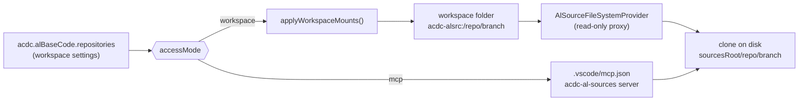
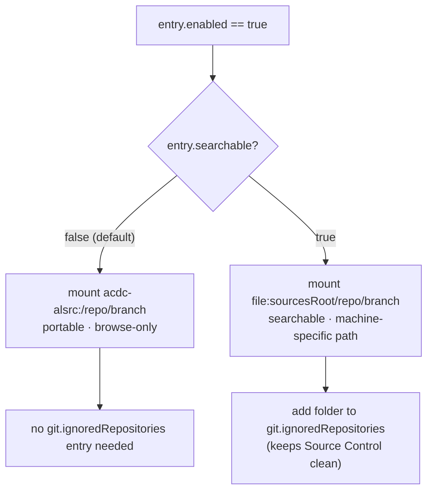
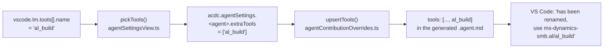
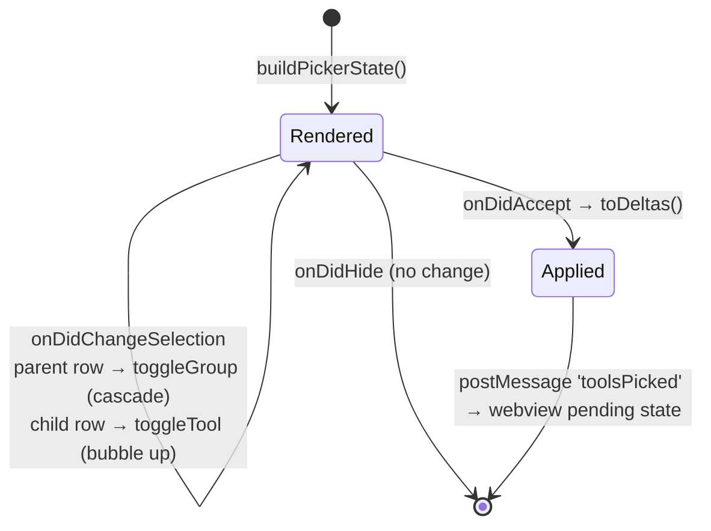
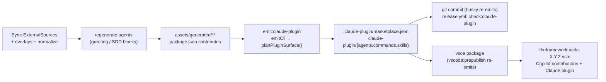

# PROJECT_BRIEF.md - AC⚡DC (Agentic Coding⚡Direct Coding)

> Last updated: 2026-09-24

## 1. Goal and Users

Internal VS Code extension (`theframework.acdc`) that ships AI agent skills, chat instructions,
workflows, and language-model tools for Business Central (AL) development. Users are AL
developers and the ALDC agent roster (Angus, Phil, Malcolm, Bon, Wrench) running in VS Code
chat/agent mode.

One of its features — **AL Base Code / ISV Code** — clones read-only AL source repositories
(Microsoft BC base app, ISV products such as Continia) and exposes them to agents so answers
are grounded in real AL code instead of model recall.

## 2. Current Scope

**Work item 1 — Restore search over mounted AL sources.** Done, implemented and verified by
the maintainer (see §3.2/§3.3 for the architecture, kept as the record of why).

**Work item 2 — Release-facing documentation.** See §11. **Still open — the only remaining scope.**

**Work item 3 — Agent tool picker: grouped selection + qualified tool IDs.** See §12.
**SHIPPED in v2.7.0** (PR #60, commit `9d54ea3`, tag `c39682b`). Published to the Marketplace.

**Work item 4 — AL toolchain resolution for agents.** See §13. **SHIPPED in v2.7.0** in the same PR.

**Out of scope**
- Changing how sources are cloned, pulled, or which repositories ship as defaults.
- The `mcp` access mode contract (unchanged).
- Making the `acdc-alsrc:` virtual scheme itself searchable — impossible on stable API (see §3).

## 3. Stack and Architecture

- Runtime/language: Node 20 (CI) / Node ≥ 22 (to run `npm test`), TypeScript, VS Code extension API
  `^1.101.0` (bumped from `^1.95.0` in work item 3)
- Build: esbuild (`node esbuild.js`), lint: ESLint 8/9 flat config
- Data/services: workspace + user settings, git CLI, `.vscode/mcp.json`
- Tests/checks: `npm test` compiles with `tsconfig.test.json` and runs `node --test` over
  `out-test/test/**/*.test.js`. It covers only vscode-free modules (`test/*.test.ts`: mount plan, tool
  identity, tool picker model/presentation, AL toolchain, AL MCP server, release-notes decision).
  Full gate: `npm run compile` + `npm run lint` + `npx tsc --noEmit -p tsconfig.json` + `npm test`
  + manual F5 for anything touching `vscode.*`. CI does not run `npm test` yet (Node 20).
- Deployment: `npm run vsix` / `vsce package`, versioned via `automation/scripts/Cut-Release.ps1`

### 3.1 AL source mounting — how it works today



### 3.2 Root cause of the search regression

Commit `f5219791` ("Migrate to portable AL Base Code layout") replaced `file:` workspace folders
with the virtual `acdc-alsrc:` scheme so that a committed `.code-workspace` no longer contains a
machine-specific absolute path. The trade-off was not identified at the time:

| Capability | Path taken | Works on `acdc-alsrc:`? |
|---|---|---|
| `list_dir`, `read_file`, opening a file in the editor | `FileSystemProvider` | Yes |
| `grep_search`, VS Code Search view | ripgrep over `file:` roots only | **No** |
| `file_search` glob | VS Code file indexer (`file:` roots only) | **No** |

VS Code only searches non-`file:` schemes when an extension registers a `FileSearchProvider` /
`TextSearchProvider`. Both are **proposed API** — confirmed absent from `@types/vscode` at our
pinned `^1.95.0` — so a marketplace-distributed extension cannot use them. The virtual scheme can
therefore *never* be made searchable; the only fix is to mount searchable sources as `file:`.

Secondary defect: the failure is silent. `grep_search` returns the generic
"excluded by search.exclude" message, so an agent burns many turns rationalising a wrong
conclusion (observed: ~15 turns hunting Continia codeunit `6175283`) instead of learning the mount
is browse-only.

### 3.3 Target architecture

Introduce a **per-entry** opt-in rather than a single global switch, because the trade-off differs
per repository:

- A small ISV source (Continia Document Output, a few hundred files) is genuinely worth grepping.
- The StefanMaron BC history repo is not: text search over it timed out and hung the chat even
  back when it *was* a `file:` mount. Keeping BC portable/browse-only and ISVs searchable is the
  correct default split.



#### Structural contract

```ts
// src/alBaseCode.ts
export interface AlSourceEntry {
  repository: string;
  branch: string;
  folder: string;
  enabled: boolean;
  /**
   * Mount as a real `file:` folder so VS Code text/file search can reach it.
   * Costs portability: the resolved absolute path lands in the workspace file.
   * Default false — keep large sources (BC base app) on the portable scheme.
   */
  searchable: boolean;
}
```

```ts
// src/alSourceMountPlan.ts  — NEW, must not import "vscode"
export type MountScheme = "virtual" | "file";

export interface PlannedMount {
  /** Stable identity: virtual path for "virtual", normalized fsPath for "file". */
  key: string;
  scheme: MountScheme;
  name: string;
}

export interface MountedFolder {
  uriString: string;
  scheme: string;
  fsPath?: string;
  name: string;
}

export interface MountPlan {
  add: PlannedMount[];
  /** Indices into the supplied `mounted` array, caller removes highest-first. */
  removeIndices: number[];
}

export function planWorkspaceMounts(
  desired: PlannedMount[],
  mounted: MountedFolder[],
  mountPrefix: string
): MountPlan;
```

`applyWorkspaceMounts` in [src/alBaseCode.ts](src/alBaseCode.ts#L656) becomes a thin adapter:
resolve entries → build `desired` → call `planWorkspaceMounts` → call
`vscode.workspace.updateWorkspaceFolders`. This is what makes the regression testable at all
(the current logic is untestable because it is fused to the VS Code API).

## 4. Key Files

| Area | Path | Purpose |
|---|---|---|
| Settings schema | `package.json` (`acdc.alBaseCode.*`, ~L1268) | Add `searchable` item property |
| Mount logic | `src/alBaseCode.ts` | `applyWorkspaceMounts`, `virtualUriFor`, `effectiveFolder`, `clearOurGitIgnoredRepositories` |
| Mount planning | `src/alSourceMountPlan.ts` (new) | vscode-free, unit-testable decision logic |
| Virtual FS | `src/alSourceFileSystemProvider.ts` | Read-only proxy for `acdc-alsrc:` |
| Migration | `src/alBaseCodeMigration.ts` | Must not "repair" an intentional `file:` mount |
| UI | `src/views/alBaseCodePanel.ts` | Source table editor — add Searchable column |
| Docs | `assets/help/settings-help.md`, `CHANGELOG.md` | User-facing explanation of the trade-off |

## 5. How to Work

- Setup: `npm install`
- Build: `npm run compile` · Watch: `npm run watch` (VS Code task `npm: watch`)
- Lint: `npm run lint`
- Typecheck: `npx tsc --noEmit -p tsconfig.json` (esbuild does not type-check)
- Test: `npm test` (VS Code task **AC/DC: Run unit tests**), requires Node ≥ 22
- Package: `npm run vsix`
- Repository rules: [AGENTS.md](AGENTS.md) (verification gate, testing boundary) and
  [CLAUDE.md](CLAUDE.md) (codebase rules for Claude Code). `.github/copilot-instructions.md` is
  **shipped AL product content**, not a rule set for this codebase.

## 6. Safety and Constraints

- **No proposed VS Code API.** The extension must stay installable from a VSIX/marketplace.
- **No machine-specific path is ever written to a workspace file unless the user opted in.**
  `searchable: true` is that opt-in and must be surfaced as such in the UI and settings text.
- `acdc.alBaseCode.sourcesRoot` stays `"scope": "machine"` — unchanged.
- **Backward compatible by default.** An existing workspace with no `searchable` key keeps
  today's behaviour (virtual mounts); no silent rewriting of committed `.code-workspace` files.
- Mounted sources are read-only mirrors that `git reset --hard` overwrites on sync — never write
  to them, never let them appear in Source Control.
- Follow the existing `resolveConfigTarget` pattern when writing settings; do not hardcode
  `ConfigurationTarget.Workspace`.

## 7. Testing Strategy

> **Historical (work item 1, done).** This section records the plan that introduced the harness.
> The current state is in §3 and §5.

When this was written, the repository had **zero** automated tests. Proportional approach: do not pull in
`@vscode/test-electron` (slow, heavyweight). Instead extract the decision logic into a
vscode-free module and cover it with Node 20's built-in runner.

- Add `"test": "tsc -p tsconfig.test.json && node --test out-test/**/*.test.js"` (or equivalent
  minimal wiring — Dev picks the exact form, but it must run in CI without a VS Code instance).
- Unit-test **only** `src/alSourceMountPlan.ts`. Anything touching `vscode.workspace` stays
  manually verified.

### Test cases — `planWorkspaceMounts`

| # | Given | When | Then |
|---|---|---|---|
| T1 | no mounted folders, one desired virtual mount | plan | `add` = that mount, `removeIndices` empty |
| T2 | virtual mount already present, same entry desired | plan | no-op (`add` and `removeIndices` empty) |
| T3 | virtual mount present, entry now `searchable: true` | plan | remove the virtual index, add the `file:` mount |
| T4 | `file:` mount present, entry now `searchable: false` | plan | remove the `file:` index, add the virtual mount |
| T5 | mount present, entry disabled | plan | remove it, add nothing |
| T6 | a `file:` folder present that is **not** ours (no `[AL Src] ` prefix) but same path | plan | never removed |
| T7 | two entries toggled at once | plan | `removeIndices` are valid and safe to apply highest-first (descending, no duplicates) |
| T8 | path casing differs on Windows (`C:\X` vs `c:\x`) | plan | treated as the same mount, not duplicated |

### Manual verification (Dev must report evidence)

- M1: enable a small ISV source with `searchable: true` → `grep_search` for a known string finds
  it; the folder appears in the VS Code Search view.
- M2: same source with `searchable: false` → still browsable via `list_dir` / `read_file`; the
  `.code-workspace` entry stays `{"uri": "acdc-alsrc:/…"}`.
- M3: a `searchable: true` mount does **not** appear in Source Control.
- M4: toggling `searchable` remounts without re-cloning (no network, no delete on disk).
- M5: opening a pre-existing workspace triggers no migration prompt and no folder churn.

## 8. Acceptance Criteria

- [ ] `acdc.alBaseCode.repositories[].searchable` exists, defaults to `false`, and is documented
      in `package.json`, `assets/help/settings-help.md`, and `CHANGELOG.md`.
- [ ] Enabled + `searchable: true` mounts as `file:`; enabled + `searchable: false` mounts as
      `acdc-alsrc:`; both directions migrate in place without a re-clone (M4).
- [ ] `grep_search` and `file_search` return results inside a `searchable: true` source (M1).
- [ ] A `searchable: false` source remains browsable and its workspace URI stays portable (M2).
- [ ] `searchable: true` folders are added to `git.ignoredRepositories`; `searchable: false`
      folders are not, and stale entries are still scrubbed (M3).
- [ ] `alBaseCodeMigration` does not flag or "repair" an intentional `file:` mount (M5).
- [ ] The AL Base Code panel exposes the toggle with a one-line statement of the trade-off
      (searchable vs portable).
- [ ] `npm test` exists and T1–T8 pass; `npm run compile` and `npm run lint` are clean.

## 9. Current State

**Working**
- Cloning/pulling sources, `sourcesRoot`, virtual mounts, `mcp` access mode, migration prompt.
- **Search over mounted AL/ISV sources** — `searchable` per-entry opt-in, implemented and
  confirmed working by the maintainer (M1–M5 passed). T1–T8 green.

**Known issues**
- Automated coverage exists only for `src/alSourceMountPlan.ts`; the rest of the extension has
  none.
- `npm test` uses a glob form that requires Node ≥ 22. Confirm before wiring it into CI.

**Next**
- Work item 2 (§11): README audit + surface release notes after an update.
- Work item 3 (§12): grouped tool picker + qualified tool IDs in the Agent Settings panel.
- Work item 5a (§14, issue #55): Claude Code plugin surface in the VSIX + self-registration in
  `~/.claude/settings.json`. **Status (2026-09-25): Task 0 spike done (S5/S6/S9 PASS, S7 FAIL). Maintainer
  decision D54: register a stable path `~/.acdc/claude-marketplace`, re-pointed by junction/symlink
  on each activation (§14.6 respecced); D44 retired. PR-A (emitter) in progress, with no contract
  change. Next: Dev runs the S11 junction/symlink mini-spike before PR-B.** High-risk (writes outside the workspace), so PR-B
  needs independent review/QA before merge. Scope extended 2026-09-24 (D45): Agent Settings overrides
  are mirrored into the Claude plugin (§14.15, PR-C after PR-A). Q8/Q9 answered (D52 Copilot dev-mode guard as PR-D; D53 Copilot re-apply on activation, in PR-C). Work item 5b (instruction domains → skills, BCQuality
  listing, hooks/MCP, retiring `ClaudePlugins/`) is deferred (§14.12).
  **PR-D status (2026-09-25): implemented and committed on `louagej/issue55`** (one branch, one PR
  at the end of WI-5a). `decideOverrideGate` in `src/agentOverrideActivation.ts` (V1 covered) is
  wired into `acdc.applyAgentSettingsToChat` ahead of `applyAgentContributionOverrides`: under F5
  it writes nothing, shows the D52 message and logs `[agent-overrides] skipped: development host`.
  Manual M24 (Apply half) not yet verified. D53 and the Claude mirror stay in PR-C.

**Known issues (work item 3)**
- **B2 (open): the Tools summary counts tokens, not tools.** Selecting the AL group stores one
  token (`ms-dynamics-smb.al/*`) so the panel reports "1 added" instead of 10.
  `renderToolsSummary` must use an expanded count; `expandToolTokens` already exists in the model
  but the webview never receives the expansion.
- **B3 (root cause found 2026-09-10 by runtime dump; VS Code 1.137.0, 139 runtime tools).**
  Two independent defects were conflated under one symptom. Split them:

  **B3-i — real picker bug (built-in vocabulary).** The frontmatter token vocabulary and the
  runtime tool-name vocabulary are disjoint, and we only have a manifest for extension-contributed
  tools. VS Code's own toolsets are contributed by no extension, so nothing maps them:

  | Declared token | Runtime tool that IS present | Landed in |
  |---|---|---|
  | `vscode/askQuestions` | `vscode_askQuestions` | orphan + `unknown` bucket |
  | `search/usages` | `vscode_listCodeUsages` | orphan + `unknown` bucket |
  | `todo` | `manage_todo_list` | orphan + `unknown` bucket |

  The same tool appears twice — once as an unmatched token, once as an unowned runtime entry —
  which is why `unknown` holds 35 tools. The two vocabularies must be reconciled.

  **B3-ii — NOT a picker bug; our agent files hardcode MCP names that vary per VS Code profile.**
  MCP config is **per profile**, and the maintainer's 10 profiles name the same logical server
  differently. Enumerated 2026-09-10:

  | Profile | `servers` keys |
  |---|---|
  | BC AL Development | `microsoftdocs/mcp`, `bc-code-intel`, `al-go-docs`, `github`, `context7`, `markitdown`, `bc-word-layout` |
  | BC19 AL Development | `microsoft.docs.mcp`, **`al-symbols-mcp`**, `al-go-docs`, `github`, `azure-devops`, `bc-code-intel` |
  | BC Controll Add-in | `microsoft.docs.mcp`, `github`, `dhtmlx-gantt`, **`al-symbols-mcp`**, `al-go-docs` |
  | Web MKDocs | `microsoftdocs/mcp`, `com.microsoft/nuget`, `io.github.github/github-mcp-server` |
  | Web Development | `microsoft/markitdown`, `com.supabase/mcp` |
  | BC AL Clean · BC AL Prerelease · BC AL Dev (DevOps) · Default | **no `mcp.json` at all** |

  Corrections to earlier producer claims:
  - **`al-symbols-mcp` is real** — configured in 2 of 5 BC profiles. The earlier "no such server
    anywhere" was wrong; it was absent only from the profile whose config was pasted.
  - The Microsoft docs server is spelled `microsoftdocs/mcp` *or* `microsoft.docs.mcp` depending on
    profile. Tokens `microsoft-learn/*`, `microsoft-docs/*`, `upstash/context7/*`,
    `microsoft/markitdown/*` and `azure-mcp/*` match **no** configured server in **any** profile —
    those are genuinely dead.

  This vindicates the existing design note in `automation/scripts/Normalize-AgentTools.ps1`:
  *"MCP server IDs … vary per user profile and are managed dynamically by the extension via
  mcpDiscoveryService."* Hardcoding any MCP namespace into an agent file is a **design violation**,
  not a typo. The fix is to strip dead MCP tokens in normalization, not to repoint them.
- **B3-iv — the weekly sync WILL clobber naive fixes.** `package.json → contributes.chatAgents`
  ships `assets/generated/aldc-community/agents/*`, which `Sync-ExternalSources.ps1` regenerates
  from `javiarmesto/ALDC-AL-Development-Collection`. Edits made directly there are lost. Only two
  places survive a sync: `automation/overlays/aldc-community/**` and the `$CoreTools` /
  `$DeprecatedTools` tables in `Normalize-AgentTools.ps1` (which runs after the sync).
- **B3b RETRACTED.** `.github/agents/**` is the dev-time copy and is **not shipped and not
  normalized**; `vscode.mermaid-chat-features/renderMermaidDiagram` is already in
  `$DeprecatedTools` and is correctly absent from the shipped generated agent. The real issue is
  narrower: `.github/agents/**` has drifted from what normalization produces.
- **B3-v — AL MCP server prerequisites (verified on this machine).** .NET 8.0.31 present. `altool`
  is **not on PATH**; it lives at
  `C:\Users\JobLouage\.vscode\extensions\ms-dynamics-smb.al-18.0.2732683\bin\altool.exe`. That path
  embeds the extension version, so any hardcoded absolute path breaks on the next AL update.
- **B3b (new, real defect in a shipped agent file)**: `angus.agent.md` declares
  `vscode.mermaid-chat-features/renderMermaidDiagram`, but the installed extension id is
  `vscode.mermaid-markdown-features`. That token has never resolved.
- **B4 (blocker, must not merge)**: `src/tools/toolCatalogDump.ts` — whose own first line reads
  `TEMPORARY DIAGNOSTIC — Delete before handoff` — is imported and called from `extension.ts`
  activation (`scheduleToolCatalogDump(context)`). It is gated on a `tmp/DUMP_TOOLS` marker so
  runtime risk is low, but diagnostic code must not ship.
- **B5 (hygiene, blocker)**: `.gitignore` covers only `tmp/external-sources/` and
  `tmp/mcp-knowledge-sources/`, so a **124 MB** Extension Development Host profile (`tmp/edh-udd`)
  plus `tmp/harness`, `tmp/DUMP_TOOLS` and `tmp/tool-dump*.json` are all sitting untracked and
  git-visible. Ignore `tmp/` properly and clean the artifacts.
- **B4 RESOLVED** — `toolCatalogDump.ts` deleted and its activation call removed from
  `extension.ts`.
- **B5 RESOLVED** — `.gitignore` now ignores `tmp/*` with a re-include for the tracked
  `tmp/agentic-coding-al-TrainingMaterial.md`; the 124 MB `tmp/edh-udd` and the dump artifacts are
  gone (tmp is down to 1 file / 82 KB).
- **Work item 3 hands-on verification COMPLETE (2026-09-10).** The webview tree is confirmed
  working. The D23 provider is confirmed end to end: the output channel logged
  `[MCP] Contributing 'al' from …\ms-dynamics-smb.al-18.0.2732683\bin\altool.exe` (resolved the
  **18.0** install, not the 8.1 one per D27, with no hardcoded version), `al` appears in
  `MCP: List Servers` attributed to *AC⚡DC — AL Tools*, and the server **starts and reaches
  `AL MCP Server ready (STDIO mode)`**.
- **B6 RESOLVED and verified by the maintainer (2026-09-10).** The `al` server now launches with
  resolved projects. Observed:
  - single folder → `Loading 1 project(s)… Successfully loaded project: …\AL\acdc\demo`
  - multi-root → `Loading 19 project(s)…`, all real AL projects, no `[AL Src]` paths
  - `Discovered 16 tools` after a full `initialize` → `tools/list` handshake
  - the server stopped and restarted with a **different** project set when the window changed,
    confirming `onDidChangeWorkspaceFolders` drives `onDidChangeMcpServerDefinitions`

  Mount exclusion is verified **indirectly** in the live logs (no `[AL Src]` path appears); direct
  proof is test B7, which exercises a real `file:`-scheme mount carrying a root `app.json`.

  **Original symptom, for the record.** The server used to start with zero projects
  (`No projects specified at startup. Use the al_addproject tool to add projects.`). The
  `launchmcpserver <projects>` positional argument is **optional** — the earlier concern was not a
  blocker — but tools needing a project (`al_compile`, `al_symbolsearch`, …) were useless until one
  was added. **Decision (maintainer): resolve projects from the window and pass them at launch.**
  Resolution rules:

  | Window state | Signal | Projects passed |
  |---|---|---|
  | no folder open | `workspaceFolders === undefined` | none (blank) |
  | single folder | `workspaceFile === undefined` | that folder, if it has `app.json` |
  | saved multi-root | `workspaceFile.scheme === "file"` | every qualifying folder |
  | unsaved multi-root | `workspaceFile.scheme === "untitled"` | every qualifying folder |

  `vscode.workspace.workspaceFile` is confirmed present in the pinned types (index.d.ts:13875).
  **The table above is descriptive, not a parameter.** All four rows reduce to the same per-folder
  predicate, so `workspaceFile` is deliberately *not* threaded into the resolver — carrying an
  unread field would be worse than omitting it. Recorded here for the reasoning, not the signature.

  **Two hard constraints:**
  - **Exclude AL Base Code mounts.** Folders named with `MOUNT_PREFIX = "[AL Src] "`
    (`src/alBaseCode.ts:37`) are read-only mirrors of the BC base app / ISV sources and contain
    *hundreds* of `app.json` files. Feeding them to the MCP server would be catastrophic. Note the
    second-order effect: in this extension a multi-root workspace frequently exists **because of**
    those mounts, so `workspaceFile !== undefined` does **not** imply multiple real AL projects.
  - **Probe `app.json` at the folder root only**, never `**/app.json` — nested test apps and
    `.alpackages` would otherwise be picked up as projects.

  Zero qualifying folders → pass nothing. The definition becomes workspace-dependent, so
  `onDidChangeMcpServerDefinitions` must also fire on `onDidChangeWorkspaceFolders`.

  **Two defects found during implementation (2026-09-10), both now fixed and tested:**
  - The `[AL Src] ` exclusion was genuinely necessary and was **missing**: filtering on
    `scheme === "file"` alone is insufficient, because a *searchable* mount (D1) is deliberately a
    real `file:` folder. An ISV mirror with a root `app.json` would have been passed to the server.
    Proven against live folders: `[AL Src] ISV Product` is `file:` **with** a root `app.json` and is
    excluded only by the name filter (test B7).
  - `AL_SOURCE_MOUNT_PREFIX` was defined in **three** places; B6 cited one of them as authoritative.
    Now exported once from the vscode-free `alSourceMountPlan.ts`.

  **Known lossiness (accepted):** `AlToolchain.layout` is a single field describing two binaries.
  `alc` and `altool` could in principle resolve in different layouts; today 8.1 has no `altool`, so
  it is harmless, but the field is lossy by construction.
- `package-lock.json` shows two field changes only, both benign: `@types/vscode` `^1.95.0` →
  `^1.101.0` (D23; resolves to 1.120.0, which is why the 1.101 MCP API was already in the `.d.ts`),
  and the root `version` `1.3.0` → `2.6.0` — the lockfile catching up to a long-stale
  `package.json` version. No packages added, removed or downgraded.
- D16 means any tool id stored before that fix may carry a runtime name instead of a reference
  name. Rule 1 repairs it on the next pass, but this is only proven by unit test U12.
- Manual checks M1, M2 (new picker), M3, M5, M6 remain unperformed — a native QuickPick is not
  reachable by any automation available to the agents, so these are maintainer-only.

**Verified by the maintainer (2026-09-10)** — W2 closed. Adding `al_build` and `al_getnextobjectid`
to Angus through the picker, then restarting, produced
`ms-dynamics-smb.al/al_build, ms-dynamics-smb.al/al_getnextobjectid` in the agent file with no
rename warning (M2), and the pre-existing `'al-symbols-mcp/*'` / `'upstash/context7/*'` wildcards
round-tripped untouched (M5).

## 10. Team and Handoff

- Producer: scope, architecture contracts, acceptance criteria, merge
- Dev: implementation, unit tests, manual verification evidence, PR
- QA: not engaged for this work item

The roles are available in both tools. GitHub Copilot uses the `ai-team-orchestration` plugin
(`@ai-team-producer`, `@ai-team-dev`, `@ai-team-qa`). Claude Code uses the `.claude/agents/`
subagents of the same names plus the `/ai-team-orchestration` and `/start-feature` skills.

**Material decisions**
- D1: per-entry `searchable` flag, not a global mount-scheme switch — the BC history repo must
  stay unsearchable (search over it previously hung the chat), while ISV sources benefit.
- D2: proposed `FileSearchProvider` / `TextSearchProvider` rejected — unavailable on stable API.
- D3: extract `planWorkspaceMounts` into a vscode-free module so the regression is testable.
- D4 (work item 3): the bare-tool-ID warning is **our** defect, not the AL extension's — the
  shipped `.agent.md` files already use the qualified form; our picker overwrites it.
- D5 (work item 3): a selected parent group persists the **wildcard** token, not an enumeration
  of its children — this is what makes "select the parent" meaningful rather than cosmetic.
- D6 (work item 3): no proposed API and no tree QuickPick exists; the tree is simulated on
  `createQuickPick`.
- D7 (work item 3): the fallback is a **two-step QuickPick** (pick groups → narrow within a
  group), not a webview tree. Simulated tree is timeboxed to one day; both share the reducers.
- D8 (work item 3): wildcard auto-widening accepted, no opt-out — but the write-capable warning
  must become wildcard-aware.
- D9 (work item 3): the bare→qualified settings migration runs silently at User scope.
- D10 (work item 3): prose references to bare tool names in `.github/skills/**` stay as-is.
- D11 (work item 3): MCP groups are keyed off `mcp.json` server ids via `getAvailableMcpServerIds`,
  matched *forward* onto flattened `mcp_<id>_` tool prefixes. Unmatched MCP tools go in a flat
  bucket with no wildcard. Supersedes the original "parse the server id out of the tool name".
- D12 (work item 3): on a duplicate tool name the lexicographically smallest extension id wins, so
  the index never depends on `extensions.all` ordering. Accepted as implemented.
- D13 (work item 3): `resolveToolOwner(id, index)` is part of the §12.4 contract — it was missing,
  and U7 could not be expressed without it.
- D14 (work item 3): the migration keys off `vscode.extensions.all` (complete at activation), not
  `vscode.lm.tools` (racy per S1). Supersedes the "after `lm.tools` is populated" wording above.
- D15 (work item 3): `VSCODE_BUILTIN_PREFIXES` gains `vscode` and moves into the vscode-free
  module. Consequence accepted: `agentWorkflowService` now treats a `vscode/*` requirement as
  built-in rather than reporting it missing — which was the intended behaviour all along.
- D16 (work item 3): the qualified token uses the contributed **`toolReferenceName`**, not the
  runtime `name`. Verified against the installed AL extension 18.0.2726309: 9 of its 10 tools have
  identical values, but `al_getdiagnostics` → **`al_get_diagnostics`**. The shipped agent files
  already declare `ms-dynamics-smb.al/al_get_diagnostics`, confirming reference-name is the
  frontmatter form. The original §12.4 rule 3 would have emitted the runtime name and reintroduced
  the rename warning for exactly that tool.
- D17 (work item 3): **toolset membership outranks extension ownership.** `copilot_readFile`
  qualifies as `read/readFile`, not `GitHub.copilot-chat/copilot_readFile`. Resolves O1; the
  producer's original rule 3 was wrong for every tool that belongs to a built-in toolset.
- D18 (work item 3): **D7 invoked — the simulated tree is withdrawn**, replaced by the two-step
  QuickPick. `onDidChangeSelection` is removed entirely; selection is read once from
  `quickPick.selectedItems` at accept or drill, and each step applies a **diff against what was
  rendered** rather than an absolute checked set — so a partial group, which a QuickPick can only
  draw unchecked, is never read as a deselection. `items` is assigned once, before `show()`.
  Reducers live in the vscode-free `src/tools/toolPickerSteps.ts` (tests S1–S7).
- D19 (work item 3): **cancel means cancel.** Escaping step 1 discards step-2 edits made during
  that session. Ratifies the implementer's judgement call; a partial commit on Escape would be
  more surprising than losing the edit.
- D20 (work item 3): **the QuickPick is abandoned; the picker becomes a dedicated editor-tab
  webview with a real tree.** Evidence: VS Code's own tool picker is not a QuickPick at all — since
  1.103 it uses `IQuickInputService.createQuickTree()` (`chatToolPicker.ts`, `showToolsPicker`),
  whose `IQuickTreeItem` carries `children`, `collapsed` and **`checked: boolean | 'mixed'`**
  (true tri-state). That service is workbench-internal: searching `src/vscode-dts` — which holds
  `vscode.d.ts` and every `vscode.proposed.*.d.ts` — for `QuickTree` and `quickTree` returns
  **zero** results. It is not public and not proposed. A hierarchical tree is therefore
  unreachable from any QuickPick API, and D7's two-step fallback was chasing an impossible target.
  Maintainer chose the **editor-tab webview** over the sidebar panel, for width.
- D21 (work item 3): the model layer (`toolIdentity.ts`, `toolPickerModel.ts`) survives the UI
  change untouched — only presentation is replaced. `toolPickerSteps.ts` becomes dead and is
  removed with its tests; `toggleExpanded` / `expanded` come back into use for the tree.
- D22 (work item 3): tri-state is now expressible, so a **partial group renders as `mixed`**
  rather than unchecked-with-a-description. That capability gap was the real reason the QuickPick
  approaches felt wrong.
- D23 (work item 3): **AC⚡DC registers the AL MCP server itself** via
  `vscode.lm.registerMcpServerDefinitionProvider` + `contributes.mcpServerDefinitionProviders`
  (present in the pinned `@types/vscode` at index.d.ts:20843). The server is named **`al`** (per
  Microsoft's own sample) and its command is resolved at activation from
  `vscode.extensions.getExtension("ms-dynamics-smb.al").extensionPath` → `bin/altool.exe`, so it
  follows AL extension upgrades instead of embedding a version in a path. This replaces the plan to
  hand-edit `mcp.json` in six BC profiles, and it self-heals for profiles created later.
  **`engines.vscode` bumps `^1.95.0` → `^1.101.0`** (approved by the maintainer); that API was
  finalized in 1.101.
- D24 (work item 3): the third-party **`al-symbols-mcp` (`npx al-mcp-server`) is retired.** It is
  configured identically in the BC19 and BC Controll Add-in profiles and is *not* Microsoft's
  `altool` server, so the name must not be reused for it. The D23 provider supplies `al` in every
  profile instead.
- D25 (work item 3): agent/prompt files must **not** name MCP servers at all — dead tokens are
  stripped in `Normalize-AgentTools.ps1` so the weekly sync cannot reintroduce them. Per-profile
  discovery stays the job of `mcpDiscoveryService`, as that script's own design note already says.
- D26 (work item 3): **D25 is NOT widened to extension namespaces.** `sshadowsdk.al-lsp-for-agents/*`
  (11 shipped files) and `ms-vscode.vscode-websearchforcopilot/*` stay as declared even though those
  extensions are not installed here. Unlike the invented MCP names, these are real marketplace
  extensions a user may legitimately install; the "extensions not installed" warning is accepted as
  informational. Do not add extension namespaces to the strip list.
- D27 (work item 3): **the AL 8.1.540594 install is intentional** — it is required for BC19  development in the BC19 AL Development profile. Do not uninstall or treat it as stale.
  Consequence to accept: `altool` (and therefore the D23 `al` MCP server) ships only with AL 17.0+,
  so in any profile where 8.1 is the active AL extension the provider correctly resolves
  `no-binary` and contributes nothing. **BC19 will have neither `al` nor the retired
  `al-symbols-mcp`.** If that becomes a problem, the options are to restore an MCP server in that
  profile or to improve the `no-binary` log to say "AL extension predates altool" rather than
  printing a bare path.

**Security (maintainer action, not an agent's)**
- **RESOLVED 2026-09-10.** The plaintext `AZURE_DEVOPS_PAT` in
  `…\Code\User\profiles\3fd38bb0\mcp.json` (BC19 AL Development) was replaced by hand with
  `${env:AZURE_DEVOPS_PAT}`. No agent read or edited that file. **The old token value was exposed
  on disk and should still be rotated in Azure DevOps** — replacing the reference does not
  invalidate the leaked secret.
- **RESOLVED 2026-09-10.** `al-symbols-mcp` removed by hand from the profiles that carried it,
  per D24. The D23 provider now supplies `al` instead.

**Open before step 4 (not blocking step 3)**
- **O1 — RESOLVED 2026-09-10, and the original rule 3 was wrong twice.** See D16/D17. The fix is
  in `toolIdentity.ts` with tests U11/U12, per the instruction to fix it in the vscode-free module
  rather than special-case it in the view.

**Next action**: work item 2 (§11 — README audit R1–R9 + release-notes-on-update) is the only
remaining scope. Note it is now further out of date than §11.2 records: the README must also cover
the grouped tool picker, the contributed `al` MCP server, `acdc_get_al_toolchain`, and the
`^1.101.0` engine floor shipped in v2.7.0.

**Carried-over follow-ups (small, not blocking)**
- `tsconfig.test.json` `include` omits `alToolchain.ts` and `toolPickerPresentation.ts`; they
  compile only via transitive imports, so the list no longer describes the vscode-free surface.
- `npm test` still needs Node ≥ 22 (glob argument). CI pins Node 20 and does not run it — the
  87-test suite is therefore local-only. Worth closing before relying on it as a merge gate.
- `AlToolchain.layout` is one field for two binaries (§13); lossy by construction, harmless today.
- BC19 profile has no MCP symbol tooling: `al-symbols-mcp` was retired (D24) and `altool` needs
  AL 17+ (D27). Options recorded under D27 if it becomes a problem.

**Agreed sequencing (2026-09-10)**: B6 (§9, D28) and Work Item 4 (§13) first, **then** Work Item 2
(§11 README + release notes).

- D28 (B6): the `al` server is launched **with the AL projects of the current window** rather than
  by auto-invoking `al_addproject`. Rationale: `al_addproject` is an MCP tool, invoked by the model;
  MCP servers start lazily, so there is nothing to invoke at activation. Launch args reach the same
  end state with no lifecycle dependency. **Rule** (producer's reading of the maintainer's
  instruction — correct if wrong): a workspace folder counts as an AL project when it contains
  `app.json`; the resulting folder paths are appended to `AL_MCP_SERVER_ARGS`. No qualifying folder
  (or no folder open) → no positional args, exactly as today. Applies identically to single-folder
  and multi-root windows.

**Work item 5a decisions (§14, issue #55, recorded 2026-09-24)**

- D29 (maintainer): **scope is phased.** WI-5a = agents, commands (from prompt files), skills,
  `plugin.json` + `marketplace.json`, packaging, a VSIX-contains-surface check and
  self-registration. The 315 instruction files → domain skills, the BCQuality marketplace listing,
  `hooks.json` / `.mcp.json` and retiring the standalone `ClaudePlugins/` install are **WI-5b**
  (§14.12).
- D30 (maintainer): **self-registration is automatic when the Claude config dir exists.** On
  activate, ensure `extraKnownMarketplaces` (source `directory`, path = `context.extensionPath`) and
  `enabledPlugins["acdc@acdc-vscode"]` in `~/.claude/settings.json`. Guard rails are part of the
  contract (§14.6): read-modify-write preserving every other key, idempotent (no write when up to
  date), never create the config dir, abort on unparseable JSON, atomic temp + rename, never flip a
  user's `false`. High-risk: independent review/QA required.
- D31 (producer; **maintainer-confirmed 2026-09-24, Q1**): kill-switch setting `acdc.claudeCode.autoRegister`
  (boolean, default `true`, scope `application`). The explicit commands in §14.6 bypass it because
  running one is a direct user request; nothing bypasses the "config dir must already exist" rule.
- D32 (maintainer; contract accepted 2026-09-24): **emitter is a vscode-free TS core plus a thin Node CLI**, not the
  `Emit-ClaudePlugin.ps1` the issue proposed. Core in `src/claudePlugin/`, unit-tested with
  `node --test`; the CLI is a second esbuild entry built to `out-tools/`, which is never shipped
  and never bundled into `dist/extension.js`.
- D33 (maintainer; contract accepted 2026-09-24): **emitted output is committed**, like `assets/generated/`, so a dev
  marketplace can point at a working clone. A `--check` mode in the CLI is the drift gate. It runs in
  `release.yml`, and the husky pre-commit hook and the weekly sync re-emit.
- D34 (producer; **maintainer-accepted 2026-09-24**): **plugin root layout.** The extension root is the marketplace root:
  `.claude-plugin/marketplace.json` sits at the VSIX root and lists one plugin with
  `"source": "./claude-plugin"`. The plugin (its own `.claude-plugin/plugin.json`, `agents/`,
  `commands/`, `skills/`) lives in `claude-plugin/`. Rationale: no top-level `agents/` or `skills/`
  in the repo root next to the Copilot sources, one folder to package and drift-check, and a
  relative-path source in a local directory marketplace **loads in place** (not copied to the
  cache), so an extension update only has to change the marketplace path (§14.3 S5).
- D35 (producer; **maintainer-confirmed 2026-09-24, Q7**): names are marketplace **`acdc-vscode`** and plugin
  **`acdc`**, so the enable key is `acdc@acdc-vscode`. They don't collide with the legacy
  `aldc@aldc-marketplace` plugin or with any reserved marketplace name.
- D36 (producer; **maintainer-confirmed 2026-09-24, Q6: emit all 13**): **the emitter's source list is `package.json → contributes`** (`chatAgents`,
  `chatPromptFiles`, `chatSkills`), read from disk after `regenerate:agents` and the overlays have
  run. It never reads `.github/agents/**` (the dev-time copy, B3b). Whatever #17 decides about the
  agent set flows through automatically. Today that is 13 agents, 11 prompts and 41 skills.
- D37 (producer; **maintainer-confirmed 2026-09-24, Q2**): **tool mapping emits an explicit allowlist of
  Claude Code built-in tools only.** `acdc_*` (VS Code LM tools), VS Code-only tools, extension
  namespaces (`ms-dynamics-smb.al/*`, `sshadowsdk.*`, `ms-vscode.*`) and MCP namespaces
  (`github/*`, `markitdown/*`) are dropped and reported. This is D25 applied to the second host:
  Claude-side MCP names are per-user (`mcp__<server>__…`) or plugin-scoped
  (`mcp__plugin_acdc_<server>__…`), so hardcoding them is the same design violation.
- D38 (producer): `handoffs` → an appended `## Handoffs` prose section. `agents:` (Malcolm's
  subagent allowlist) → an appended `## Subagents` prose section plus the `Agent` tool.
  `user-invocable` / `disable-model-invocation` → a description suffix. `argument-hint` is dropped
  on agents and kept on commands. All other non-Claude keys are stripped (#15).
- D39 (producer): **no `version` in the emitted `plugin.json` or marketplace entry.** A plugin
  loaded in place ignores it (§14.3 S5), and leaving it out keeps the committed output stable when
  `release.yml` runs `npm version`, so there's no drift on every release.
- D40 (producer; **maintainer-accepted 2026-09-24; revised by D54 on 2026-09-25**: ownership and no-downgrade now apply to the *link target*, with the newer version winning and a tie keeping the incumbent. The settings path is constant): **registration only overwrites a marketplace path it owns, and never
  downgrades.** It owns the path when the entry is missing, the path equals `extensionPath`, or the
  basename matches `theframework.acdc-<semver>`. A registered path whose version is newer than ours
  *and* still exists on disk is left alone, so VS Code Stable and Insiders with different versions
  can't flip-flop the file. Any other path (for example the maintainer's working clone) is
  user-managed and only the force command replaces it.
- D41 (producer; **maintainer-confirmed 2026-09-24, Q5**): **the extension never writes Claude Code's internal state** (`~/.claude/plugins/**`,
  `known_marketplaces.json`, `installed_plugins.json`) and never enables, disables or uninstalls
  another plugin. If the legacy `aldc@aldc-marketplace` is enabled, a **one-time notice**
  recommends disabling it. It's never switched off automatically.
- D42 (producer; **refined by D48**): the frontmatter parser for the emitter is the `yaml` package as a
  **devDependency** (build-time only). No runtime dependency is added to the extension. Settings
  handling is plain `JSON.parse` / `JSON.stringify`.
- D43 (producer; **maintainer-confirmed 2026-09-24, Q3**): cleanup on uninstall (`vscode:uninstall`
  hook) is deferred to WI-5b. WI-5a ships an explicit **Unregister** command and documents manual
  cleanup.
- D44 (maintainer, 2026-09-24, Q4; **RETIRED 2026-09-25 by D54**: S6 passed, so there's no install branch; S7 showed `marketplace update` doesn't work, and the stable path removes the need): if S6 or S7 fails,
  the extension **may** offer a **user-clicked** action that opens a VS Code terminal running
  `claude plugin install acdc@acdc-vscode` (S6 failure) or
  `claude plugin marketplace update acdc-vscode` (S7 failure). It must **never run silently**:
  nothing is spawned without a click on the notification button, and the command is shown in a
  visible terminal. Fallback contract: §14.6 "Contingent fallback (D44)". If both S6 and S7 pass,
  this fallback is **not built**.
- The §14.9 test plan (E1–E30, R1–R20, M1–M12, plus F1–F7 and M13 for D44) was accepted by the
  maintainer on 2026-09-24. Revised 2026-09-25 for D54: F1–F7 dropped, L1–L12 added, R5/R11
  rewritten, M1/M3/M5/M6/M12 revised, and M13 is now a link-safety step.
- D45 (maintainer, 2026-09-24): **per-user Agent Settings overrides are mirrored into the Claude
  plugin, in WI-5a.** This recalls the earlier "Not planned" note. Spec: §14.15.
- D46 (producer, 2026-09-24): **approach = rewrite the installed
  `claude-plugin/agents/<id>.md` in place**, reusing the originals + sha-sidecar ownership model
  under its own subtree `agent-overrides/claude/…`. The Copilot paths and state are untouched.
  **Rejected:** a separate user-level plugin in `globalStorage` registered as a second marketplace.
  Its agents would appear twice unless the base plugin were auto-disabled (which conflicts with
  D30/D41), it would mean more writes to `~/.claude/settings.json`, and the path would vary per
  VS Code profile. The Copilot `resolveBaseline` is **not** refactored in 5a; the Claude path uses
  the new pure `decideOverrideBaseline`.
- D47 (producer, 2026-09-24): **mirroring runs inside `acdc.applyAgentSettingsToChat`** (before the
  Copilot apply and its window reload) **and on activation.** The activation run re-applies
  overrides after an extension update and needs no window reload. The Copilot side
  now re-applies on activation too (**superseded in part by D53**, Q9).
- D48 (producer, 2026-09-24; **refines D42**): the runtime rewrites only our own emitter output,
  using a restricted, fixed format (A12: JSON-quoted one-line scalars, a one-line `tools` list,
  marker-wrapped generated sections). The runtime bundle gains `toolMap.ts`, `slugifyAgentId`,
  `claudeAgentOverrides.ts` and `overrideBaseline.ts`, **with no `yaml`**. `yaml` stays a
  devDependency, importable only from `src/claudePlugin/frontmatter.ts` (enforced by ESLint
  `no-restricted-imports` plus a bundle check).
- D49 (producer, 2026-09-24): **Dev-host rule.** Claude mirroring is skipped when `extensionMode` is
  Development or Test, so F5 never dirties the committed `claude-plugin/agents/*.md`. `--check`
  stays strict. The pre-existing identical hazard on the Copilot path (Apply under F5 rewrites the
  committed `assets/generated/…/*.agent.md`) is fixed by D52 (Q8).
- D50 (producer, 2026-09-24): field mapping as in §14.15.3. `model` via `mapModel` (unmapped → keep
  the baseline); `reasoningEffort` → `effort` (the same enum, per the sub-agents docs); tools
  through TOOL_MAP with D37 built-ins only, so unmapped extra tools are dropped; `handoffs` → the
  prose section. `argumentHint`, `bcReviewSpecialist` and `placeholderTarget` have no Claude
  effect.
- D51 (producer, 2026-09-24): users get a one-line `/reload-plugins` notice only when a mirror run
  changed or restored at least one file. On the Apply path it's deferred across the window reload
  via `globalState`. **On activation this notice is merged with the Copilot notice into one (D53).**
- D54 (maintainer, 2026-09-25; S7 FAILED): **register a stable path and re-point it on every
  activation.** Claude Code keeps a known marketplace's `installLocation` when the settings path
  changes, `claude plugin marketplace update` reports success while changing nothing, and only
  remove + re-add works (which strips our keys). So `settings.json` registers
  `<home>/.acdc/claude-marketplace`, which never changes. On activation the extension makes it a
  **directory junction (Windows, no admin needed) / symlink (macOS/Linux)** to
  `context.extensionPath`. D34 is unchanged: the link target is the marketplace root.
  Producer details inside D54:
  - location under the home dir, not `globalStorage` (which differs for Stable/Insiders and per
    profile);
  - the newer version wins the link, and a tie keeps the incumbent;
  - F5 never links;
  - a real directory at the path is refused and never deleted;
  - there is no recursive delete near the link;
  - a read-only diagnostic of `known_marketplaces.json` gives a text-only reset hint.
  D44 is retired. Verified by the new mini-spike S11 before PR-B. **No PR-A contract change.**
- D55 (producer, 2026-09-25; **contingent on S11 failing**, maintainer to confirm only then): if
  Claude Code resolves the link's realpath into `installLocation`, or rejects plugin files reached
  through the link, replace the link with a hash-synced **materialised copy** at the same stable
  path. It's marked `.acdc-managed`, uses the same newest-version-wins rule, and PR-C would mirror
  overrides into the copy.
- D52 (maintainer, 2026-09-24, Q8): **the Copilot "Apply to chat" path gets the same
  Development/Test-mode guard as D49.** Under F5 the command writes nothing and says why, so it no
  longer rewrites the committed `assets/generated/aldc-community/agents/*.agent.md`. The gate is the
  shared pure `decideOverrideGate` (§14.15.8). Consequence accepted: Copilot overrides can only be
  exercised on an installed VSIX. Placement: small PR-D, landed before PR-C.
- D53 (maintainer, 2026-09-24, Q9): **Copilot overrides also re-apply on activation**, which removes
  the asymmetry D47 described. Rules (§14.15.8):
  - activation runs `applyAgentContributionOverrides` and the Claude mirror;
  - the user is told **only when files actually changed or were restored** (typically after an
    extension update re-baselined them), never on a steady-state activation, and never on
    rebaselining alone;
  - one combined notification covers both hosts: a **Reload Window** button when Copilot files
    changed, and the `/reload-plugins` hint when Claude files changed;
  - **never an automatic reload** on activation;
  - skipped in Development/Test mode (D49/D52).

  The notice decision is the pure `decideOverrideNotice`. Placement: folded into PR-C, because it
  shares the activation run and the combined notice with D47/D51.

---

## 13. Work Item 4 (proposed) — expose the resolved AL toolchain to agents

### 13.1 Why

Observed 2026-09-10: asked to build, Phil **globbed** `~/.vscode/extensions/ms-dynamics-smb.al-*\bin\win32\alc.exe`,
hit the **8.1** compiler, failed on `runtime: 17.0`, then re-globbed and retried against 18.0. Three
wasted terminal round-trips and a red herring ("build failed") that was really a toolchain problem.
Agents should never guess the compiler path — the extension already knows it.

### 13.2 Contract

Extend the existing vscode-free `src/tools/alMcpServer.ts` resolution (rename the module if it
outgrows its name) and surface it as an LM tool alongside `acdc_get_sdd_config`:

```ts
export interface AlToolchain {
  extensionId: string;      // "ms-dynamics-smb.al"
  version: string;          // "18.0.2732683" — parsed from the folder name
  extensionPath: string;
  alc?: string;             // resolved compiler, undefined when absent
  altool?: string;          // undefined on AL < 17
  /** Layout actually found; 8.1 uses bin/win32, 18.x uses bin. */
  layout: "bin" | "bin/win32";
}
```

`acdc_get_al_toolchain` returns this, or a clear "AL extension not active" result.

### 13.3 Two traps that make this non-trivial

- **T1 — "active" is not "newest".** `vscode.extensions.getExtension()` returns whatever VS Code
  resolved for that ID. With two versions installed (D27: 8.1 is *intentional* for BC19), that may
  be 8.1. The tool must therefore report the **version**, not just a path, so an agent can compare
  it against the project's `app.json → runtime` and fail fast with a useful message instead of
  after a red build.
- **T2 — CORRECTED 2026-09-10. Probe order is part of the contract, not an implementation detail.**
  The original wording ("8.1 → `bin/win32/alc.exe`; 18.x → `bin/alc.exe`; probe both") was
  materially wrong: **AL 8.1 ships `alc.exe` in BOTH locations**, and `bin/alc.exe` is a 17,344-byte
  stub while `bin/win32/alc.exe` is the real 152,008-byte compiler. Measured on this machine; AL
  18.0 has no `bin/win32` at all. A `bin`-first probe therefore returns the **wrong binary** on
  exactly the install D27 keeps around — the precise failure §13.1 exists to prevent.
  **Required order: `["bin/win32", "bin"]`.** Covered by test C8.

### 13.4 Agent-side change

Update the AL agents' instructions: resolve the toolchain via the tool, never glob the extensions
folder. Must go in the layer that survives the weekly sync (`Normalize-AgentTools.ps1` /
`automation/overlays/**`), per D25's precedent.

### 13.5 Explicitly rejected

Pinning a versioned `alc.exe` path into `.vscode/tasks.json` — suggested by Phil in the same
session. It bakes `…al-18.0.2732683\…` into a committed file and breaks on the next AL update. This
is the exact anti-pattern D23 exists to avoid.

---

## 11. Work Item 2 — Release-facing documentation

### 11.1 Goal

The README no longer describes what the extension does, and nothing tells a user that an update
landed. Close both gaps: bring the README current, and surface the release notes after an update.

### 11.2 README audit — confirmed gaps

Audited [README.md](README.md) against `package.json` contributions and `CHANGELOG.md` 2.2.x → Unreleased.

| # | Gap | Since |
|---|---|---|
| R1 | **No AL Base Code / ISV Code section.** The feature only appears as two rows in the Commands and Settings tables, despite being the largest subsystem in the extension (clone cache, portable mounts, `workspace` vs `mcp` access, searchable mounts). BCQuality custom layers get a full section; this gets none. | pre-existing |
| R2 | Commands table missing **AC/DC: Migrate AL Base Code Settings to Portable Layout** (`acdc.migrateAlBaseCodeSettings`) | 2.3.0 |
| R3 | Commands table missing **AC/DC: Apply Agent Settings to Chat** (`acdc.applyAgentSettingsToChat`) | 2.4.0 |
| R4 | Commands table missing **AC/DC: Reset Agent Override Baselines** (`acdc.resetAgentOverrideBaselines`) | 2.4.0 |
| R5 | Settings table missing **`acdc.alBaseCode.sourcesRoot`** — the machine-scoped clone root, and the single most likely thing a new user needs to set | 2.3.0 |
| R6 | Settings table missing the per-source **`searchable`** flag and its trade-off | Unreleased |
| R7 | Agent Settings panel section does not mention **Reasoning effort** (`low`…`max`, requires VS Code 1.136+) | 2.4.0 |
| R8 | Agent Settings panel still says "the disabled **tools**". Tools are now a full multi-select picker stored as deltas (`disabledTools` + `extraTools`) with a warning when a write-capable tool is granted to an agent that does not declare one | 2.4.0 |
| R9 | Requirements section says "VS Code 1.95 or higher" with no note that reasoning effort needs 1.136+ | 2.4.0 |

Not gaps (verified accurate): the 8-agent roster, the `#acdcCodingStandard` tool, the BCQuality
custom-layers section, the routing guide, the weekly-sync section.

### 11.3 Release notes after an update

`src/update/` exists and is empty — the intended home. Nothing currently reads the installed
version, so an update is invisible to the user.

Rejected: `contributes.walkthroughs`. VS Code opens a walkthrough on **install**, not on update,
so it does not answer the requirement.

#### Contract

```ts
// src/update/releaseNotes.ts
export type ReleaseNotesTrigger = "never" | "minor" | "always";

/** Compares the running version against globalState and decides what to surface. */
export function decideReleaseNotesAction(
  previousVersion: string | undefined,
  currentVersion: string,
  trigger: ReleaseNotesTrigger
): { kind: "none" } | { kind: "welcome" } | { kind: "update"; auto: boolean };

/** Activation hook: fire-and-forget, must never block or throw into activate(). */
export function showReleaseNotesOnUpdate(
  context: vscode.ExtensionContext
): void;
```

- Version comparison is semver-ish on `major.minor.patch`; a **downgrade or an unparsable value
  never auto-opens**.
- `previousVersion === undefined` (fresh install) → `welcome` → open **README.md** preview.
- Version increased → `update`. `auto: true` for a major/minor bump under the default trigger
  (`"minor"`), or for any bump under `"always"`; patch-only bumps notify without stealing focus.
- `auto: true` → open the **CHANGELOG.md** markdown preview, plus a non-modal notification
  `AC⚡DC updated to v<x.y.z>` with actions `What's New` / `README` / `Don't show again`
  (the last writes `acdc.showReleaseNotesOnUpdate = "never"` at Global scope).
- `auto: false` → notification only.
- `context.globalState` key `acdc.lastSeenVersion` is written **after** the decision, in every
  branch including `none`, so an update is announced at most once.
- Reuse the existing `markdown.showPreview` → `openTextDocument` fallback pattern already used
  for `settings-help.md` in [src/extension.ts](src/extension.ts#L262).
- Skip entirely when `context.extensionMode === vscode.ExtensionMode.Development`.

New setting:

| Setting | Default | Values |
|---|---|---|
| `acdc.showReleaseNotesOnUpdate` | `"minor"` | `"never"`, `"minor"`, `"always"` |

### 11.4 Acceptance criteria

- [ ] R1–R9 are addressed in [README.md](README.md), matching the existing voice and table style.
- [ ] The new AL Base Code section explains: clone cache + `sourcesRoot`, `workspace` vs `mcp`
      access mode, and portable vs `searchable` mounts with the trade-off stated in one line.
- [ ] Every command in `contributes.commands` appears in the README Commands table, and every
      `acdc.*` setting in `contributes.configuration` appears in the Settings table (including
      the new `acdc.showReleaseNotesOnUpdate`).
- [ ] Fresh install opens the README preview once; a subsequent activation opens nothing.
- [ ] A minor/major version bump opens the CHANGELOG preview once and shows the notification;
      a patch bump notifies only; `"never"` does neither.
- [ ] `Don't show again` persists `acdc.showReleaseNotesOnUpdate = "never"` in User settings.
- [ ] Unit tests cover `decideReleaseNotesAction`: fresh install, patch bump, minor bump, major
      bump, same version, downgrade, unparsable version, and each of the three trigger values.
- [ ] `npm run compile`, `npm run lint`, `npm test` clean.
- [ ] Activation is not blocked or slowed; failures are swallowed and logged to the AC⚡DC output
      channel.

### 11.5 Verification

- Automated: the `decideReleaseNotesAction` unit tests above.
- Manual: clear the `acdc.lastSeenVersion` global-state key (or use a scratch profile), reload,
  and observe welcome → no-op → update behaviour across a bumped `package.json` version.
- Independent review: not needed. QA: not needed — documentation plus one activation-time,
  user-dismissible notification.

### 11.6 Risks

- Auto-opening a preview on every update is intrusive if mistuned. Mitigated by defaulting to
  major/minor only and shipping a one-click opt-out.
- README drift will recur. Out of scope now, but a follow-up check that diffs
  `contributes.commands` / `contributes.configuration` against the README tables would prevent it.

---

## 12. Work Item 3 — Agent tool picker: grouped selection + qualified tool IDs

### 12.1 Goal

Two defects in the Agent Settings panel's **Tools** control
([src/views/agentSettingsView.ts](src/views/agentSettingsView.ts#L199)):

| # | Defect | Impact |
|---|---|---|
| W1 | The gear opens a **flat** multi-select of every registered tool. VS Code's own *Configure Tools* control groups tools under a collapsible parent, and selecting the parent grants the whole group. | Configuring an agent with ~170 tools is impractical; users cannot express "all AL tools". |
| W2 | Picked tools are persisted using the **runtime name** (`al_build`) instead of the **qualified ID** (`ms-dynamics-smb.al/al_build`). | VS Code warns `Tool or toolset 'al_build' has been renamed…` on the customized-agents page, and the tool may silently not bind. |

#### W2 root cause (confirmed, not assumed)

The shipped agent definitions are already correct — `.github/agents/phil.agent.md` and friends
declare `ms-dynamics-smb.al/al_build`. The bare form is introduced by **our own picker**:



Secondary symptom of the same gap: `pickTools` looks declared tokens up in the runtime map by the
qualified token (`registered.get("ms-dynamics-smb.al/al_build")`), which never matches — so every
declared tool renders with an empty description.

### 12.2 Constraint that shapes the design

`LanguageModelToolInformation` exposes only `name`, `description`, `inputSchema`, `tags` — **no
owning extension, no display name, no group**. Verified against the pinned `@types/vscode`.
There is also **no tree-shaped QuickPick** on stable API; VS Code's *Configure Tools* control is
internal (`IQuickInputService` + a bespoke list) and is not exposed to extensions.

Everything below is therefore built on two public facts:

1. `vscode.extensions.all[].packageJSON.contributes.languageModelTools[].name` gives
   `runtimeName → extensionId` and `displayName`.
2. `vscode.window.createQuickPick()` gives item buttons, live `items` replacement, and
   `selectedItems` — enough to *simulate* a collapsible tree in one list.

### 12.3 Task 0 — mandatory spike before any implementation

The mapping from `vscode.lm.tools[].name` to the token namespace used in `tools:` frontmatter is
**only proven for extension-contributed tools**. For VS Code built-ins (`read/readFile`,
`edit/editFiles`, `vscode/memory`) and MCP tools (`al-symbols-mcp/*`, `upstash/context7/*`) the
runtime name may or may not already carry its namespace.

Dev must first dump the live data and record it in the PR before designing the grouping:

- A throwaway command (or debug console snippet) that logs, for every `vscode.lm.tools` entry:
  `name`, `tags`, and the owning `extensionId` resolved via the index in 12.4.
- Report: the exact runtime name for at least one built-in (`readFile`), one AL tool (`al_build`),
  one MCP tool (`al-symbols-mcp`), and one of our own tools (`acdc_get_sdd_config`).

**If the observed shape contradicts §12.4/§12.5, stop and hand back to the Producer** rather than
bending the design around a guess.

#### Spike result (2026-09-10, VS Code 1.137.0) — §12.4 confirmed, §12.5 corrected

| Case | Observed runtime `name` | Owner from `extensions.all` |
|---|---|---|
| "built-in" readFile | `copilot_readFile` | `GitHub.copilot-chat` |
| AL Language | `al_build` | `ms-dynamics-smb.al` |
| MCP | `mcp_github_mcp_se_get_me` | **none** |
| ours | `acdc_get_sdd_config` | `theframework.acdc` |

Only 5 extensions contribute tools (68 of 148 registered). Three facts that change the design:

- **S1 — tool registration is racy.** 68 tools at `activate()`, 148 twenty seconds later. Nothing
  may depend on `vscode.lm.tools` being complete at activation (see D14).
- **S2 — MCP tools are not slash-namespaced at runtime.** `mcp_github_mcp_se_get_me`, not
  `github-mcp-se/get_me`. The server id is flattened into an underscore prefix and is **not**
  recoverable from the tool name alone. §12.5's "group MCP by server" cannot be built from
  `vscode.lm.tools` (see D11).
- **S3 — no built-in toolset name (`read`, `edit`, …) exists as a runtime tool name.** They are
  frontmatter tokens only, so rule 2 only ever fires against already-stored settings values.
  Correct as written, but it is not a live-tool concern.

### 12.4 Structural contract — tool identity

New **vscode-free** module, unit-testable per the boundary in [AGENTS.md](AGENTS.md):

```ts
// src/tools/toolIdentity.ts — NEW, must not import "vscode"

export type ToolOwnerKind = "builtin" | "extension" | "mcp" | "unknown";

/** A parent node in the picker; also the wildcard namespace for that node. */
export interface ToolOwner {
  kind: ToolOwnerKind;
  /** Qualifier prefix and group key: "ms-dynamics-smb.al" | "al-symbols-mcp" | "read" | "". */
  id: string;
  /** Human label shown on the parent row: "AL Language" | "al-symbols-mcp" | "Built-In". */
  label: string;
  /** Token persisted when the parent row is selected, e.g. "ms-dynamics-smb.al/*". */
  wildcardId?: string;
}

export interface ToolCatalogEntry {
  /** Raw name as reported by vscode.lm.tools, e.g. "al_build". */
  runtimeName: string;
  /** Token persisted in settings and frontmatter, e.g. "ms-dynamics-smb.al/al_build". */
  qualifiedId: string;
  label: string;
  description: string;
  owner: ToolOwner;
}

/** Minimal projection of vscode.extensions.all — keeps this module vscode-free. */
export interface ContributingExtension {
  id: string;               // "ms-dynamics-smb.al"
  displayName?: string;     // "AL Language"
  toolNames: string[];      // contributes.languageModelTools[].name
}

export function buildOwnerIndex(extensions: ContributingExtension[]): Map<string, ToolOwner>;

/**
 * Idempotent. Returns the id unchanged when it is already qualified, is a wildcard,
 * or has no known owner — never invents a prefix.
 */
export function qualifyToolId(id: string, index: Map<string, ToolOwner>): string;

/** Migration helper: qualifies a stored list, de-duplicates, preserves order. */
export function normalizeStoredToolIds(ids: string[], index: Map<string, ToolOwner>): string[];

/** Comparison used by the write-capable warning; qualifier-insensitive. */
export function toolIdMatches(a: string, b: string): boolean;
```

**Qualification rules (in order):**

1. Contains `/` → **re-resolve** rather than trust it. An id qualified with the *runtime* name
   (`ms-dynamics-smb.al/al_getdiagnostics`) is repaired to the reference name
   (`ms-dynamics-smb.al/al_get_diagnostics`); an MCP token or a wildcard passes through.
2. Is a known VS Code built-in toolset name (`edit`, `search`, `read`, `todo`, `web`, `agent`,
   `execute`, `changes`, `new`, `browser`, `vscode`) → return unchanged.
3. Is a member of a contributed **toolset** → the toolset wins over the extension:
   `copilot_readFile` → `read/readFile`, **not** `GitHub.copilot-chat/copilot_readFile`.
4. Found in the owner index → return `` `${owner.id}/${referenceName}` `` — the
   **`toolReferenceName`**, not the runtime `name` (see D16).
5. Otherwise → return unchanged, and mark the entry `owner.kind = "unknown"` so the picker can
   render it under *Unavailable / unknown owner* instead of silently mangling it.

### 12.5 Structural contract — picker model

Also vscode-free. `agentSettingsView.ts` becomes a thin adapter over it (same pattern as D3 /
`planWorkspaceMounts` in §3.3).

```ts
// src/tools/toolPickerModel.ts — NEW, must not import "vscode"

export type NodeState = "checked" | "unchecked" | "partial";

export interface ToolPickerGroup {
  owner: ToolOwner;
  children: ToolCatalogEntry[];
  state: NodeState;
  expanded: boolean;
  /** True when the agent declares the group wildcard (e.g. "al-symbols-mcp/*"). */
  wildcardSelected: boolean;
}

export interface ToolPickerState {
  groups: ToolPickerGroup[];
  /** Stored ids whose owner is not currently registered — shown, never dropped silently. */
  orphans: string[];
}

export function buildPickerState(
  catalog: ToolCatalogEntry[],
  declaredTools: string[],
  disabledTools: string[],
  extraTools: string[]
): ToolPickerState;

export function toggleGroup(state: ToolPickerState, ownerId: string, checked: boolean): ToolPickerState;
export function toggleTool(state: ToolPickerState, qualifiedId: string, checked: boolean): ToolPickerState;
export function toggleExpanded(state: ToolPickerState, ownerId: string): ToolPickerState;

/** Projects the state back onto the delta model the settings already persist. */
export function toDeltas(
  state: ToolPickerState,
  declaredTools: string[]
): { disabledTools: string[]; extraTools: string[] };
```

**Selection semantics (the contract that answers W1):**

| Parent state | Persisted as |
|---|---|
| Parent checked, group has a `wildcardId` | the single wildcard token `ms-dynamics-smb.al/*` — children are **not** enumerated |
| Parent partial | only the individually checked children, as qualified IDs |
| Parent unchecked | nothing from that group |
| Built-in group parent checked | the bare toolset name (`read`), not `read/*` — matches existing frontmatter |

Checking the parent therefore *collapses* an enumeration into a wildcard, which is exactly the
form the shipped agent files already use (`'al-symbols-mcp/*'`, `'upstash/context7/*'`). W1 and
W2 are one problem: the picker had no concept of a namespace.

**MCP grouping (D11), superseding the original assumption.** Because of S2 the server id must come
from **`mcp.json`**, not from the tool name. Reuse `getAvailableMcpServerIds()` in
`mcpDiscoveryService.ts`, then match in the recoverable direction only:

```
serverId "github-mcp-se"  →  flattened prefix "mcp_github_mcp_se_"  →  matches mcp_github_mcp_se_get_me
```

i.e. derive the prefix *from the known id* and test tool names against it; never try to parse an
id back out of a tool name. A tool matching no known server falls into a flat **"MCP tools
(unknown server)"** bucket — listed, individually selectable, **no wildcard parent**. The wildcard
emitted for a matched server is the `mcp.json` id form (`al-symbols-mcp/*`), which is what the
shipped agent files already use.

**Auto-widening is accepted (D8).** A checked parent grants tools the owner ships *later*, not
just the ones registered today. This matches VS Code's own wildcard semantics and is the point of
the feature — no "expand to explicit IDs" opt-out is in scope. The one consequence Dev must
handle: `warnOnNewWriteCapableTools` has to evaluate **wildcards**, not only literal IDs, or
granting a whole extension to a read-only agent (Bon, Wrench) will pass unwarned.

### 12.6 Interaction design — simulated tree on `createQuickPick`



- Parent rows use `$(chevron-right)` / `$(chevron-down)` **item buttons** for expand/collapse and
  the checkbox for selection, so the two gestures never collide.
- Groups start **collapsed**, except groups the agent already declares tools from.
- The existing separator sections (*Declared by this agent* / *Available tools* / *Unavailable*)
  are replaced by grouping; "declared" becomes a `description` badge on the row.
- Save path is unchanged: the picker still only posts `toolsPicked` back to the webview; nothing
  is written to settings from the picker. Do not add a second write path.

**Known implementation risk (must be handled, not discovered):** replacing `quickPick.items`
resets `selectedItems`. Every re-render must re-apply selection by stable id, and must guard
against the resulting `onDidChangeSelection` re-entering the reducer (a `suppressEvents` flag or
equivalent).

**Approved fallback (D7).** If the simulated tree proves unstable, do **not** build a webview
checkbox tree. Fall back to a **two-step QuickPick**:

1. Step 1 — pick groups. One row per owner, `canPickMany`, pre-checked to the group's current
   state. Accepting a group here selects the whole group (the wildcard, per §12.5).
2. Step 2 — for each group the user wants to narrow, a second `canPickMany` over that group's
   children only. Reached via a per-row `$(list-selection)` item button on step 1, so the common
   "grant the whole extension" path stays one click.

The fallback consumes the **same** `toolPickerModel.ts` reducers (§12.5) — only the presentation
changes. Timebox the simulated tree to one day, then switch without asking.

### 12.7 Migration of already-stored settings

Users already have bare IDs in `acdc.agentSettings.*.extraTools`. Follow the existing
`alBaseCodeMigration` shape:

- Run once at activation off `vscode.extensions.all`, guarded by a `globalState` flag. **Not**
  off `vscode.lm.tools` — that list is still filling when `activate()` returns (S1, D14).
- Apply `normalizeStoredToolIds` to `extraTools` **and** `disabledTools` for every agent entry.
- Write back only when the normalized list differs; never touch entries with unknown owners.
- Silent — no prompt. This is a lossless rename, not a behaviour change. Approved by the
  maintainer (D9): the migration may write User-scope settings without asking.
- `warnOnNewWriteCapableTools` must compare with `toolIdMatches`, or granting `edit` will stop
  warning once IDs are qualified.

**Not in scope (D10).** `.github/skills/**/SKILL.md` and the other docs mention `al_build` in
prose. Those are documentation, never parsed as frontmatter, and do not trigger the rename
warning. Leave them untouched.

### 12.8 Key files

| Area | Path | Change |
|---|---|---|
| Tool identity | `src/tools/toolIdentity.ts` (new) | vscode-free qualification + owner index |
| Picker model | `src/tools/toolPickerModel.ts` (new) | vscode-free grouping, cascade, delta projection |
| Picker UI | `src/views/agentSettingsView.ts` | `pickTools` → `createQuickPick` adapter over the model |
| Settings migration | `src/agentSettingsService.ts` or a new `src/tools/toolIdMigration.ts` | normalize stored IDs once |
| Frontmatter writer | `src/agentContributionOverrides.ts` | no logic change — verify it round-trips qualified IDs and wildcards untouched |
| Discovery | `src/tools/mcpDiscoveryService.ts` | reuse `VSCODE_BUILTIN_PREFIXES` as the rule-2 built-in list; do not duplicate it |
| Docs | `README.md`, `CHANGELOG.md` | R8 in §11.2 already flags this section as stale — update it in the same PR |

### 12.9 Testing strategy

Unit tests (`node --test` over `out-test/`) cover the two new vscode-free modules only. The
`createQuickPick` wiring and the migration's settings write are **manual**, per the boundary in
[AGENTS.md](AGENTS.md).

#### `toolIdentity.ts`

| # | Given | Then |
|---|---|---|
| U1 | `al_build`, index maps it to `ms-dynamics-smb.al` | → `ms-dynamics-smb.al/al_build` |
| U2 | `ms-dynamics-smb.al/al_build` (already qualified) | unchanged (idempotent) |
| U3 | `ms-dynamics-smb.al/*` (wildcard) | unchanged |
| U4 | `edit`, `search`, `read` (built-in toolsets) | unchanged |
| U5 | `read/readFile` (namespaced built-in) | unchanged |
| U6 | `al-symbols-mcp/search` (MCP form) | unchanged |
| U7 | unknown name with no owner | unchanged, `owner.kind === "unknown"` |
| U8 | two extensions contributing the same tool name | deterministic winner + no crash; document which wins |
| U9 | `normalizeStoredToolIds(['al_build','ms-dynamics-smb.al/al_build'])` | de-duplicated to one entry, order preserved |
| U10 | `toolIdMatches('edit', 'ms-x.y/edit')` | true; `toolIdMatches('edit','editFiles')` false |

#### `toolPickerModel.ts`

| # | Given | When | Then |
|---|---|---|---|
| P1 | agent declares `ms-dynamics-smb.al/*`, extension has 9 tools | `buildPickerState` | group `state = "checked"`, `wildcardSelected = true`, 9 children checked |
| P2 | agent declares 2 of 9 AL tools | `buildPickerState` | group `state = "partial"` |
| P3 | partial group | `toggleGroup(checked: true)` | `toDeltas` yields the wildcard, **not** 9 individual IDs |
| P4 | wildcard-checked group | `toggleTool(one child, false)` | group becomes `partial`; deltas enumerate the remaining 8, wildcard dropped |
| P5 | declared tool unchecked | `toDeltas` | appears in `disabledTools`, absent from `extraTools` |
| P6 | undeclared tool checked | `toDeltas` | appears in `extraTools` as a **qualified** ID |
| P7 | stored ID whose extension is uninstalled | `buildPickerState` | listed in `orphans`, still checked, survives a round-trip unchanged |
| P8 | `toggleExpanded` | — | changes only `expanded`; `toDeltas` output is byte-identical |
| P9 | built-in group checked | `toDeltas` | emits `read`, not `read/*` |
| P10 | build → no interaction → `toDeltas` | — | returns the input deltas unchanged (no churn on open+cancel) |

#### Manual verification (Dev must report evidence, with the exact strings observed)

- M1: gear → picker shows collapsed parents (`AL Language`, `al-symbols-mcp`, `Built-In`, …), not
  a flat 170-row list.
- M2: check the `AL Language` parent → Apply → the generated `.agent.md` contains
  `ms-dynamics-smb.al/*` and the customized-agents page shows **no** rename warning.
- M3: expand `AL Language`, check only `al_build` and `al_debug` → frontmatter contains
  `ms-dynamics-smb.al/al_build, ms-dynamics-smb.al/al_debug`.
- M4: with a pre-existing bare `al_build` in `acdc.agentSettings`, reload → the setting is
  rewritten to the qualified form once, and not touched again on the next reload.
- M5: an agent declaring `'upstash/context7/*'` opens, round-trips through Apply, and the
  wildcard is still present verbatim.
- M6: granting `edit` to a read-only agent (Bon) still raises the write-capable warning.
- M7: granting a whole write-capable group by wildcard to Bon also raises the warning (D8).

### 12.10 Acceptance criteria

- [ ] Task 0 spike output is in the PR description; the design matches the observed runtime data.
- [ ] The picker groups tools by owning extension / MCP server / built-in category, with
      expand-collapse and a selectable parent (M1).
- [ ] Selecting a parent persists the group **wildcard**, not an enumeration of children (P3, M2).
- [ ] Every tool ID this extension writes to settings or frontmatter is qualified; the
      `Tool or toolset '<x>' has been renamed` warning no longer appears for AC⚡DC-managed agents (M2).
- [ ] Existing bare IDs in `acdc.agentSettings` are migrated once, silently, losslessly (M4).
- [ ] Wildcards and MCP tokens already present in agent files round-trip untouched (M5, P7).
- [ ] Declared tools render with their description in the picker (the `registered.get` lookup bug).
- [ ] `warnOnNewWriteCapableTools` still fires after qualification (M6, U10) **and** when a
      write-capable group is granted via a wildcard (M7).
- [ ] `toolIdentity.ts` and `toolPickerModel.ts` import nothing from `vscode`; U1–U10 and P1–P10 pass.
- [ ] README §Agent Settings panel and `CHANGELOG.md` updated (closes R8 from §11.2).
- [ ] `.github/skills/**` prose references to bare tool names are left untouched (D10).
- [ ] Full gate green and pasted into the handoff: `npm run compile`, `npm run lint`,
      `npx tsc --noEmit -p tsconfig.json`, `npm test`.

### 12.11 Risks

| Risk | Mitigation |
|---|---|
| No stable-API tree QuickPick; the simulated tree may feel wrong or flicker on re-render | Timeboxed to one day, then the approved two-step QuickPick fallback (D7) — same reducers, no hand-back needed |
| The runtime→frontmatter namespace mapping is only proven for extension tools | Task 0 spike is a hard gate (§12.3) |
| Wildcard expansion silently widens an agent's permissions as owners ship new tools | Accepted (D8); mitigated by making the write-capable warning wildcard-aware (M7) |
| VS Code may change the qualified-ID format again | Qualification lives in one vscode-free function with tests; a format change is a one-line edit |
| Migration corrupts a hand-edited settings entry | Write back only on difference, never touch unknown owners, no deletion |

### 12.12 Sequencing

W2 first, W1 second — the picker's grouping is defined in terms of the owner index that W2
introduces, and W2 alone already removes the warning the user is seeing.

1. Task 0 spike (§12.3) → report back.
2. `toolIdentity.ts` + U1–U10 + migration (§12.7) → **W2 closed, shippable on its own**.
3. `toolPickerModel.ts` + P1–P10.
4. `agentSettingsView.ts` `createQuickPick` adapter → **W1 closed**.
5. README + CHANGELOG.

---

## 14. Work Item 5a — Claude Code plugin surface in the VSIX

Issue [#55](https://github.com/Louage/frw-agentic-coding/issues/55). Related: #17 (which agent set
survives), #29 (handoffs), #15 (extension-only frontmatter keys). Decisions D29–D43 (§10).

### 14.1 Goal

**One artifact, two hosts.** The VSIX that gives GitHub Copilot our agents, prompts and skills also
gives them to Claude Code. The user doesn't install anything separately and never copies files
into a project repo. The installed extension folder *is* the Claude Code marketplace, and the
extension keeps `~/.claude/settings.json` pointed at whichever version is installed.

**Built and emitted in 5a**
- Emit the 13 contributed agents → `claude-plugin/agents/*.md`
- Emit the 11 prompt files → `claude-plugin/commands/*.md`
- Emit the 41 skills with clean ids + the plugin consumption note
- `.claude-plugin/marketplace.json` + `claude-plugin/.claude-plugin/plugin.json`
- Packaging (`.vscodeignore`, prepublish), drift check, VSIX-contents check
- Self-registration on activate via the stable link `~/.acdc/claude-marketplace` (D54) + kill-switch
  + Register/Unregister commands
- Per-user Agent Settings overrides (model, reasoning effort, extra or disabled tools, handoffs)
  mirrored into the installed Claude agent files (§14.15, D45)

**Deferred to WI-5b — NOT emitted or built in 5a** (details in §14.12)
- 315 instruction files → domain skills with `references/`
- BCQuality plugin listed in our `marketplace.json`
- `hooks/hooks.json`, `.mcp.json`, `userConfig`
- Retiring the standalone `ClaudePlugins/` install
- `vscode:uninstall` cleanup (D43)

**Hard constraints**
- `package.json → contributes` (chat agents, prompts, skills, instructions, tools) is **not
  changed**. Copilot behaviour stays identical (M4).
- No proposed API. The engine stays `^1.101.0`. No new *runtime* dependency (D42).
- Generated sources are never hand-edited. The emitter reads the post-sync, post-overlay,
  post-`regenerate:agents` files (D36).
- Cross-platform. JSON paths are serialised with `JSON.stringify`, so Windows backslashes are
  escaped. Marketplace `source` paths always use `/`, because Claude Code refuses a backslash after
  `./` on macOS/Linux (S1).

### 14.2 The constraint that shapes the design

Claude Code can't read a VS Code extension folder as such. It discovers agents and skills only from
`~/.claude/…`, `<project>/.claude/…`, or **plugins from a marketplace registered in settings**. A
`directory` marketplace takes an arbitrary absolute path, so the extension folder can be that path.
Three things block it today, and each maps to a part of this plan:

| Blocker | Resolved by |
|---|---|
| No manifest or Claude-shaped layout in the VSIX | Emitter (§14.4) + packaging (§14.7) |
| Copilot frontmatter doesn't parse as Claude agents | Frontmatter mapping (§14.5) |
| The version is baked into the install path (`theframework.acdc-2.8.1`) | Self-registration on activate (§14.6) |

`~/.vscode/extensions/extensions.json` isn't a reliable resolver (issue #55). Only
`context.extensionPath` at activation is authoritative.

### 14.3 Task 0 — spike (research done by the Producer; Dev closes the open rows)

Researched 2026-09-24 against the current Claude Code docs and the maintainer's own machine.

| # | Question | Status | Finding / source |
|---|---|---|---|
| S1 | `plugin.json` / `marketplace.json` field set | **Confirmed** | `plugin.json`: only `name` is required. Optional: `displayName`, `version`, `description`, `author{name,email,url}`, `homepage`, `repository`, `license`, `keywords`, `defaultEnabled`, component paths (`agents`/`commands` **replace** the defaults, `skills` **adds**), `hooks`, `mcpServers`, `userConfig`, `dependencies`. `marketplace.json`: requires `name`, `owner.name` and `plugins[]{name, source}`. A relative `source` resolves against the **marketplace root (the folder that contains `.claude-plugin/`)**, must start with `./`, must not use `../`, and must use `/` separators. `acdc-vscode` isn't reserved. Sources: https://code.claude.com/docs/en/plugins-reference, https://code.claude.com/docs/en/plugin-marketplaces |
| S1b | Is `pluginConfigs` plugin-declared or free-form? | **Confirmed** | The plugin declares it via `userConfig`. Answers are stored under `pluginConfigs["<plugin>@<marketplace>"].options` in user settings (observed: `aldc@aldc-marketplace`). Not used in 5a. |
| S2 | Native equivalent of `handoffs` | **Confirmed: none** | No handoff field exists. Subagents can spawn subagents (the `Agent` tool, up to 3 levels deep by default), and `SendMessage` resumes one. Prose stays the idiom (D38). **Open for Dev (optional):** whether `tools: Agent(acdc:al-planning-subagent, …)` allowlisting works in a *plugin* agent. If it does, Malcolm may use it instead of plain `Agent`. Source: https://code.claude.com/docs/en/sub-agents |
| S3 | Skill frontmatter and `references/` loading | **Confirmed** | Fields: `name`, `description`, `when_to_use`, `disable-model-invocation`, `user-invocable`, `allowed-tools`, `disallowed-tools`, `model`, `effort`, `context`, `agent`, `argument-hint`, `arguments`, `paths`, `hooks`, `shell`, `metadata`, `license`, `compatibility`. Supporting files load **only when `SKILL.md` references them** (progressive disclosure). For **plugin** skills, the frontmatter `name` sets the id's last segment (`/acdc:<name>`), so the emitter must write the clean id into `name`, not only into the folder name. Commands (`commands/*.md`) are the legacy skill form: `description`, `argument-hint`, `allowed-tools`, `model` and `disable-model-invocation` are allowed; `name` is not. Source: https://code.claude.com/docs/en/skills |
| S4 | Does Claude Code re-read `settings.json` mid-session? | **Confirmed: partly** | Settings files are watched and reloaded live, but **plugin changes need `/reload-plugins` or a restart**, and plugin MCP servers only change in a new session. The documented post-update sequence is therefore *update extension → `/reload-plugins` (or restart Claude Code)*. Sources: https://code.claude.com/docs/en/settings ("When edits take effect"), https://code.claude.com/docs/en/discover-plugins ("Apply plugin changes without restarting") |
| S5 | Is the plugin copied into a cache, which would make the version-in-path problem worse? | **PASS (re-verified 2026-09-24, `claude --version` 2.1.281)** | Isolated `CLAUDE_CONFIG_DIR` fixture (D34 layout, two content-distinct copies `acdc-2.8.1`/`acdc-2.8.2`). Registered purely via `settings.json` (`extraKnownMarketplaces`+`enabledPlugins`), then started one `claude -p … --bare` process. Result: `plugins/known_marketplaces.json.installLocation` == the fixture directory **itself**; no `plugins/cache/**` was ever created. Loads **in place**, matching docs, not the legacy caveat. The legacy `aldc` cache copy is a *different* code path: the real `~/.claude/plugins/installed_plugins.json` shows `aldc@aldc-marketplace` has an explicit **installed** record (`installPath` under `plugins/cache/aldc-marketplace/aldc/4.2.0`, 2026-07-01) — that record type is created by an explicit install flow (`claude plugin install`/`marketplace add`+install), which `registerClaudeCodePlugin()` never calls. No change forced on §14.4/§14.6. |
| S6 | Does writing `extraKnownMarketplaces` + `enabledPlugins` to **user** settings make the plugin load **without** `/plugin install`? | **PASS (re-verified 2026-09-24)** | Same isolated run as S5. Before registration, `claude plugin marketplace list`/`plugin list`/`plugin details acdc@acdc-vscode` all reported nothing configured. After the settings.json write + one process start (no `/plugin install`, no `claude plugin install`, no `marketplace add` ever run), `claude plugin details acdc@acdc-vscode` succeeded and enumerated the live component inventory: `Agents (1) spike-probe`, `Skills (2) spike-probe, spike-probe` (the skill and the legacy-skill-form command are both counted as "skills" by this command). §14.6 as designed is sufficient; **the D44 "install" branch is not needed.** Nuance for M3/M6: `claude plugin list` and `installed_plugins.json` stay empty for a directory-source, enabled-via-settings plugin — that command/file tracks a narrower "installed" concept (github/npm sources, or an explicit `claude plugin install`). Use `claude plugin details` to check availability, not `claude plugin list`. Caveat: repeated attempts to complete a real authenticated `claude -p` turn (to see a live completion name `spike-probe`) hung 90–200s against a deliberately-invalid API key before failing with a 401 — no real-credential turn was completed during this spike; the PASS rests on `claude plugin details`, the documented purpose-built inspector for plugin component loading, not on an observed LLM completion. M3 (maintainer's own credentials) still gives the end-to-end check. |
| S7 | When the registered **path changes** for an already-known marketplace (the update case), does Claude Code follow it? | **FAIL for the documented fallback command; part UNDETERMINED non-interactively — hand back to Producer** | Registered at fixture path A (creates `known_marketplaces.json.installLocation` = A, per S5/S6). Without removing the marketplace, changed only `settings.json`'s `extraKnownMarketplaces.acdc-vscode.source.path` to fixture path B (distinct content, same ids). Reproduced 3×: plain `claude plugin marketplace list`/`plugin details` still report A (expected, read-only). **`claude plugin marketplace update acdc-vscode`** — the exact command D44's "marketplace-update" notification tells the user to run — printed "✔ Successfully updated marketplace: acdc-vscode" and bumped `lastUpdated`, but **left `source.path`/`installLocation` at A**; it re-validates at the already-known location and never re-reads settings.json's new path. This is a **confirmed FAIL of the documented fallback command** as worded — running it reports success while fixing nothing. The only thing that changed the known location was `claude plugin marketplace remove acdc-vscode` (which itself rewrites the user's settings.json, stripping our keys — an action D41 forbids the extension from doing) followed by a fresh registration. **Undetermined non-interactively:** whether `/reload-plugins` (session-only slash command) or a full restart — what §14.9's **M5** actually claims ("`/reload-plugins`, or a restart, loads from the new folder"), which is a different claim from D44's notification text — re-diffs `extraKnownMarketplaces` against an *already-known* marketplace and follows the new path. Reaching a point where `/reload-plugins` could be issued needs a completed authenticated turn, which repeatedly hung 90–200s then failed 401 against a deliberately-invalid key; this was not tried against real credentials (see manual steps below). Because D44's own message text does not do what it claims, the Task 0 rule applies: **this contradicts the plan, stop and hand back to the Producer** rather than have Dev build the fallback around a guess. **Manual steps for the maintainer** (interactive, ~5 min, needs a logged-in `claude`): (1) register fixture A via settings.json as above; (2) `claude` interactively, confirm `@acdc:spike-probe` shows the A marker; (3) exit, edit only the path to fixture B; (4) start a **new** session (no `/reload-plugins` yet) and re-check the marker — isolates M5's "restart" claim; (5) if still A, run `/reload-plugins` in that session and re-check — isolates the slash command alone; (6) if still A, run `claude plugin marketplace update acdc-vscode` (confirmed here to be a no-op for the path) then `/reload-plugins`, matching D44's current text exactly, and re-check. Report which step (4/5/6/none) actually flips the marker, so §14.6/D44's notification text names the step that actually works. |
| S11 | **NEW (D54), mini-spike for Dev.** Does Claude Code load a directory marketplace reached through a **junction (Windows) / symlink (POSIX)**, keep the *link* path as `installLocation`, and pick up a re-pointed target? | **OPEN — blocking for PR-B** | Run in the isolated `CLAUDE_CONFIG_DIR` fixture already in the scratchpad (`wi5a-spike`), `claude --version` recorded. Steps: (1) create `<fixture>/acdc-link` as a junction to fixture A (`fs.symlink(A, link, "junction")`); (2) register `acdc-link` in `settings.json`, start one `claude -p … --bare`; (3) check `known_marketplaces.json.installLocation` equals the **link path, not A**, and `claude plugin details acdc@acdc-vscode` lists A's components (probe marker) — no "path outside plugin root" error in `/plugin` Errors or `--debug`; (4) re-point the junction to fixture B (remove link via `fs.rmdir` — verify A's files are intact afterwards — then re-create); (5) start a **new** process: `plugin details` shows B's marker, `installLocation` unchanged; (6) if an interactive logged-in session is available, also confirm `/reload-plugins` picks up B mid-session (otherwise note "new session only"). Repeat (1)–(5) with a POSIX symlink if a WSL/macOS box is at hand; otherwise mark POSIX as verified by M5 on a real machine. **PASS → build D54 as specified. FAIL at (3) or (5) → hand back; D55 (materialised copy) applies.** |
| S8 | Do `.mcp.json` servers load (only context7 did in the issue's session)? | **Deferred to 5b** | No `.mcp.json` ships in 5a (D29). |
| S9 | Does `vsce` package the dot-folder `.claude-plugin/`? | **PASS (2026-09-24, `@vscode/vsce` 3.9.2)** | Added the exact D34 layout as **untracked** files at the repo root (`.claude-plugin/marketplace.json`, `claude-plugin/.claude-plugin/plugin.json`, `claude-plugin/agents/spike-probe.md`, `claude-plugin/commands/spike-probe.md`, `claude-plugin/skills/spike-probe/SKILL.md` — none `git add`ed). `npx vsce ls` listed all five paths verbatim. Confirms vsce's packaging isn't restricted to git-tracked files, and neither `.claude-plugin/` nor `claude-plugin/` is filtered by `.vscodeignore` or vsce's `defaultIgnore`. Fixture removed immediately after; `git status` returned to the pre-spike state. |
| S10 | Plugin agent id and name rules | **Confirmed** | The id is `<plugin>:<name>` (`acdc:phil`). `name` must not contain `:`. Plugin agents **ignore** `hooks`, `mcpServers`, `permissionMode` and `initialPrompt`. Model aliases: `sonnet`, `opus`, `haiku`, `fable`, `inherit`, or a full id. With `tools` omitted, the agent inherits every tool. Source: https://code.claude.com/docs/en/sub-agents |

**Rule (as in §12.3):** if S5, S6 or S7 contradicts this plan, **stop and hand back to the
Producer**. Don't bend §14.6 around a guess. Record the Claude Code version (`claude --version`)
used for each observation.

**Resolution (2026-09-25, maintainer, D54):** the S7 failure is designed around, not worked around. The registered path becomes a stable link (`~/.acdc/claude-marketplace`) that the extension re-points on activation (§14.6). Claude Code's `installLocation` therefore never changes. D44 is fully retired. The new mini-spike S11 verifies link resolution before PR-B.

**Task 0 spike result (2026-09-24, `claude --version` 2.1.281, methodology and evidence in the
S5/S6/S7/S9 rows above):** S5 PASS, S6 PASS, S9 PASS. **S7 triggers the rule** — the fallback
command D44's own notification tells the user to run (`claude plugin marketplace update
<name>`) is confirmed to report success while leaving the stale path in place, and whether the
alternative (`/reload-plugins` or a restart, per M5) actually works could not be determined
without a completed authenticated session. **Handed back to the Producer; no code written.**
Producer must decide, before Dev starts PR-B: (a) which interactive step, if any, actually
follows a changed path (needs one manual check — steps given in the S7 row), and (b) whether
D44's "marketplace-update" notification text should drop `claude plugin marketplace update`
and instead tell the user to restart Claude Code / run `/reload-plugins` only, or whether the
whole marketplace-update branch should instead be replaced by a "remove and re-register" fallback
(the one mechanism confirmed to work here, though D41 forbids the *extension* from calling
`marketplace remove` itself — only a user-run CLI step could do it).

### 14.4 Structural contract — emitter (vscode-free)

**Layout produced** (committed, D33; packaged, D34):

```
.claude-plugin/marketplace.json          # marketplace "acdc-vscode" → plugin "acdc", source "./claude-plugin"
claude-plugin/
├─ .claude-plugin/plugin.json            # name "acdc", no version (D39)
├─ agents/<id>.md                        # 13 today
├─ commands/<id>.md                      # 11 today
└─ skills/<id>/SKILL.md (+ every supporting file copied byte-for-byte)   # 41 today
```

**Modules**

| File | Kind | Responsibility |
|---|---|---|
| `src/claudePlugin/types.ts` | vscode-free | Types below |
| `src/claudePlugin/frontmatter.ts` | vscode-free | Parse and render frontmatter (uses the `yaml` devDependency, D42) |
| `src/claudePlugin/toolMap.ts` | vscode-free | `TOOL_MAP`, `mapTools`, `mapModel` |
| `src/claudePlugin/mapAgent.ts` | vscode-free | Agent, command and skill transforms |
| `src/claudePlugin/planPluginSurface.ts` | vscode-free | Whole-surface plan from in-memory inputs |
| `src/claudePlugin/emitCli.ts` | node-only (fs, no `vscode`) | Thin CLI: read inputs → plan → write or `--check` |

```ts
// src/claudePlugin/types.ts — must not import "vscode"

/** Repo-relative POSIX path, e.g. "assets/generated/aldc-community/agents/phil.agent.md". */
export type RelPath = string;

export interface CopilotHandoff { label: string; agent: string; prompt?: string; send?: boolean }

export interface CopilotAgentFrontmatter {
  name: string;                        // "Phil, AL Developer" | "AL Planning Subagent"
  description?: string;
  tools?: string[];
  model?: string;                      // "Claude Sonnet 4.6 (copilot)"
  "argument-hint"?: string;
  "user-invocable"?: boolean;
  "disable-model-invocation"?: boolean;
  handoffs?: CopilotHandoff[];
  agents?: string[];                   // subagent allowlist by display name (Malcolm)
  [extensionOnlyKey: string]: unknown; // stripped (#15)
}

export interface CopilotAgentDoc { sourcePath: RelPath; frontmatter: CopilotAgentFrontmatter; body: string }

export type ClaudeModelAlias = "sonnet" | "opus" | "haiku";
export type ClaudeToolName =
  | "Read" | "Grep" | "Glob" | "Edit" | "Write" | "Bash" | "PowerShell"
  | "WebFetch" | "WebSearch" | "Agent" | "Skill" | "TodoWrite";

export interface ClaudeAgentDoc {
  id: string;                          // "phil" → invoked as "acdc:phil"
  fileName: string;                    // "phil.md"
  frontmatter: { name: string; description: string; tools?: ClaudeToolName[]; model?: ClaudeModelAlias };
  body: string;
}

export interface ClaudeCommandDoc {
  id: string;                          // "al-spec-create"
  fileName: string;                    // "al-spec-create.md"
  frontmatter: { description: string; "argument-hint"?: string; model?: ClaudeModelAlias };
  body: string;
}

export interface SkillSource {
  dir: RelPath;                        // folder containing SKILL.md
  skillMd: string;
  supportingFiles: ReadonlyMap<RelPath, Uint8Array>;   // relative to `dir`
}

export interface ClaudeSkillDoc {
  id: string;                          // "skill-api" | "al-performance-review"
  skillMd: string;                     // rendered; frontmatter name === id
  supportingFiles: ReadonlyMap<RelPath, Uint8Array>;   // copied verbatim
}

export type EmitCode =
  | "tool-dropped" | "model-unmapped" | "key-stripped" | "handoff-target-unknown"
  | "duplicate-agent-id" | "duplicate-command-id" | "duplicate-skill-id"
  | "missing-source" | "unparseable-frontmatter" | "consumption-note-missing";

export interface EmitDiagnostic { level: "info" | "warn" | "error"; source: RelPath; code: EmitCode; message: string }

export interface PluginSurfaceInput {
  /** From package.json. */
  packageMeta: { name: string; displayName?: string; description?: string; publisher: string; license?: string; repositoryUrl?: string };
  contributions: { agents: RelPath[]; prompts: RelPath[]; skills: RelPath[] };  // contributes.* paths, "./" stripped
  /** Every file the plan may read, keyed by RelPath. The CLI decodes text files as UTF-8. */
  files: ReadonlyMap<RelPath, string | Uint8Array>;
}

export interface PlannedFile { path: RelPath; content: string | Uint8Array }   // text is always LF, UTF-8

export interface PluginFilePlan {
  /** Every file under the managed roots. The CLI deletes anything on disk under them that isn't listed. */
  files: PlannedFile[];
  managedRoots: readonly [".claude-plugin", "claude-plugin"];
  diagnostics: EmitDiagnostic[];
  counts: { agents: number; commands: number; skills: number };
}
```

```ts
// src/claudePlugin/frontmatter.ts
export function parseFrontmatter(text: string): { data: Record<string, unknown>; body: string } | undefined;
/** Deterministic: fixed key order per doc kind, strings quoted only when YAML needs it, LF, trailing newline. */
export function renderMarkdown(frontmatter: Record<string, unknown>, body: string): string;

// src/claudePlugin/toolMap.ts
export const TOOL_MAP: ReadonlyArray<{ match: string | RegExp; to: readonly ClaudeToolName[] }>;
export function mapTools(tokens: readonly string[]): { tools: ClaudeToolName[]; dropped: string[] };
export function mapModel(copilotModel: string | undefined): ClaudeModelAlias | undefined;

// src/claudePlugin/mapAgent.ts
export function slugifyAgentId(displayName: string): string;
export function buildAgentIdIndex(docs: readonly CopilotAgentDoc[]): { byDisplayName: Map<string, string>; diagnostics: EmitDiagnostic[] };
export function mapAgent(doc: CopilotAgentDoc, idIndex: Map<string, string>, invokedBy: readonly string[]): { agent: ClaudeAgentDoc; diagnostics: EmitDiagnostic[] };
export function mapPromptToCommand(sourcePath: RelPath, text: string): { command: ClaudeCommandDoc; diagnostics: EmitDiagnostic[] };
export function mapSkill(source: SkillSource): { skill: ClaudeSkillDoc; diagnostics: EmitDiagnostic[] };
export const PLUGIN_CONSUMPTION_NOTE: string;

// src/claudePlugin/planPluginSurface.ts
export const MARKETPLACE_NAME = "acdc-vscode";
export const PLUGIN_NAME = "acdc";
export const PLUGIN_DIR = "claude-plugin";
export function planPluginSurface(input: PluginSurfaceInput): PluginFilePlan;
```

**CLI contract (`emitCli.ts`, built by a second esbuild entry to `out-tools/emit-claude-plugin.cjs`)**
- Reads `package.json`, collects the `contributes.chatAgents|chatPromptFiles|chatSkills` paths,
  reads those files and every file under each skill folder, then calls `planPluginSurface`.
- Default mode writes the plan and deletes files under the managed roots that aren't in the plan.
  It prints the counts and every `warn` or `error` diagnostic. It exits `1` on any `error`.
- `--check` writes nothing. It compares the plan to disk, **normalising CRLF → LF** so a Windows
  `autocrlf` checkout doesn't fail, reports missing, extra and changed paths, and exits `1` on any
  difference. This is the drift gate (D33).
- Must run on Node 20 (CI). Must not be imported by `src/extension.ts`.

### 14.5 Frontmatter mapping (the transform table — each row is a unit test)

**Agents** (`contributes.chatAgents` → `claude-plugin/agents/<id>.md`)

| # | Copilot | Claude | Rule |
|---|---|---|---|
| A1 | `name: "Phil, AL Developer"` | `name: phil`, file `phil.md` | `slugifyAgentId`: the text **before the first comma**, NFKD, strip non-ASCII, lowercase, runs of non-`[a-z0-9]` → `-`, trim `-`. No comma → the whole name (`AL Planning Subagent` → `al-planning-subagent`). Never contains `:`. |
| A2 | persona display name | body prefix line `> Persona: **Phil, AL Developer** · Claude Code id \`acdc:phil\`` | Inserted **above** the existing body. The body is otherwise byte-identical, including the `<!-- BEGIN:… -->` / `<!-- END:… -->` blocks. |
| A3 | `description:` | `description:` | Verbatim, plus A6 suffixes only. |
| A4 | `tools: [...]` | `tools: Read, Grep, …` | `mapTools` over `TOOL_MAP` (below), de-duplicated, in canonical order. Source without `tools` → omit (inherit). A non-empty source that maps to nothing → `tools: Read` + `warn`, never an empty list. |
| A5 | `model: Claude Sonnet 4.6 (copilot)` | `model: sonnet` | `mapModel`: `/sonnet/i` → `sonnet`, `/opus/i` → `opus`, `/haiku/i` → `haiku`. Anything else (GPT, Gemini, …) → omitted (inherit) + `warn model-unmapped`. |
| A6 | `user-invocable: false` and/or `disable-model-invocation: true` | *(no field)* | Removed. Description suffix: with invokers → ` Internal subagent: only invoked by \`acdc:malcolm\` via the Agent tool.` (invokers = agents whose `agents:` list contains this display name). With none → ` Internal subagent: not for direct use.` `disable-model-invocation: true` alone → ` Use only when the user explicitly asks for this agent.` |
| A7 | `handoffs: [{label, agent, prompt, send}]` | appended `## Handoffs` section | One bullet each: `- **<label>**: delegate to \`acdc:<id>\` with: <prompt>`. The target is resolved through `buildAgentIdIndex`. An unknown target keeps the display name + `warn handoff-target-unknown`. `send` is dropped. |
| A8 | `agents: ['AL Planning Subagent', …]` | appended `## Subagents` section + `Agent` in `tools` | Lists `acdc:<id>` for each entry. |
| A9 | `argument-hint:` | *(dropped)* | Agents only (S3). |
| A10 | any other key (`bc-review-specialist`, `target`, `mcp-servers`, …) | *(dropped)* | `info key-stripped` (#15). |
| A11 | `reasoning-effort: high` | `effort: high` | The values are identical (`low`, `medium`, `high`, `xhigh`, `max`). Any other value → dropped + `warn`. |
| A12 | *(output format)* | restricted, fixed format | Needed for §14.15 (D48). Key order `name, description, tools, model, effort`. Every scalar is a one-line JSON string literal (`description: "…"`), which is valid YAML. `tools` is one line, comma-separated. The generated sections are wrapped in `<!-- BEGIN:ACDC-CLAUDE-HANDOFFS -->…<!-- END:ACDC-CLAUDE-HANDOFFS -->` and `<!-- BEGIN:ACDC-CLAUDE-SUBAGENTS -->…<!-- END:… -->`, so the runtime can parse and rewrite the file without a YAML library. |

**`TOOL_MAP`** (reuses the vocabulary in `Normalize-AgentTools.ps1` `$CoreTools`; D37)

| Copilot token(s) | Claude tools |
|---|---|
| `read`, `read/readFile`, `read/viewImage` | `Read` |
| `search`, `search/codebase`, `search/textSearch`, `search/fileSearch`, `search/listDirectory`, `search/usages` | `Grep`, `Glob` |
| `edit`, `edit/editFiles`, `edit/createFile`, `edit/createDirectory`, `edit/rename` | `Edit`, `Write` |
| `execute`, `execute/runInTerminal`, `execute/getTerminalOutput` | `Bash`, `PowerShell` |
| `web`, `web/fetch`, `web/githubTextSearch` | `WebFetch`, `WebSearch` |
| `agent`, `search/searchSubagent` | `Agent` |
| `read/skill` | `Skill` |
| `todo` | `TodoWrite` |
| `vscode`, `vscode/*`, `read/problems`, `read/getTaskOutput`, `search/changes`, `changes` | dropped (VS Code-only) |
| `acdc_*` | dropped (VS Code LM tools; the SDD-paths block already tells the agent to ask the user when they're unavailable) |
| `<publisher>.<ext>/*` (e.g. `ms-dynamics-smb.al/…`, `sshadowsdk.al-lsp-for-agents/…`, `ms-vscode.…`) | dropped (D37) |
| `<server>/*` MCP tokens (`github/…`, `markitdown/*`) | dropped (D37, D25) |

Canonical output order: `Read, Grep, Glob, Edit, Write, Bash, PowerShell, WebFetch, WebSearch,
Agent, Skill, TodoWrite`.

**Commands** (`contributes.chatPromptFiles` → `claude-plugin/commands/<id>.md`)

| # | Rule |
|---|---|
| C1 | id = the file basename without `.prompt.md`, with `.` → `-` (`al-spec.create.prompt.md` → `al-spec-create`). |
| C2 | Keep `description` and `argument-hint`. Map `model` with `mapModel`. |
| C3 | Drop `agent:` and `tools:`. **Don't** translate `tools` into `allowed-tools`, because that would pre-approve Bash and Edit without a prompt. Least privilege: a command runs with the session's permissions. |
| C4 | Drop every other key (`info key-stripped`). The body is verbatim. |

**Skills** (`contributes.chatSkills` → `claude-plugin/skills/<id>/`)

| # | Rule |
|---|---|
| K1 | id: if the frontmatter `name` starts with `microsoft-bcquality-assets-`, use the basename of the `Source:` line path without `.md` (`microsoft/skills/review/al-performance-review.md` → `al-performance-review`). Otherwise the id is the frontmatter `name` (`skill-api`). The frontmatter `name` is rewritten to the id (S3). |
| K2 | The single blockquote paragraph that starts `> **Bundled consumption note.**` is replaced by `PLUGIN_CONSUMPTION_NOTE`. BCQuality skills without the note → `warn consumption-note-missing`. |
| K3 | A description that matches `^Imported BCQuality skill from ` is replaced by the first sentence of the first prose paragraph after the second H1, capped at 1024 characters. Otherwise `description` is verbatim. |
| K4 | Supporting files (`references/`, `examples/`, …) are copied byte-for-byte at the same relative paths. |
| K5 | Duplicate ids → `error duplicate-skill-id`. |

`PLUGIN_CONSUMPTION_NOTE` (Dev may polish the wording; the meaning is fixed):
> **Plugin consumption note.** In Claude Code this skill ships inside the AC⚡DC plugin *without*
> the bundled BCQuality instruction corpus. If a BCQuality `skills/entry.md` is available in this
> session (for example from an installed BCQuality plugin), follow it. Otherwise apply this skill's
> Relevance and Worklist natively and label findings **reduced confidence (no BCQuality citation)**.
> Upstream clone-oriented paths below are kept for provenance.

**Manifests** (the exact content is a unit test)

```jsonc
// .claude-plugin/marketplace.json
{ "name": "acdc-vscode",
  "owner": { "name": "<package.json publisher>" },
  "metadata": { "description": "AC⚡DC VS Code extension, as a Claude Code marketplace." },
  "plugins": [ { "name": "acdc", "source": "./claude-plugin", "description": "<package.json description>" } ] }

// claude-plugin/.claude-plugin/plugin.json   (no "version", D39)
{ "name": "acdc", "displayName": "AC⚡DC", "description": "<package.json description>",
  "author": { "name": "<publisher>" }, "repository": "<repository.url>", "license": "MIT",
  "keywords": ["AL", "Business Central", "Dynamics 365"] }
```

### 14.6 Structural contract — self-registration

**Revised 2026-09-25 by D54 (S7 failed).** Claude Code keeps a known marketplace's
`installLocation` even when the `settings.json` path changes (S7). So the extension registers a
**stable path that never changes across updates**, and on every activation it re-points that
path at the current `context.extensionPath` with a directory link. The registered path and
Claude Code's stored `installLocation` never go stale; only the link target moves.

```
%USERPROFILE%\.acdc\claude-marketplace   ──junction──▶  …\extensions\theframework.acdc-2.8.2\   (Windows)
~/.acdc/claude-marketplace               ──symlink───▶  …/extensions/theframework.acdc-2.8.2/   (macOS/Linux)
        ▲ registered in ~/.claude/settings.json (never changes)
        └─ <link>/.claude-plugin/marketplace.json → "./claude-plugin" (D34 layout, unchanged)
```

**Location (D54).** `<home>/.acdc/claude-marketplace`. That's one path per OS user, shared by
VS Code Stable, Insiders and every profile. `globalStorageUri` was rejected because it differs
between Stable and Insiders (separate user-data dirs) and per profile, so each would register a
different path and fight over the one `acdc-vscode` marketplace. `~/.acdc/` is our own folder, so
creating it is allowed. It isn't Claude's config dir, and the "never create `~/.claude`" rule still
applies. On a remote window (WSL/SSH) this is the remote home, which matches where Claude Code runs.

**Split:**
- `src/claudePlugin/claudeSettings.ts` (vscode-free) holds the settings decisions.
- `src/claudePlugin/marketplaceLink.ts` (vscode-free, **new**) holds the link decision.
- `src/claudePlugin/registration.ts` is the thin adapter: fs, links, `vscode` configuration, the
  output channel and notices.

```ts
// src/claudePlugin/marketplaceLink.ts — must not import "vscode" (NEW, D54/D55)

export const STABLE_MARKETPLACE_DIRNAME = ".acdc/claude-marketplace";
export function resolveStableMarketplacePath(homedir: string, platform: NodeJS.Platform): string;

/** What the adapter observed at the stable path (via lstat + readlink, never following it for deletes). */
export type LinkState =
  | { kind: "missing" }
  | { kind: "link"; target: string; targetExists: boolean }   // junction or symlink; target normalised (strip \\?\)
  | { kind: "directory" }                                      // a REAL directory — never deleted
  | { kind: "file" }
  | { kind: "other" };

export type LinkDecision =
  | { action: "create" | "repoint"; target: string }
  | { action: "keep"; reason: "up-to-date" | "newer-or-equal-incumbent" | "foreign-target" | "development-host" }
  | { action: "refuse"; reason: "real-directory" | "file" | "unknown-entry" };

export function decideMarketplaceLink(input: {
  state: LinkState;
  extensionPath: string;                 // context.extensionPath (the link target we want)
  extensionVersion: string;
  platform: NodeJS.Platform;
  isDevelopmentOrTest: boolean;
  force: boolean;                        // explicit Register command only
}): LinkDecision;
```

**Link rules (`decideMarketplaceLink`), in order**
1. `isDevelopmentOrTest` → `keep: "development-host"`. F5 never re-points the user's Claude Code at
   the repo clone (it's consistent with D49/D52). Not even `force` overrides this.
2. `directory` → `refuse: "real-directory"`. **Never delete or replace a real directory.** `file` →
   `refuse: "file"`. `other` → `refuse: "unknown-entry"`. `force` changes none of these.
3. `missing` → `create`.
4. `link` whose target `pathsEqual` our `extensionPath` → `keep: "up-to-date"`.
5. `link` whose target is dangling (`targetExists: false`) → `repoint`. The incumbent was
   uninstalled or updated away.
6. `link` to a target that isn't owned (basename not `theframework.acdc-<semver>`, e.g. a dev clone
   the user linked by hand) → `keep: "foreign-target"`, unless `force` → `repoint`.
7. `link` to an owned, existing target: **the newer version wins; a tie keeps the incumbent**
   (D40). The target's version is newer than or equal to ours → `keep: "newer-or-equal-incumbent"`
   (unless `force` → `repoint`). Ours is strictly newer → `repoint`.

   So with Stable and Insiders both installed, the newer AC⚡DC serves Claude Code, and at equal
   versions whichever linked first stays. No flip-flopping.

```ts
// src/claudePlugin/claudeSettings.ts — must not import "vscode" (revised by D54)

export const ACDC_MARKETPLACE = "acdc-vscode";
export const ACDC_PLUGIN_KEY = "acdc@acdc-vscode";
export const LEGACY_PLUGIN_KEY = "aldc@aldc-marketplace";

export interface RegistrationOptions {
  platform: NodeJS.Platform;           // path comparison (win32: case-insensitive, \ ≡ /)
  force: boolean;                      // true only from the explicit Register command
}

export type SkipReason = "up-to-date" | "unparseable" | "not-an-object" | "user-managed-path";
export type RegistrationChange = "settings-created" | "marketplace-added" | "marketplace-path-updated" | "plugin-enabled";
export type RegistrationNotice = "legacy-aldc-enabled" | "plugin-disabled-by-user" | "known-location-needs-reset";

export type SettingsUpdateResult =
  | { changed: true; next: string; changes: RegistrationChange[]; notices: RegistrationNotice[] }
  | { changed: false; skip: SkipReason; notices: RegistrationNotice[] };

/** `stablePath` = resolveStableMarketplacePath(...). It is the ONLY path this function ever writes. */
export function computeClaudeSettingsUpdate(current: string | undefined, stablePath: string, opts: RegistrationOptions): SettingsUpdateResult;
export function computeClaudeSettingsRemoval(current: string | undefined): SettingsUpdateResult;
export function readRegisteredMarketplacePath(current: string | undefined): string | undefined;
export function resolveClaudeConfigDir(env: Record<string, string | undefined>, homedir: string, platform: NodeJS.Platform): string;

export type RegistrationGate = { proceed: true } | { proceed: false; reason: "no-config-dir" | "disabled-by-setting" };
export function decideRegistrationGate(input: { configDirExists: boolean; autoRegister: boolean; force: boolean }): RegistrationGate;

export function pathsEqual(a: string, b: string, platform: NodeJS.Platform): boolean;
export function versionFromExtensionDir(p: string): string | undefined;   // "…/theframework.acdc-2.8.1" → "2.8.1"
```

**Settings rules (`computeClaudeSettingsUpdate`), in order.** Rules 1, 2 and 4–7 are unchanged;
rule 3 is simplified because the registered path is now constant.
1. `current === undefined` → create `{ extraKnownMarketplaces: {…ours}, enabledPlugins: { [ACDC_PLUGIN_KEY]: true } }`.
2. `JSON.parse` throws (this includes JSONC) → `skip: "unparseable"`. The root, an existing
   `extraKnownMarketplaces` or an existing `enabledPlugins` that isn't a plain object →
   `skip: "not-an-object"`. Never clobber.
3. Marketplace entry under `acdc-vscode`:
   - missing → add `{ source: { source: "directory", path: stablePath } }`
   - `pathsEqual(existing, stablePath)` → no change
   - existing is an **owned versioned extension dir** (`theframework.acdc-<semver>`; only
     pre-release and spike machines have these) → replace it with `stablePath` **and** add the
     notice `known-location-needs-reset`. Because of S7, Claude Code won't follow the change until
     the user runs `claude plugin marketplace remove acdc-vscode` once. That command also strips
     our keys, and the next activation or the Register command re-adds them.
   - anything else (not owned) → `skip: "user-managed-path"`, unless `force` → replace (with the
     same notice).
   - Sibling fields such as `autoUpdate` are always kept.
4. `enabledPlugins[ACDC_PLUGIN_KEY]`: `undefined` → `true`. `false` → **leave it**, and add the
   notice `plugin-disabled-by-user`. `true` → no change.
5. `enabledPlugins[LEGACY_PLUGIN_KEY] === true` → notice `legacy-aldc-enabled`. Never modified (D41).
6. Nothing changed → `skip: "up-to-date"` (**idempotent: no write, no mtime change**).
7. Serialise in the original indent, EOL and final-newline style. Key order is preserved, and new
   keys are appended.

The version and no-downgrade comparison (the old R11) moved from here to link rule 7. Settings no
longer depend on the extension version at all.

**Adapter (`registration.ts`)**

```ts
export function registerClaudeCodePlugin(context: vscode.ExtensionContext, output: vscode.OutputChannel, opts?: { force?: boolean }): Promise<void>;
export function unregisterClaudeCodePlugin(context: vscode.ExtensionContext, output: vscode.OutputChannel): Promise<void>;
```

Order on activation (not awaited, and never throwing into `activate()`):
1. **Gate.** `decideRegistrationGate`: no Claude config dir or kill-switch off → stop. **Never
   `mkdir` the Claude config dir.**
2. **Link.** `lstat` the stable path (never `stat`: don't follow it). Build `LinkState`, then call
   `decideMarketplaceLink`.
   - `create` / `repoint`:
     - `mkdir -p <home>/.acdc`.
     - **POSIX:** `fs.symlink(target, tmp, "dir")`, then `fs.rename(tmp, stablePath)` (atomic).
     - **Windows:** a junction can't be renamed over an existing junction, so if a link exists,
       remove **only the link** with `fs.rmdir(stablePath)` / `fs.unlink`, after `lstat` confirms
       `isSymbolicLink()`. Then `fs.symlink(target, stablePath, "junction")`. A junction needs no
       admin rights and no Developer Mode; the target must be absolute. There's a sub-millisecond
       window where the path is missing, which is accepted: Claude Code only reads it at session
       start or on `/reload-plugins`.
     - **Hard safety rule:** there is no `fs.rm(..., { recursive: true })` anywhere near the link
       path. Deleting a link must never follow it into the installed extension.
   - `refuse` → log and stop. **Don't write settings** (it would register a path that doesn't serve
     our plugin). This is shown in a one-time notice naming the path.
   - `keep: newer-or-equal-incumbent` / `foreign-target` → log. Continue to settings: the
     registered path is still correct and just served by another install.
3. **Settings.** `computeClaudeSettingsUpdate(text, stablePath, { platform, force })`. The write
   uses a temp file + rename with the re-read check (unchanged).
4. **Diagnostic (read-only).** If `~/.claude/plugins/known_marketplaces.json` exists and its
   `acdc-vscode.installLocation` isn't `pathsEqual` to `stablePath`, log a warning and show the
   one-time `known-location-needs-reset` notice. The extension only reads Claude Code's internal
   files and never writes them (D41). The notice says: "Claude Code still has the `acdc-vscode`
   marketplace at an old location. Run `claude plugin marketplace remove acdc-vscode` once, then
   reload this window (AC⚡DC re-registers it)." It's text only, with no terminal button.
5. Logs: `[Claude] link created|repointed|kept (<reason>)|refused (<reason>)` +
   `[Claude] settings registered|up-to-date|skipped: <reason>`.

- **Unregister** (`acdc.claudeCode.unregister`): runs `computeClaudeSettingsRemoval`, then removes
  the stable link **only if** `lstat` says it's a link **and** its target is this install or is
  dangling. It never touches a real directory or another install's live link.
- **Register** (`acdc.claudeCode.register`): `force: true`. It bypasses the kill-switch and the
  keep rules 6–7, but never the Development-host rule, the real-directory refusal, or the missing
  Claude-config-dir rule.
- **Refresh after an update (S5 + S11).** An update changes only the link target. The registered
  path and `installLocation` stay the same, so a **new Claude Code session or `/reload-plugins`**
  loads the new content. Claude Code has no cache to invalidate (S5). The D51/D53 notices already
  tell the user to run `/reload-plugins`, and the README says the same.
- Notices (one-time, `globalState`-guarded): `legacy-aldc-enabled` (unchanged),
  `known-location-needs-reset`, `link-refused`.

**D44 is fully retired (2026-09-25).** The install branch isn't needed (S6 PASS). The
marketplace-update branch is dropped: the command doesn't work (S7), and with a stable path it
isn't needed. `decideCliFallback` and F1–F7 are removed, and the old M13 is replaced by a link-safety step. No terminal-running action exists
anywhere in 5a; the only CLI hint is the text-only `known-location-needs-reset` notice.

**Contingency if S11 fails (D55; Producer recommendation, maintainer to confirm only if it
triggers).** If Claude Code resolves the link's realpath (so `installLocation` becomes the
versioned target again), or refuses plugin files reached through a junction or symlink, then
replace the link with a **materialised copy**. On activation, content-hash-sync
`<extensionPath>/{.claude-plugin,claude-plugin}` into the same stable path, as a real directory
**owned by us**, marked with a `.acdc-managed` file. It uses the same newest-version-wins rule,
with the version recorded in the marker. PR-C would then mirror overrides into that copy instead of
the installed folder. Contracts for this are only written if S11 fails.

**New setting** (`contributes.configuration`, "General" section):

```json
"acdc.claudeCode.autoRegister": {
  "type": "boolean",
  "default": true,
  "scope": "application",
  "markdownDescription": "When the Claude Code config folder (`~/.claude`, or `CLAUDE_CONFIG_DIR`) exists, point `~/.acdc/claude-marketplace` at this extension's folder and register it as the `acdc-vscode` plugin marketplace in its user `settings.json` on startup and enable the `acdc` plugin. Turn off to manage it yourself. [More](command:acdc.showSettingsHelp)"
}
```

### 14.7 Build, packaging and hooks

| Place | Change |
|---|---|
| `esbuild.js` | Second entry `src/claudePlugin/emitCli.ts` → `out-tools/emit-claude-plugin.cjs` (platform node, not in `dist/`) |
| `package.json → scripts` | `emit:claude-plugin` (build the CLI + run it) and `check:claude-plugin` (the same with `--check`). `vscode:prepublish` → `regenerate:agents && emit:claude-plugin && package`. `pipeline:assets` → append `&& npm run emit:claude-plugin` |
| `package.json → devDependencies` | `yaml` (D42) |
| `.vscodeignore` | Add `out-tools/**`. Leave `.claude-plugin/**` and `claude-plugin/**` included, with a comment saying why. Confirm with `npx vsce ls` (S9) |
| `.gitignore` | `out-tools/` |
| `.husky/pre-commit` | Widen the trigger to staged paths under `assets/generated/`, `.github/agents/`, `automation/overlays/`, `assets/greetings.json`, `src/claudePlugin/` or `package.json`. Run `regenerate:agents` (as today), **then** `emit:claude-plugin`, then `git add .claude-plugin claude-plugin` |
| `.github/workflows/sync-external-assets.yml` | Run `npm run emit:claude-plugin` after `regenerate:agents`, and include both roots in the commit |
| `.github/workflows/release.yml` | Run `npm run check:claude-plugin` next to `validate:contribution-paths` |
| `tsconfig.test.json` | Add the vscode-free `src/claudePlugin/*.ts` modules (not `registration.ts`, not `emitCli.ts`) |
| `test/` | `claudePluginEmit.test.ts`, `claudeSettings.test.ts` |
| `README.md`, `assets/help/settings-help.md`, `CHANGELOG.md` | See §14.10 |

### 14.8 Use scenarios

**Build and package**



**Install / update → activate → register → Claude Code discovery**

```mermaid
sequenceDiagram
  participant U as User
  participant VS as VS Code
  participant X as AC⚡DC activate()
  participant R as registration.ts (adapter)
  participant P as claudeSettings.ts (pure)
  participant S as ~/.claude/settings.json
  participant CC as Claude Code
  U->>VS: install / update VSIX
  VS->>X: onStartupFinished (extensionPath = …/theframework.acdc-X.Y.Z)
  X-)R: registerClaudeCodePlugin() (not awaited)
  R->>P: decideRegistrationGate(configDirExists, autoRegister, force)
  Note over R: lstat ~/.acdc/claude-marketplace → decideMarketplaceLink()
  R->>R: create / repoint junction|symlink → extensionPath (or keep / refuse)
  alt no ~/.claude or setting off
    R-->>X: log "skipped" (nothing created)
  else proceed
    R->>S: read text (ENOENT → undefined)
    R->>P: computeClaudeSettingsUpdate(text, stablePath, opts)
    alt changed
      R->>S: write temp + rename (after re-read check)
    else skip (up-to-date / unparseable / user-managed / newer)
      R-->>X: log reason, no write
    end
  end
  U->>CC: start session or /reload-plugins
  CC->>S: read extraKnownMarketplaces + enabledPlugins
  CC->>CC: load acdc in place from ~/.acdc/claude-marketplace → extensionPath (S5, S6 PASS; S11 to verify)
  U->>CC: @agent-acdc:phil, /acdc:al-build, /acdc:skill-api
```

### 14.9 Testing strategy

Unit tests (`node --test`) cover the vscode-free modules only. The adapter, fs writes and
packaging are verified manually, per the AGENTS.md boundary.

#### Emitter — `claudePluginEmit.test.ts`

| # | Given | When | Then |
|---|---|---|---|
| E1 | agent `name: "Bon, AL Auditor"` | `mapAgent` | id `bon`, file `bon.md`, frontmatter `name: bon` (A1) |
| E2 | `name: AL Implementation Subagent` | `slugifyAgentId` | `al-implementation-subagent` |
| E3 | a name with `⚡`, accents, quotes, double spaces | `slugifyAgentId` | ASCII `[a-z0-9-]`, no leading/trailing `-`, no `:` |
| E4 | two agents that slug to the same id | `planPluginSurface` | `error duplicate-agent-id`, the CLI exits 1 |
| E5 | a description with `:`, quotes, `→` and a newline | render → re-parse | round-trips to the identical string (A3) |
| E6 | each `TOOL_MAP` row | `mapTools` | exactly the mapped Claude tools (parameterised, one case per row) |
| E7 | `acdc_get_sdd_config`, `ms-dynamics-smb.al/al_build`, `sshadowsdk.al-lsp-for-agents/bclsp_hover`, `github/search_code`, `markitdown/*`, `vscode/memory` | `mapTools` | all in `dropped`, none in `tools` |
| E8 | duplicates in mixed order (`edit`, `edit/editFiles`, `read`, `read/readFile`) | `mapTools` | de-duplicated, canonical order |
| E9 | an agent without `tools` | `mapAgent` | no `tools` key (inherit) |
| E10 | non-empty tools that all drop | `mapAgent` | `tools: Read` + `warn` |
| E11 | `Claude Sonnet 4.6 (copilot)` / `Claude Opus 4.5` / `Claude Haiku 4.5` / `GPT-5 (copilot)` / absent | `mapModel` | `sonnet` / `opus` / `haiku` / `undefined` + `warn` / `undefined` |
| E12 | a subagent with `user-invocable: false` + `disable-model-invocation: true`, listed in Malcolm's `agents:` | `mapAgent` | both keys absent. The description ends with the invokers suffix naming `acdc:malcolm` (A6) |
| E13 | the same, but no invoker | `mapAgent` | the "not for direct use" suffix |
| E14 | `handoffs` to `Phil, AL Developer` and to an unknown agent | `mapAgent` | a `## Handoffs` section with `acdc:phil`. The unknown target keeps its name + `warn` (A7) |
| E15 | Malcolm's `agents:` list | `mapAgent` | a `## Subagents` section listing the three `acdc:` ids. `Agent` in `tools` (A8) |
| E16 | `argument-hint` on an agent | `mapAgent` | dropped (A9) |
| E17 | `bc-review-specialist`, `target`, `mcp-servers` | `mapAgent` | stripped + `info` (A10) |
| E18 | a body with `<!-- BEGIN:AC-DC-AVATAR-GREETING -->…<!-- END:… -->` | `mapAgent` | the marker blocks are byte-identical in the output. The persona line is above them (A2) |
| E19 | `al-spec.create.prompt.md` with `agent`, `model`, `tools`, `description` | `mapPromptToCommand` | `al-spec-create.md`. Keeps `description`, maps `model`, drops `agent`/`tools`, no `allowed-tools` (C1–C3) |
| E20 | a prompt with `argument-hint` | `mapPromptToCommand` | `argument-hint` kept |
| E21 | `skill-api` with `references/api-advanced-patterns.md` | `mapSkill` | `skills/skill-api/SKILL.md`, and `references/…` byte-identical (K4) |
| E22 | BCQuality `al-performance-review-microsoft-skills-review-al-performance-review-md` | `mapSkill` | id and `name` `al-performance-review` (K1) |
| E23 | a BCQuality skill with the bundled note | `mapSkill` | note replaced. The output has no `assets/generated` and does contain `Plugin consumption note` (K2) |
| E24 | the BCQuality description `Imported BCQuality skill from …` | `mapSkill` | replaced by the first body sentence (K3) |
| E25 | two skills with the same id | `planPluginSurface` | `error duplicate-skill-id` |
| E26 | a contributed path missing from `files` | `planPluginSurface` | `error missing-source` |
| E27 | the same input twice | `planPluginSurface` | byte-identical plans (determinism) |
| E28 | CRLF source files | `planPluginSurface` | all text outputs are LF |
| E29 | fixture `packageMeta` | `planPluginSurface` | `marketplace.json` and `plugin.json` deep-equal the §14.5 shapes. No `version` anywhere. The plugin `source` is `./claude-plugin` |
| E30 | a fixture with 13 agents, 11 prompts, 41 skills | `planPluginSurface` | `counts` = 13 / 11 / 41, and every planned path is under the managed roots |
| E31 | a source with `reasoning-effort: xhigh` / `reasoning-effort: turbo` | `mapAgent` | `effort: xhigh` / no `effort` + `warn` (A11) |
| E32 | any emitted agent | `parseEmittedClaudeAgent` (§14.15) | parses with no YAML library. Frontmatter values equal the `ClaudeAgentDoc`. Handoff and subagent sections are found by their markers (A12) |

#### Registration — `claudeSettings.test.ts`

| # | Given | When | Then |
|---|---|---|---|
| R1 | `current` undefined | `computeClaudeSettingsUpdate` | `changed`, `settings-created`. The file has only our two keys |
| R2 | settings with `model`, `permissions`, `hooks`, `pluginConfigs` and another marketplace | update | every foreign key deep-equal and in the same order. Ours are appended |
| R3 | already registered at the same path and enabled | update | `changed: false, skip: "up-to-date"` (idempotent) |
| R4 | the same path differing only in case, a trailing `\`, or `/` separators (win32) | update | `up-to-date`. On `linux` a case difference **is** a change |
| R5 | registered at `…\theframework.acdc-2.8.0` (pre-D54 install) | update | replaced by `stablePath`, `marketplace-path-updated` + notice `known-location-needs-reset`. The sibling `autoUpdate: true` is preserved |
| R6 | `enabledPlugins["acdc@acdc-vscode"]: false` + a stale path | update | the path is updated, the value **stays `false`**, notice `plugin-disabled-by-user` |
| R7 | `current = "{ not json"` | update | `skip: "unparseable"`, no `next` |
| R8 | JSONC (a `// comment` line) | update | `skip: "unparseable"` |
| R9 | root `[]` / `null`, or `extraKnownMarketplaces: "x"`, or `enabledPlugins: []` | update | `skip: "not-an-object"` |
| R10 | our entry points at `C:\dev\frw-agentic-coding` (not owned), no force | update | `skip: "user-managed-path"`. With `force: true` → updated |
| R11 | already registered at `stablePath`, twice in a row with different extension versions | update | `up-to-date` both times. Settings never depend on the version (D54) |
| R12 | `enabledPlugins["aldc@aldc-marketplace"]: true` | update | notice `legacy-aldc-enabled`; the legacy key is untouched |
| R13 | 4-space indent + CRLF + no final newline; tab indent | update | the output keeps the same indent, EOL and final-newline state |
| R14 | `extensionPath` `C:\Users\x\.vscode\extensions\theframework.acdc-2.8.1` | update → `JSON.parse(next)` | the path string equals the input exactly (escaped backslashes) |
| R15 | `CLAUDE_CONFIG_DIR=D:\cc` / unset | `resolveClaudeConfigDir` | `D:\cc` / `<home>\.claude` |
| R16 | `configDirExists: false`, `force: true` | `decideRegistrationGate` | `no-config-dir` (force never creates the dir) |
| R17 | `configDirExists: true`, `autoRegister: false`, `force: false` / `true` | `decideRegistrationGate` | `disabled-by-setting` / `proceed` |
| R18 | registered + enabled + foreign keys | `computeClaudeSettingsRemoval` | only our marketplace entry and our key are removed. Everything else is untouched |
| R19 | nothing of ours present | `computeClaudeSettingsRemoval` | `up-to-date` |
| R20 | `…/theframework.acdc-2.8.1`, `…/theframework.acdc-2.9.0-beta.1`, `C:\dev\clone` | `versionFromExtensionDir` | `2.8.1`, `2.9.0-beta.1`, `undefined` |

#### Marketplace link — `marketplaceLink.test.ts` (D54)

| # | Given | When | Then |
|---|---|---|---|
| L1 | `missing` | `decideMarketplaceLink` | `create`, target = `extensionPath` |
| L2 | `link` → our `extensionPath` (case/separator variant on win32) | decide | `keep: up-to-date` |
| L3 | `link` → `…/theframework.acdc-2.8.1`, `targetExists: false`; ours 2.8.2 | decide | `repoint` |
| L4 | `link` → existing `…acdc-2.8.1`, ours 2.8.2 | decide | `repoint` (newer wins) |
| L5 | `link` → existing `…acdc-2.9.0` (e.g. Insiders), ours 2.8.2 | decide | `keep: newer-or-equal-incumbent`; with `force` → `repoint` |
| L6 | `link` → existing `…acdc-2.8.2` in *another* extensions dir (Stable vs Insiders), ours 2.8.2 | decide | `keep: newer-or-equal-incumbent` (tie keeps the incumbent) |
| L7 | `link` → existing `C:\dev\frw-agentic-coding` (foreign) | decide | `keep: foreign-target`; with `force` → `repoint` |
| L8 | `directory` (a real folder at the stable path), with and without `force` | decide | `refuse: real-directory` both times |
| L9 | `file` / `other` | decide | `refuse: file` / `refuse: unknown-entry` |
| L10 | any state, `isDevelopmentOrTest: true`, `force: true` | decide | `keep: development-host` |
| L11 | `link` target reported as `\\?\C:\Users\…\theframework.acdc-2.8.2` | decide | normalised; equal to `extensionPath` → `keep: up-to-date` |
| L12 | homedir `C:\Users\x` (win32) / `/home/x` (linux) | `resolveStableMarketplacePath` | `C:\Users\x\.acdc\claude-marketplace` / `/home/x/.acdc/claude-marketplace` |

#### Manual verification (Dev reports evidence with the exact strings observed)

- **M1** (revised by D54: F5 never links, L10) *Installed VSIX* with `~/.claude` present: the output channel logs `[Claude] link created` + `[Claude] settings registered`, `~/.acdc/claude-marketplace` is a junction/symlink to the install folder, and the
  `settings.json` diff shows only the two added keys. Reload the window: it logs `up-to-date` and
  the file's mtime doesn't change.
- **M2** `npm run vsix`, then unzip. `extension/.claude-plugin/marketplace.json` and
  `extension/claude-plugin/.claude-plugin/plugin.json` are present, with 13 files in `agents/`,
  11 in `commands/` and 41 folders in `skills/`. Attach the `npx vsce ls` output.
- **M3** Install that VSIX. First confirm availability with `claude plugin details acdc@acdc-vscode` (lists the agents, commands and skills; **not** `claude plugin list`, which stays empty for a settings-enabled directory plugin, per S6). Start Claude Code in an empty temp folder with **no** `.claude/`. The
  `@agent-acdc:` typeahead lists every emitted agent. Invoke `acdc:phil`, `acdc:bon` and
  `acdc:malcolm` (Malcolm delegates to `acdc:al-planning-subagent`), and run `/acdc:al-build` and
  `/acdc:skill-api`. Record `claude --version`.
- **M4** Copilot unchanged: the chat agent picker shows the same 13 agents, the prompts and skills
  still resolve, `git diff main -- package.json` touches only `scripts`, `devDependencies`,
  `contributes.commands` and `contributes.configuration`, and
  `npm run validate:contribution-paths` passes.
- **M5** Update path (D54): install the VSIX at version N and activate, then install N+1 (bump the
  version locally) and activate. `~/.acdc/claude-marketplace` now points at the N+1 folder, the
  `settings.json` path is **unchanged**, and `known_marketplaces.json.installLocation` is still the
  link path. A new Claude Code session (and `/reload-plugins` in an open one) shows N+1 content.
  Also: with Stable at N+1 and Insiders at N, activating Insiders leaves the link on N+1 (L5).
- **M6** Set `enabledPlugins["acdc@acdc-vscode"]` to `false`, then reload the window: it's still
  `false`, a one-time notice appears, and `claude plugin details acdc@acdc-vscode` reports it
  disabled (don't rely on `claude plugin list`).
- **M7** Corrupt `settings.json` (a trailing comma), then reload the window: the file is
  byte-identical and the error is logged.
- **M8** Set `acdc.claudeCode.autoRegister` to `false` and remove our keys, then reload: nothing is
  written. Run *AC⚡DC: Register Claude Code plugin*: it's written.
- **M9** Point `CLAUDE_CONFIG_DIR` at a missing folder (or rename `~/.claude` temporarily), then
  reload: no folder is created and `skipped: no-config-dir` is logged.
- **M10** With the legacy `aldc@aldc-marketplace` enabled: the notice appears once, and not after
  the next reload. The legacy entry is unchanged.
- **M11** Edit one source agent without re-emitting: `npm run check:claude-plugin` exits 1 and
  names the file. Re-emit: it exits 0.
- **M12** *AC⚡DC: Unregister Claude Code plugin* removes only our two keys **and** the stable link
  (the install folder's files are intact afterwards). It leaves a real directory at the stable path
  alone.
- **M13** (D54 safety) Create a real folder with a file in it at `~/.acdc/claude-marketplace`, then
  reload: `link refused (real-directory)` is logged, one notice appears, the folder and file are
  untouched, and `settings.json` is unchanged. Separately, on a machine that already knows
  `acdc-vscode` at a versioned path (the spike fixture), the `known-location-needs-reset` notice
  appears once, and the documented `marketplace remove` + reload fixes it.

### 14.10 Acceptance criteria

- [ ] The Task 0 findings for S5, S6, S7 and S9 (and optionally S2) are in the PR description, with
      `claude --version`. The design matches what was observed, or the work was handed back.
- [ ] `npm run emit:claude-plugin` produces `.claude-plugin/` and
      `claude-plugin/{agents,commands,skills}` from the `package.json` contributions. The output is
      committed. `check:claude-plugin` passes on a clean tree (M11).
- [ ] Skills are emitted with clean ids (frontmatter `name` = folder = id) and the plugin
      consumption note (E22–E24).
- [ ] The frontmatter mapping follows §14.5 exactly, and E1–E30 pass.
- [ ] The emitter runs from `vscode:prepublish`, `pipeline:assets`, the husky hook and the weekly
      sync. `release.yml` runs the drift check. `.vscodeignore` ships the surface, and an unpacked
      VSIX shows it (M2).
- [ ] The extension registers the stable path and re-points the link to its own `extensionPath` on activate under every rule in §14.6, and
      R1–R20 pass. M1 and M5–M10 and M12 have evidence.
- [ ] S11 (junction/symlink mini-spike) passed and its evidence is in the PR, or the work was handed back for D55.
- [ ] The stable link follows §14.6 (D54): L1–L12 pass, there's no recursive delete anywhere near the link path, and a real directory is never removed (M13). D44 isn't built (retired).
- [ ] Every emitted user-facing agent can be invoked in Claude Code from a project with no local
      `.claude/` (M3).
- [ ] Copilot behaviour is unchanged. The `package.json` chat contributions are untouched (M4).
- [ ] `src/claudePlugin/{types,frontmatter,toolMap,mapAgent,planPluginSurface,claudeSettings,marketplaceLink}.ts`
      import nothing from `vscode` and are listed in `tsconfig.test.json`.
- [ ] Agent Settings overrides are mirrored into the installed Claude agent files per §14.15:
      O1–O14, B1–B5 and G1–G3 pass, and M14–M20 have evidence. `yaml` is absent from
      `dist/extension.js` (D48).
- [ ] D52: *Apply to chat* and the activation run write nothing in Development/Test mode (V1,
      M24).
- [ ] D53: Copilot and Claude overrides re-apply on activation. At most one combined notice with a
      Reload Window button, only when files changed, never an automatic reload (V2–V10, M21–M23,
      M25, M26).
- [ ] `README.md` (a new "Claude Code" section: what registers, `/reload-plugins` or a restart
      after an update, the kill-switch, the commands, manual cleanup after uninstall, remote
      behaviour, disabling the legacy ALDC plugin), `assets/help/settings-help.md`
      (`acdc.claudeCode.autoRegister`) and `CHANGELOG.md` are updated.
- [ ] The full gate is green and **its real output is pasted** into the handoff: `npm run compile`,
      `npm run lint`, `npx tsc --noEmit -p tsconfig.json`, `npm test`.
- [ ] An independent review (or QA with `ai-team-qa`) of `claudeSettings.ts` and `registration.ts`
      is done before merge. This is a high-risk write outside the workspace.

### 14.11 Risks

| Risk | Mitigation |
|---|---|
| We corrupt the user's `~/.claude/settings.json` (it's another tool's config) | Pure compute with R1–R20. Abort on a parse error. Atomic temp + rename. Re-read before the rename. Mandatory independent review |
| Churn: a write on every activation, or two VS Code builds fighting | Idempotent `up-to-date` (R3/R4). Ownership + no-downgrade (D40, R10/R11) |
| Claude Code doesn't follow a changed marketplace path (S7 FAILED) | Designed out: the registered path never changes (D54), only the link target does. S11 verifies link resolution; D55 (materialised copy) if it fails |
| Deleting or re-pointing the link follows it and deletes the installed extension | `lstat`-only inspection, link removed with `unlink`/`rmdir` (never recursive `rm`), atomic rename on POSIX. Covered by M12/M13 and S11 step 4 |
| Something else occupies `~/.acdc/claude-marketplace` | A real directory, file or unknown entry is refused, never deleted (L8, L9, M13). Settings aren't written then |
| Stable and Insiders fight over the link | Newer version wins; a tie keeps the incumbent (L5, L6) |
| Duplicate agents while the legacy `aldc` plugin is enabled | The namespaces differ (`acdc:` vs `aldc:`), so there's no hard collision. One-time notice (D41). Retiring it is WI-5b |
| Agents lose AL MCP tools in Claude Code (D37) | Accepted by the maintainer (Q2, D37). Documented in the README. 5b brings `.mcp.json` |
| BCQuality skills have no corpus in 5a | The plugin consumption note makes the degradation explicit (reduced confidence). The corpus comes in WI-5b |
| Drift between the committed output and its sources | `--check` in `release.yml` + husky re-emit + the sync-workflow emit |
| An uninstalled extension leaves a dangling link at `~/.acdc/claude-marketplace` (Claude Code then reports the marketplace as missing) | Another installed AC⚡DC (Stable/Insiders) re-points it on its next activation (L3). Otherwise the Unregister command removes the link and keys (M12), and the README gives the manual cleanup. The `vscode:uninstall` cleanup of the link + keys stays in 5b (D43) |
| `CLAUDE_CONFIG_DIR` is set in the shell but not in VS Code's environment | Documented. The Register command + README explain launching VS Code from that shell |
| The VSIX grows (~1 MB of duplicated markdown) | Accepted |
| Override mirroring corrupts or loses an installed Claude agent file | The same originals + sha-sidecar ownership model as the Copilot path, with its own subtree. The pure `decideOverrideBaseline` (B1–B5). Unparseable baseline → leave the file alone (O13). The reset-baselines command covers the subtree |
| F5 dirties the committed `claude-plugin/agents/*.md` | Mirroring is skipped in Development/Test mode (D49, G1, M17) |
| Claude Code keeps showing the old agent after a rewrite | One-line `/reload-plugins` notice, only when files changed (D51) |
| Activation re-apply (D53) nags on every startup | Counts exclude `generatedFiles` and rebaselining. Writes only on difference. Covered by V5, M22 and M25 |
| Activation rewrites Copilot agent files that Chat already loaded | Expected; hence the Reload Window button. It's never automatic, and a dismissed notice self-heals at the next startup (M23) |
| The D52 guard blocks legitimate override testing under F5 | Accepted by the maintainer. Test overrides on an installed VSIX |
| The emitter core leaks `yaml` into the runtime bundle | `no-restricted-imports` lint rule + bundle check (D48) |

### 14.12 Deferred to WI-5b

1. The 315 `*.instructions.md` → one skill per domain (performance 47, style 35, ui 30, security 25,
   …), with the files under `references/` and loaded on demand. This restores the BCQuality
   corpus and replaces the 5a consumption note.
2. List the `Louage/BCQuality-AC-DC` plugin in our `marketplace.json`, so one registration installs
   both and `skills/entry.md` resolves.
3. `hooks/hooks.json` and `.mcp.json` (the `al` altool server per D23, context7, docs). Verify which
   of them actually load (issue #55 saw only context7).
4. Retire the standalone `ClaudePlugins/ALDC-AL-Development-Collection` install and remove
   `aldc@aldc-marketplace` from the maintainer's settings. This is a maintainer action, not an
   automatic one (D41).
5. `vscode:uninstall` cleanup (D43).

### 14.13 Maintainer questions — ALL CLOSED (Q1–Q9 answered 2026-09-24)

- **Q1** Kill-switch `acdc.claudeCode.autoRegister` (default `true`, scope `application`), and the
  Register command bypasses it? → **Yes.** D31 confirmed.
- **Q2** Agent tools: the explicit built-in allowlist, or inherit for AL agents? → **The built-in
  allowlist only.** D37 confirmed.
- **Q3** Defer `vscode:uninstall` cleanup to 5b? → **Yes**, with an Unregister command in 5a. D43
  confirmed.
- **Q4** A user-clicked CLI fallback if S6/S7 fails? → **Yes, never silent.** Recorded as D44,
  contract in §14.6, tests F1–F7, manual step M13. Contingent on the spike. **Superseded 2026-09-25:
  D44 is retired by D54 (S6 passed; S7 designed out by the stable link).**
- **Q5** A one-time notice for the legacy `aldc` plugin? → **Yes, that's enough.** D41 confirmed.
- **Q6** Emit all 13 contributed agents? → **Yes.** D36 confirmed.
- **Q7** Names `acdc-vscode` / `acdc`? → **Confirmed.** D35 confirmed.

The maintainer also accepted D32/D33 (emitter), D34 (plugin root), D40 (registration safety) and
the §14.9 test plan.

**Questions from the scope change (D45), answered 2026-09-24.**
- **Q8** Should the Copilot "Apply to chat" path get a Development-mode guard too? → **Yes.** D52,
  as a small PR-D landed before PR-C.
- **Q9** Should Copilot overrides also re-apply on activation? → **Yes, remove the asymmetry.** D53,
  specified in §14.15.8 and folded into PR-C.

### 14.14 Sequencing

Four PRs (one branch, `louagej/issue55`), split by risk:

1. **Task 0 spike** (S5, S6, S7, S9): **DONE 2026-09-24.** S5/S6/S9 PASS, S7 FAIL → D54.
2. **PR-A (normal risk):** emitter core + E1–E32 → CLI + esbuild entry + scripts + the first
   committed emit → `.vscodeignore`, husky and workflow wiring → M2, M4, M11.
3. **S11 mini-spike** (junction/symlink, about an hour, in the `wi5a-spike` fixture) → report. PASS → PR-B as specified; FAIL → hand back (D55). **PR-A doesn't depend on it.**
4. **PR-B (high risk):** `marketplaceLink.ts` + L1–L12, `claudeSettings.ts` + R1–R20 → adapter, setting and commands → M1, M3,
   M5–M10, M12 → docs → **independent review / QA** → merge.
5. **PR-D (small, normal risk; D52; DONE 2026-09-25, commit 4ccadb7):** the Copilot *Apply to chat* development-host guard,
   `decideOverrideGate` + V1 → M24 (the Apply half). No dependency on PR-A/B. **Land it before
   PR-C**, so developing PR-C under F5 can't dirty the committed agent files.
6. **PR-C (elevated risk; §14.15):** override mirroring, O1–O14, B1–B5, G1–G3 → M14–M20, **plus
   D53** (activation re-apply for both hosts + the combined notice, V2–V11 → M21–M26) →
   independent review → merge. D53 is folded in here because it shares the activation run and the
   notice with D47/D51. **Depends on PR-A** (emitted files, the A12 format, `toolMap.ts`,
   `slugifyAgentId`). It has **no code dependency on PR-B** and can run in parallel with it.
   M14–M16 need the plugin loaded in Claude Code, so verify them after PR-B, or point the
   stable link at the install folder and register it by hand (never `marketplace add` a versioned
   path, because of S7).

**Next owner:** Dev, S11 mini-spike (in parallel with PR-A), then PR-B. The contracts were accepted by the maintainer on 2026-09-24 and revised for D54 on 2026-09-25.

### 14.15 Agent Settings overrides mirrored into the Claude plugin (D45–D53)

#### 14.15.1 Goal and what exists today (verified 2026-09-24)

A user who customises an agent in the Agent Settings panel (model, reasoning effort, tools,
handoffs) gets the same customisation in Claude Code.

Today's Copilot mechanism (`src/agentContributionOverrides.ts`):
- `applyAgentContributionOverrides(context, output)` rewrites the **installed** contributed
  `.agent.md` files under `context.extensionUri`. It keeps pristine copies in
  `globalStorage/agent-overrides/originals/`, the last output in `…/generated/`, and a per-file
  ownership sidecar in `…/state/<relPath>.json` (`baselineSha` plus the last 5 `writtenShas`).
  `resolveBaseline` re-baselines when the installed file isn't "ours", which covers an extension
  update, a git checkout or a manual edit. With no override, the original is restored.
- **Only fields in `hasRuntimeOverride`** trigger a rewrite: `model`, `reasoningEffort`,
  `argumentHint`, `disabledTools`, `extraTools`, `handoffs`. `bcReviewSpecialist` and
  `placeholderTarget` never touch agent files.
- **The single trigger is the `acdc.applyAgentSettingsToChat` command.** The panel's "Apply to
  chat" button runs it with `autoReload: true`. It is **not** run on activation (D53 changes this), so after an
  extension update the new install folder is pristine until the user applies again.
- **There is no Development-mode guard.** Under F5, `extensionUri` is the repo clone, so an Apply
  rewrites the committed `assets/generated/aldc-community/agents/*.agent.md`. This is a
  pre-existing hazard. It is fixed in 5a by D52 (§14.15.8).
- `resetAgentOverrideBaselines` deletes the whole `agent-overrides` tree.

#### 14.15.2 Approach (D46)

**Chosen: rewrite the installed Claude agent files in place.** For each contributed agent that has
an override, rewrite `<extensionPath>/claude-plugin/agents/<id>.md`. The content is the pristine
emitted baseline with the override applied by a small vscode-free function over the A12 format.
It reuses the originals + sidecar ownership model under its own subtree
**`globalStorage/agent-overrides/claude/{originals,state}/agents/<id>.md[.json]`**. There's no
`generated/` copy, because nothing reads one. The Copilot paths and state are untouched.

**Rejected: a separate user-level plugin in `globalStorage`, registered as its own marketplace.**
- Claude Code can't hide one agent of plugin A behind an agent of plugin B. Overridden agents
  would show up twice (`acdc:phil` and `acdc-user:phil`) unless the whole base plugin were disabled
  and fully copied. That would mean toggling `enabledPlugins` automatically, which conflicts with
  D30/D41's "never flip a user's value".
- It needs a second marketplace entry in `~/.claude/settings.json` (more writes to another tool's
  config) and a second full copy of the plugin.
- `globalStorageUri` differs per VS Code profile and per remote, so the registered path would
  change with the profile, which churns the same file D40 protects.

**D54 check (2026-09-25):** mirroring still writes to `<context.extensionPath>/claude-plugin/agents/<id>.md`,
the real install folder, never through the link. When this install is the link target, Claude
Code sees the change through the link, so nothing changes for PR-C. When another install (for
example a newer Insiders AC⚡DC) holds the link, Claude Code serves *that* install's files and
overrides (Stable and Insiders keep separate VS Code settings). This install's mirroring then has
no visible Claude effect, and the notice's Claude part is suppressed (§14.15.8 rule 4, V11). Under
D55 the mirror target would become the materialised copy.

The in-place approach inherits the lifecycle the Copilot overrides already have. A plugin loaded in
place reads the extension folder directly (S5).

#### 14.15.3 Field mapping (D50)

| `AgentSettingEntry` field | Claude effect | Rule |
|---|---|---|
| `model` | `model:` | `mapModel(setting.model)`. `sonnet` / `opus` / `haiku` replace the baseline value. Unmapped (GPT, Gemini, …) → **keep the baseline model** + log `model-unmapped`. |
| `reasoningEffort` | `effort:` | Claude Code subagent frontmatter supports `effort: low|medium|high|xhigh|max`, the same enum as `acdc.agents.settings.*.reasoningEffort` (https://code.claude.com/docs/en/sub-agents, field table). Set or replace it. Any other value → ignored. |
| `disabledTools`, `extraTools` | `tools:` | The adapter computes the effective Copilot token list with the existing `resolveEffectiveTools` (`agentSettingsService.ts:157`, declared tokens + deltas) and passes it in. The pure function runs `mapTools` over it (TOOL_MAP, **D37 built-ins only**). Extra tools with no built-in mapping (`ms-dynamics-smb.al/*`, `acdc_*`, MCP tokens) are **dropped and logged**; they have no Claude effect. A disabled token removes its Claude tools **only** if no remaining token still maps to them (`edit` disabled but `edit/editFiles` kept → `Edit`, `Write` stay). `Agent` is kept when the baseline has a `SUBAGENTS` section (A8). An empty result → `tools: Read` (A4). |
| `handoffs` | `HANDOFFS` marker section | Rendered with the A7 bullet format, replacing everything between the A12 markers. Targets resolve through `slugifyAgentId` over the agent display names the adapter loads from `agentSettingsService`. A missing prompt falls back to the baseline bullet with the same label, then to the label (the same precedence as `upsertHandoffs`). An empty list isn't an override. |
| `argumentHint` | none | Agents have no `argument-hint` in Claude Code (D38, S3). |
| `bcReviewSpecialist` | none | Visualisation metadata for the workflow view (`agentWorkflowService.ts`). It isn't written into Copilot agent files either (#15). |
| `placeholderTarget` | none | Placeholders (`reviewAgent`, `developerAgent`, …) are resolved at runtime by `PlaceholderResolver` and the `acdc_*` LM tools. They are **not** substituted into agent bodies on the Copilot side, and the contributed agent bodies contain no agent-placeholder tokens (only `brian` has an unrelated `${projectSlug}`). The body is not changed. |

"Has a Claude override" = `model`, `reasoningEffort`, `disabledTools`, `extraTools` or `handoffs`
is set. `argumentHint` alone → the baseline is restored.

#### 14.15.4 Contracts

```ts
// src/claudePlugin/claudeAgentOverrides.ts — must not import "vscode" or "yaml" (D48)

export interface EmittedClaudeAgent {
  frontmatter: { name: string; description: string; tools?: ClaudeToolName[]; model?: string; effort?: string };
  preamble: string;                     // body up to the first generated marker
  handoffs?: string;                    // text between the HANDOFFS markers
  subagents?: string;                   // text between the SUBAGENTS markers
  rest: string;                         // everything after, byte-identical
}
/** Restricted A12 parser. Returns undefined for anything that isn't emitter output. */
export function parseEmittedClaudeAgent(text: string): EmittedClaudeAgent | undefined;
export function renderEmittedClaudeAgent(doc: EmittedClaudeAgent): string;   // shared with the emitter

export interface ClaudeAgentOverride {
  model?: string;                       // setting.model (Copilot-side name)
  reasoningEffort?: string;
  effectiveCopilotTools?: string[];     // resolveEffectiveTools(declared, setting); undefined = no tool delta
  handoffs?: Array<{ label: string; agent: string; prompt?: string }>;
}

export interface OverrideContext { agentIdByDisplayName: ReadonlyMap<string, string> }

export type OverrideResult =
  | { ok: true; content: string; dropped: string[]; notes: string[] }   // content === baseline when nothing applies
  | { ok: false; reason: "unparseable-baseline" };

export function hasClaudeOverride(setting: { model?: string; reasoningEffort?: string; disabledTools?: string[]; extraTools?: string[]; handoffs?: unknown[] } | undefined): boolean;
export function applyOverridesToClaudeAgent(baselineClaudeMd: string, override: ClaudeAgentOverride, ctx: OverrideContext): OverrideResult;

// src/claudePlugin/overrideBaseline.ts — vscode-free; the Claude path's ownership decision
export interface OverrideState { baselineSha?: string; writtenShas: string[] }
export type BaselineDecision =
  | { action: "use-backup" }
  | { action: "rebaseline"; nextState: OverrideState; reason: "no-backup" | "foreign-content" | "backup-integrity" };
export function decideOverrideBaseline(input: { installedSha: string; backupSha?: string; state?: OverrideState }): BaselineDecision;
export function recordWritten(state: OverrideState, sha: string, max?: number /* 5 */): OverrideState;

export type MirrorGate = { proceed: true } | { proceed: false; reason: "development-host" | "no-plugin-dir" };
export function decideClaudeMirror(input: { isDevelopmentOrTest: boolean; pluginDirExists: boolean }): MirrorGate;
```

The Copilot path keeps its own `resolveBaseline` in 5a. Moving it onto `decideOverrideBaseline`
is a possible follow-up, deliberately not done here to avoid regressing the Copilot behaviour
(D46).

**Adapter** (new `src/claudePlugin/claudeAgentMirror.ts`, uses `vscode` and fs):

```ts
export interface MirrorResult { changed: number; restored: number; rebaselined: number; skipped: number; dropped: string[] }
export function mirrorAgentOverridesToClaude(context: vscode.ExtensionContext, output: vscode.OutputChannel): Promise<MirrorResult>;
```

- For each `contributes.chatAgents` entry: `id = slugifyAgentId(profile.name)`, target
  `<extensionPath>/claude-plugin/agents/<id>.md`. The rest follows the Copilot loop exactly:
  resolve the baseline (with `decideOverrideBaseline`), restore when there's no Claude override,
  otherwise apply, record the sha **before** writing, and write only if the content differs.
- The effective tool list comes from `resolveEffectiveTools`, and display names from the existing
  agent profile loader. There's no second frontmatter parser for Copilot files.
- **Triggers (D47):**
  1. Inside `acdc.applyAgentSettingsToChat`, **before** the Copilot apply and its window reload.
     Counts are appended to the existing `[agent-overrides]` log line as `claude=changed/restored`.
  2. On activation, not awaited and never throwing. The Claude side needs no window reload, and an
     extension update installs a pristine `claude-plugin/`, so this re-applies the user's overrides
     to the new version. Since D53 the Copilot side re-applies on activation too, and one combined
     notice covers both hosts (§14.15.8).
- `resetAgentOverrideBaselines` already deletes the whole `agent-overrides` tree, so the Claude
  subtree is included with no code change. M20 verifies it.

**Bundle and D42 (revisited in D48):** the runtime bundle (`dist/extension.js`) now includes
`toolMap.ts`, `slugifyAgentId`, `claudeAgentOverrides.ts` and `overrideBaseline.ts`. These are
plain TS with **no `yaml`**. The runtime only rewrites our own A12 output, so the fixed format is
the parser contract. `yaml` stays a devDependency and may be imported **only** by
`src/claudePlugin/frontmatter.ts` (the emitter). This is enforced with an ESLint
`no-restricted-imports` rule for `yaml` everywhere else, plus an acceptance check that `yaml` is
absent from `dist/extension.js`. `mapAgent.ts` and `planPluginSurface.ts` stay out of the runtime
bundle.

#### 14.15.5 Dev-host rule (D49)

Under F5, `extensionPath` is the clone, and the Claude agent files there are committed (D33).
`decideClaudeMirror` skips mirroring when `context.extensionMode` is `Development` or `Test` and
logs `[claude-overrides] skipped: development host`. `--check` stays strict (D33). Test overrides
in Claude Code with an installed VSIX (M14–M16). The Copilot path has the same hazard today with no
guard (§14.15.1). D52 adds the same guard there (§14.15.8).

#### 14.15.6 Telling the user (D51)

- When a mirror run reports `changed + restored > 0` **and** the Claude config dir exists, show a
  one-line non-modal info message: "AC⚡DC updated N Claude Code agent file(s) from Agent Settings.
  Run `/reload-plugins` in open Claude Code sessions." It's never shown when nothing changed, so
  it never appears on every activation.
- On the Apply path the window reloads straight away, so the count is stored in `globalState`
  (`acdc.claudeCode.pendingReloadNotice`) and shown once by the next activation, then cleared.
- Rebaselining alone is never announced (the same rule as the Copilot path).

#### 14.15.7 Tests

**`claudeAgentOverrides.test.ts`**

| # | Given | When | Then |
|---|---|---|---|
| O1 | emitted `phil.md`, no Claude override | `applyOverridesToClaudeAgent` | `content` byte-identical to the baseline (restore case) |
| O2 | `model: "Claude Opus 4.5 (copilot)"` over baseline `sonnet` | apply | `model: "opus"`; nothing else changes |
| O3 | `model: "GPT-5 (copilot)"` | apply | the baseline model is kept, and `notes` has `model-unmapped` |
| O4 | `reasoningEffort: "xhigh"` / `"turbo"` | apply | `effort: "xhigh"` inserted in canonical key order / ignored |
| O5 | effective tools gain `execute`, `web` | apply | `Bash, PowerShell, WebFetch, WebSearch` added, in canonical order |
| O6 | effective tools gain `ms-dynamics-smb.al/al_build`, `acdc_get_sdd_config`, `github/*` | apply | the `tools` line is unchanged, and all three are in `dropped` |
| O7 | `edit` disabled but `edit/editFiles` still effective | apply | `Edit, Write` stay |
| O8 | every token disabled | apply | `tools: Read` |
| O9 | Malcolm baseline with a SUBAGENTS section, `agent` disabled | apply | `Agent` is kept |
| O10 | handoffs override to `Angus, AL Architect` with no prompt, the label matching a baseline bullet | apply | the HANDOFFS section is replaced, the target is `acdc:angus`, the prompt comes from the baseline bullet |
| O11 | only `argumentHint`, `bcReviewSpecialist`, `placeholderTarget` set | `hasClaudeOverride` / apply | `false` / byte-identical |
| O12 | the same inputs twice | apply | identical output (deterministic, no timestamps) |
| O13 | a baseline without A12 markers, or a hand-edited frontmatter | apply | `{ ok: false, reason: "unparseable-baseline" }` |
| O14 | a baseline with greeting and SDD `<!-- BEGIN/END -->` blocks | apply with every field | `preamble` and `rest` byte-identical |

**`overrideBaseline.test.ts`**

| # | Given | Then |
|---|---|---|
| B1 | no backup | `rebaseline`, `no-backup`, and `nextState` = `{ baselineSha: installed, writtenShas: [installed] }` |
| B2 | installed sha == backup sha == `state.baselineSha` | `use-backup` |
| B3 | installed sha in `writtenShas` (our override output) | `use-backup` |
| B4 | installed sha unknown (an **extension update** shipped new content) | `rebaseline`, `foreign-content` |
| B5 | backup sha ≠ `state.baselineSha` | `rebaseline`, `backup-integrity` |

Plus `recordWritten`: newest first, de-duplicated, capped at 5.

**Gate:** G1 `isDevelopmentOrTest: true` → `development-host`. G2 no `claude-plugin/` →
`no-plugin-dir`. G3 otherwise → `proceed`.

**Manual verification** (on an **installed** VSIX, except M17):
- **M14** In Agent Settings, set Phil's model to a Claude Opus model, set effort to `high`, add
  `execute`, then Apply to chat. After the reload the notice appears once.
  `<ext>/claude-plugin/agents/phil.md` shows `model: "opus"`, `effort: "high"` and `Bash`. After
  `/reload-plugins` in Claude Code, `acdc:phil` reflects the change (check the `/agents` detail).
- **M15** Remove the override and apply: `phil.md` is byte-identical to the file in the unzipped
  VSIX.
- **M16** Keep the override and install version N+1 (bump locally): on activation the new
  folder's `phil.md` carries the override without clicking Apply, the log shows `rebaselined`, and
  the notice appears once.
- **M17** F5: set an override and apply. `git status -- claude-plugin` is clean and the log says
  `skipped: development host`. With D52 in place, the Copilot side also writes nothing (M24).
- **M18** Add `ms-dynamics-smb.al/al_build` as an extra tool: it's absent from `phil.md` and listed
  as dropped in the log.
- **M19** Copilot regression: the same override produces the same `phil.agent.md` as before PR-C
  (diff against a pre-PR-C install).
- **M20** Run *Reset agent override baselines*, then Apply: both subtrees re-baseline and there's no
  data loss.

#### 14.15.8 Copilot dev-mode guard (D52) and re-apply on activation for both hosts (D53)

**Pure logic** (new `src/agentOverrideActivation.ts`; must not import `vscode`):

```ts
export type OverrideGate = { proceed: true } | { proceed: false; reason: "development-host" };
/** Used by BOTH the Copilot path (Apply command + activation) and the Claude mirror. It replaces
 *  the development half of decideClaudeMirror, which keeps only the no-plugin-dir check. */
export function decideOverrideGate(input: { isDevelopmentOrTest: boolean }): OverrideGate;

/** Only files whose content actually changed. Rebaselining and "generatedFiles" never count. */
export interface OverrideRunCounts { changed: number; restored: number }

export type OverrideNotice =
  | { show: false }
  | { show: true; message: string; reloadWindowButton: boolean };

export function decideOverrideNotice(input: {
  copilot?: OverrideRunCounts;           // undefined = the path didn't run (gate or error)
  claude?: OverrideRunCounts;
  pendingClaudeFromApply: number;        // D51 globalState carry-over, 0 if none
  claudeConfigDirExists: boolean;        // Claude part is suppressed without a Claude config dir
  claudeServesThisInstall: boolean;      // D54: the stable link targets this install
}): OverrideNotice;
```

**Rules**
1. **Gate (D52, D49).** `decideOverrideGate` runs first on every override path. When it blocks:
   - The *Apply to chat* command writes nothing and shows "Agent overrides aren't applied in the
     Extension Development Host, because they would rewrite committed files. Test them with an
     installed VSIX." It logs `[agent-overrides] skipped: development host`.
   - The activation run is silent (log only).

   The panel's `autoReload` doesn't fire when the gate blocks.
2. **Activation re-apply (D53).** Not awaited and never throwing. Run
   `applyAgentContributionOverrides` (Copilot), then `mirrorAgentOverridesToClaude`. Both write only
   when content differs, so a steady-state activation writes nothing. After an extension update
   the new folder's files are foreign, so they're re-baselined, and the overrides are written
   again (`changed > 0`).
3. **Counting.** On the Copilot side use `changedContributionFiles` + `restoredContributionFiles`.
   **Never `generatedFiles`**, because it increments on every run for every overridden agent and
   would notify on every activation. The existing Apply command's `hasWork` check keeps its
   current behaviour.
4. **Notice** (`decideOverrideNotice`). One non-modal notification at most, per activation:

   | Copilot changed+restored | Claude changed+restored (+pending) with a config dir | Message | Reload Window button |
   |---|---|---|---|
   | 0 | 0 | none | — |
   | N > 0 | 0 | "AC⚡DC re-applied your Agent Settings to N Copilot agent(s). Reload the window so Chat uses them." | yes |
   | 0 | M > 0 | "AC⚡DC updated M Claude Code agent file(s) from Agent Settings. Run `/reload-plugins` in open Claude Code sessions." (the D51 text) | no |
   | N > 0 | M > 0 | "AC⚡DC re-applied your Agent Settings: N Copilot agent(s) (reload the window) and M Claude Code agent file(s) (run `/reload-plugins` in open Claude Code sessions)." | yes |

   - The button only runs `workbench.action.reloadWindow` on a click. **Activation never reloads
     automatically.** Dismissing the notice is fine: the next activation finds the files already
     "ours", writes nothing and says nothing, and Chat reads the rewritten files at that startup.
   - The D51 pending count (from an Apply → auto-reload) is folded in and then cleared, so there's
     one notice, not two.
   - With no Claude config dir the Claude part is dropped (the files are still mirrored).
   - With the stable link pointing at a different install (D54), the Claude part is dropped too.
     The adapter passes `claudeServesThisInstall = linkTarget pathsEqual extensionPath`.
5. **Where the calls live.** `extension.ts` activation calls one new adapter
   `reapplyAgentOverridesOnActivation(context, output)`, which runs the gate, both runs and the
   notice. The Apply command gets the gate check at its top. No other Copilot logic changes.

**Tests — `agentOverrideActivation.test.ts`**

| # | Given | When | Then |
|---|---|---|---|
| V1 | `isDevelopmentOrTest: true` / `false` | `decideOverrideGate` | `development-host` / `proceed` |
| V2 | Copilot `{changed: 1, restored: 0}`, Claude `{0, 0}`, pending 0 | `decideOverrideNotice` | show, Copilot text with N=1, `reloadWindowButton: true` |
| V3 | Copilot `{0, 0}`, Claude `{2, 0}`, config dir present | notice | show, Claude text with M=2, no button |
| V4 | Copilot `{1, 0}`, Claude `{0, 1}`, config dir present | notice | **one** combined message, button |
| V5 | everything 0, pending 0 (steady state, or rebaselined only) | notice | `show: false` |
| V6 | everything 0, pending 3 | notice | Claude text with M=3, no button |
| V7 | Copilot `{0, 0}`, Claude `{2, 0}`, **no** config dir | notice | `show: false` |
| V8 | Copilot `{0, 2}` (overrides removed, e.g. via Settings Sync) | notice | Copilot text with N=2, button |
| V9 | Copilot undefined (gate blocked or error), Claude `{1, 0}` | notice | Claude text only |
| V10 | Copilot `{1, 0}`, Claude `{1, 0}` with no config dir, pending 2 | notice | Copilot text only (the Claude part, pending included, is suppressed), button |
| V11 | Copilot `{0, 0}`, Claude `{2, 0}`, config dir present, `claudeServesThisInstall: false` | notice | `show: false` |

**Manual verification** (installed VSIX unless stated otherwise)
- **M21** With an override on Phil (model + an extra tool), install version N+1 and let VS Code
  activate. **One** notification appears, with the combined text and a **Reload Window** button;
  nothing reloads by itself. Click it: the Copilot Phil agent shows the override, and
  `claude-plugin/agents/phil.md` carries it too.
- **M22** Reload again: no notification. Both agent files keep the same mtime.
- **M23** Repeat M21 but dismiss the notification. Reload manually: the override is active in
  Copilot and no second notification appears.
- **M24** F5: *Apply to chat* shows the development-host message, and
  `git status -- assets/generated claude-plugin` is clean. Activation writes nothing and shows
  nothing.
- **M25** With no overrides configured, over several activations: no notification, and the
  installed agent files are untouched (mtime).
- **M26** *Apply to chat* with a change on both hosts: the window auto-reloads (the existing
  behaviour), then exactly one notification with the Claude part only appears (the pending count).
