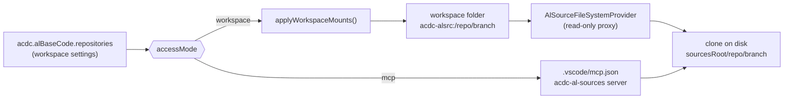
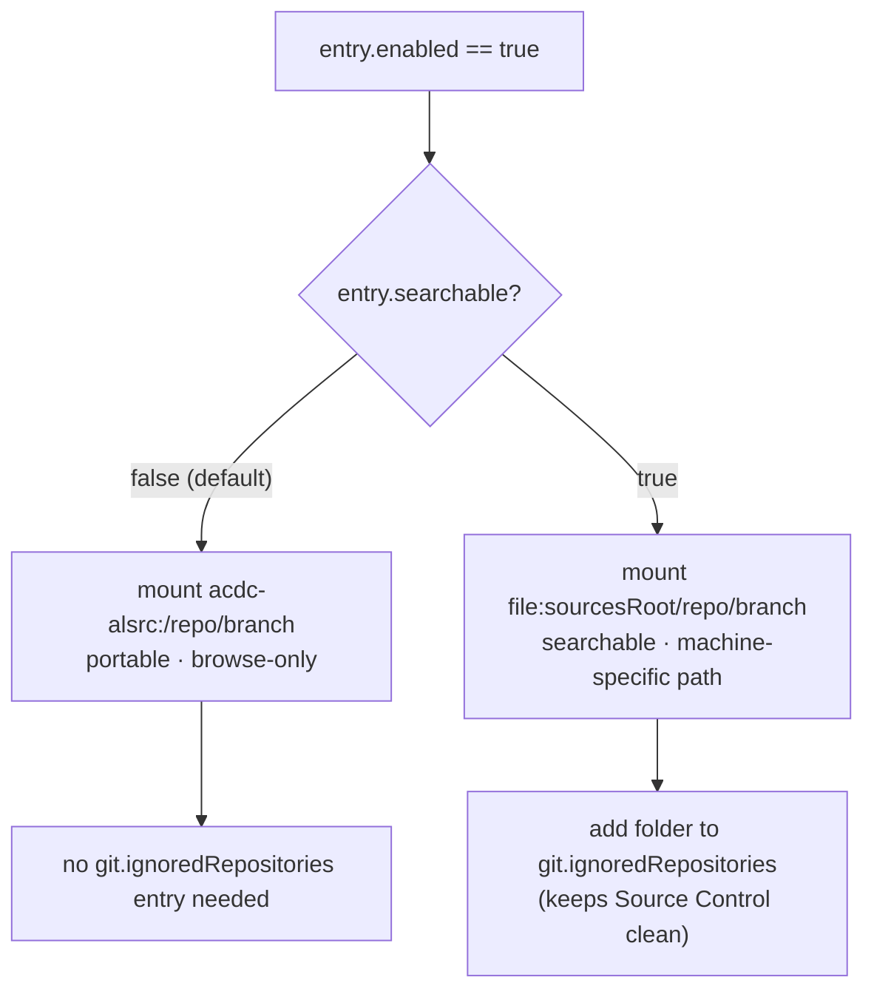

# PROJECT_BRIEF.md - AC⚡DC (Agentic Coding⚡Direct Coding)

> Last updated: 2026-09-09

## 1. Goal and Users

Internal VS Code extension (`theframework.acdc`) that ships AI agent skills, chat instructions,
workflows, and language-model tools for Business Central (AL) development. Users are AL
developers and the ALDC agent roster (Angus, Phil, Malcolm, Bon, Wrench) running in VS Code
chat/agent mode.

One of its features — **AL Base Code / ISV Code** — clones read-only AL source repositories
(Microsoft BC base app, ISV products such as Continia) and exposes them to agents so answers
are grounded in real AL code instead of model recall.

## 2. Current Scope

**Work item 1 — Restore search over mounted AL sources.** Done, implemented and verified by
the maintainer (see §3.2/§3.3 for the architecture, kept as the record of why).

**Work item 2 — Release-facing documentation.** See §11.

**Out of scope**
- Changing how sources are cloned, pulled, or which repositories ship as defaults.
- The `mcp` access mode contract (unchanged).
- Making the `acdc-alsrc:` virtual scheme itself searchable — impossible on stable API (see §3).

## 3. Stack and Architecture

- Runtime/language: Node 20, TypeScript, VS Code extension API `^1.95.0`
- Build: esbuild (`node esbuild.js`), lint: ESLint 8/9 flat config
- Data/services: workspace + user settings, git CLI, `.vscode/mcp.json`
- Tests/checks: **no automated test harness exists today** (`package.json` has no `test` script,
  no `*.test.ts`). Verification is currently `npm run compile` + `npm run lint` + manual F5.
- Deployment: `npm run vsix` / `vsce package`, versioned via `automation/scripts/Cut-Release.ps1`

### 3.1 AL source mounting — how it works today



### 3.2 Root cause of the search regression

Commit `f5219791` ("Migrate to portable AL Base Code layout") replaced `file:` workspace folders
with the virtual `acdc-alsrc:` scheme so that a committed `.code-workspace` no longer contains a
machine-specific absolute path. The trade-off was not identified at the time:

| Capability | Path taken | Works on `acdc-alsrc:`? |
|---|---|---|
| `list_dir`, `read_file`, opening a file in the editor | `FileSystemProvider` | Yes |
| `grep_search`, VS Code Search view | ripgrep over `file:` roots only | **No** |
| `file_search` glob | VS Code file indexer (`file:` roots only) | **No** |

VS Code only searches non-`file:` schemes when an extension registers a `FileSearchProvider` /
`TextSearchProvider`. Both are **proposed API** — confirmed absent from `@types/vscode` at our
pinned `^1.95.0` — so a marketplace-distributed extension cannot use them. The virtual scheme can
therefore *never* be made searchable; the only fix is to mount searchable sources as `file:`.

Secondary defect: the failure is silent. `grep_search` returns the generic
"excluded by search.exclude" message, so an agent burns many turns rationalising a wrong
conclusion (observed: ~15 turns hunting Continia codeunit `6175283`) instead of learning the mount
is browse-only.

### 3.3 Target architecture

Introduce a **per-entry** opt-in rather than a single global switch, because the trade-off differs
per repository:

- A small ISV source (Continia Document Output, a few hundred files) is genuinely worth grepping.
- The StefanMaron BC history repo is not: text search over it timed out and hung the chat even
  back when it *was* a `file:` mount. Keeping BC portable/browse-only and ISVs searchable is the
  correct default split.



#### Structural contract

```ts
// src/alBaseCode.ts
export interface AlSourceEntry {
  repository: string;
  branch: string;
  folder: string;
  enabled: boolean;
  /**
   * Mount as a real `file:` folder so VS Code text/file search can reach it.
   * Costs portability: the resolved absolute path lands in the workspace file.
   * Default false — keep large sources (BC base app) on the portable scheme.
   */
  searchable: boolean;
}
```

```ts
// src/alSourceMountPlan.ts  — NEW, must not import "vscode"
export type MountScheme = "virtual" | "file";

export interface PlannedMount {
  /** Stable identity: virtual path for "virtual", normalized fsPath for "file". */
  key: string;
  scheme: MountScheme;
  name: string;
}

export interface MountedFolder {
  uriString: string;
  scheme: string;
  fsPath?: string;
  name: string;
}

export interface MountPlan {
  add: PlannedMount[];
  /** Indices into the supplied `mounted` array, caller removes highest-first. */
  removeIndices: number[];
}

export function planWorkspaceMounts(
  desired: PlannedMount[],
  mounted: MountedFolder[],
  mountPrefix: string
): MountPlan;
```

`applyWorkspaceMounts` in [src/alBaseCode.ts](src/alBaseCode.ts#L656) becomes a thin adapter:
resolve entries → build `desired` → call `planWorkspaceMounts` → call
`vscode.workspace.updateWorkspaceFolders`. This is what makes the regression testable at all
(the current logic is untestable because it is fused to the VS Code API).

## 4. Key Files

| Area | Path | Purpose |
|---|---|---|
| Settings schema | `package.json` (`acdc.alBaseCode.*`, ~L1268) | Add `searchable` item property |
| Mount logic | `src/alBaseCode.ts` | `applyWorkspaceMounts`, `virtualUriFor`, `effectiveFolder`, `clearOurGitIgnoredRepositories` |
| Mount planning | `src/alSourceMountPlan.ts` (new) | vscode-free, unit-testable decision logic |
| Virtual FS | `src/alSourceFileSystemProvider.ts` | Read-only proxy for `acdc-alsrc:` |
| Migration | `src/alBaseCodeMigration.ts` | Must not "repair" an intentional `file:` mount |
| UI | `src/views/alBaseCodePanel.ts` | Source table editor — add Searchable column |
| Docs | `assets/help/settings-help.md`, `CHANGELOG.md` | User-facing explanation of the trade-off |

## 5. How to Work

- Setup: `npm install`
- Build: `npm run compile` · Watch: `npm run watch` (VS Code task `npm: watch`)
- Lint: `npm run lint`
- Test: `npm test` — **to be introduced by this work item** (see §7)
- Package: `npm run vsix`
- Repository rules: [.github/copilot-instructions.md](.github/copilot-instructions.md)

## 6. Safety and Constraints

- **No proposed VS Code API.** The extension must stay installable from a VSIX/marketplace.
- **No machine-specific path is ever written to a workspace file unless the user opted in.**
  `searchable: true` is that opt-in and must be surfaced as such in the UI and settings text.
- `acdc.alBaseCode.sourcesRoot` stays `"scope": "machine"` — unchanged.
- **Backward compatible by default.** An existing workspace with no `searchable` key keeps
  today's behaviour (virtual mounts); no silent rewriting of committed `.code-workspace` files.
- Mounted sources are read-only mirrors that `git reset --hard` overwrites on sync — never write
  to them, never let them appear in Source Control.
- Follow the existing `resolveConfigTarget` pattern when writing settings; do not hardcode
  `ConfigurationTarget.Workspace`.

## 7. Testing Strategy

The repository has **zero** automated tests today. Proportional approach: do not pull in
`@vscode/test-electron` (slow, heavyweight). Instead extract the decision logic into a
vscode-free module and cover it with Node 20's built-in runner.

- Add `"test": "tsc -p tsconfig.test.json && node --test out-test/**/*.test.js"` (or equivalent
  minimal wiring — Dev picks the exact form, but it must run in CI without a VS Code instance).
- Unit-test **only** `src/alSourceMountPlan.ts`. Anything touching `vscode.workspace` stays
  manually verified.

### Test cases — `planWorkspaceMounts`

| # | Given | When | Then |
|---|---|---|---|
| T1 | no mounted folders, one desired virtual mount | plan | `add` = that mount, `removeIndices` empty |
| T2 | virtual mount already present, same entry desired | plan | no-op (`add` and `removeIndices` empty) |
| T3 | virtual mount present, entry now `searchable: true` | plan | remove the virtual index, add the `file:` mount |
| T4 | `file:` mount present, entry now `searchable: false` | plan | remove the `file:` index, add the virtual mount |
| T5 | mount present, entry disabled | plan | remove it, add nothing |
| T6 | a `file:` folder present that is **not** ours (no `[AL Src] ` prefix) but same path | plan | never removed |
| T7 | two entries toggled at once | plan | `removeIndices` are valid and safe to apply highest-first (descending, no duplicates) |
| T8 | path casing differs on Windows (`C:\X` vs `c:\x`) | plan | treated as the same mount, not duplicated |

### Manual verification (Dev must report evidence)

- M1: enable a small ISV source with `searchable: true` → `grep_search` for a known string finds
  it; the folder appears in the VS Code Search view.
- M2: same source with `searchable: false` → still browsable via `list_dir` / `read_file`; the
  `.code-workspace` entry stays `{"uri": "acdc-alsrc:/…"}`.
- M3: a `searchable: true` mount does **not** appear in Source Control.
- M4: toggling `searchable` remounts without re-cloning (no network, no delete on disk).
- M5: opening a pre-existing workspace triggers no migration prompt and no folder churn.

## 8. Acceptance Criteria

- [ ] `acdc.alBaseCode.repositories[].searchable` exists, defaults to `false`, and is documented
      in `package.json`, `assets/help/settings-help.md`, and `CHANGELOG.md`.
- [ ] Enabled + `searchable: true` mounts as `file:`; enabled + `searchable: false` mounts as
      `acdc-alsrc:`; both directions migrate in place without a re-clone (M4).
- [ ] `grep_search` and `file_search` return results inside a `searchable: true` source (M1).
- [ ] A `searchable: false` source remains browsable and its workspace URI stays portable (M2).
- [ ] `searchable: true` folders are added to `git.ignoredRepositories`; `searchable: false`
      folders are not, and stale entries are still scrubbed (M3).
- [ ] `alBaseCodeMigration` does not flag or "repair" an intentional `file:` mount (M5).
- [ ] The AL Base Code panel exposes the toggle with a one-line statement of the trade-off
      (searchable vs portable).
- [ ] `npm test` exists and T1–T8 pass; `npm run compile` and `npm run lint` are clean.

## 9. Current State

**Working**
- Cloning/pulling sources, `sourcesRoot`, virtual mounts, `mcp` access mode, migration prompt.
- **Search over mounted AL/ISV sources** — `searchable` per-entry opt-in, implemented and
  confirmed working by the maintainer (M1–M5 passed). T1–T8 green.

**Known issues**
- Automated coverage exists only for `src/alSourceMountPlan.ts`; the rest of the extension has
  none.
- `npm test` uses a glob form that requires Node ≥ 22. Confirm before wiring it into CI.

**Next**
- Work item 2 (§11): README audit + surface release notes after an update.

## 10. Team and Handoff

- Producer: scope, architecture contracts, acceptance criteria, merge
- Dev: implementation, unit tests, manual verification evidence, PR
- QA: not engaged for this work item

**Material decisions**
- D1: per-entry `searchable` flag, not a global mount-scheme switch — the BC history repo must
  stay unsearchable (search over it previously hung the chat), while ISV sources benefit.
- D2: proposed `FileSearchProvider` / `TextSearchProvider` rejected — unavailable on stable API.
- D3: extract `planWorkspaceMounts` into a vscode-free module so the regression is testable.

**Next action**: `@ai-team-dev` implements §11 against the acceptance criteria in §11.4. Do not merge.

---

## 11. Work Item 2 — Release-facing documentation

### 11.1 Goal

The README no longer describes what the extension does, and nothing tells a user that an update
landed. Close both gaps: bring the README current, and surface the release notes after an update.

### 11.2 README audit — confirmed gaps

Audited [README.md](README.md) against `package.json` contributions and `CHANGELOG.md` 2.2.x → Unreleased.

| # | Gap | Since |
|---|---|---|
| R1 | **No AL Base Code / ISV Code section.** The feature only appears as two rows in the Commands and Settings tables, despite being the largest subsystem in the extension (clone cache, portable mounts, `workspace` vs `mcp` access, searchable mounts). BCQuality custom layers get a full section; this gets none. | pre-existing |
| R2 | Commands table missing **AC/DC: Migrate AL Base Code Settings to Portable Layout** (`acdc.migrateAlBaseCodeSettings`) | 2.3.0 |
| R3 | Commands table missing **AC/DC: Apply Agent Settings to Chat** (`acdc.applyAgentSettingsToChat`) | 2.4.0 |
| R4 | Commands table missing **AC/DC: Reset Agent Override Baselines** (`acdc.resetAgentOverrideBaselines`) | 2.4.0 |
| R5 | Settings table missing **`acdc.alBaseCode.sourcesRoot`** — the machine-scoped clone root, and the single most likely thing a new user needs to set | 2.3.0 |
| R6 | Settings table missing the per-source **`searchable`** flag and its trade-off | Unreleased |
| R7 | Agent Settings panel section does not mention **Reasoning effort** (`low`…`max`, requires VS Code 1.136+) | 2.4.0 |
| R8 | Agent Settings panel still says "the disabled **tools**". Tools are now a full multi-select picker stored as deltas (`disabledTools` + `extraTools`) with a warning when a write-capable tool is granted to an agent that does not declare one | 2.4.0 |
| R9 | Requirements section says "VS Code 1.95 or higher" with no note that reasoning effort needs 1.136+ | 2.4.0 |

Not gaps (verified accurate): the 8-agent roster, the `#acdcCodingStandard` tool, the BCQuality
custom-layers section, the routing guide, the weekly-sync section.

### 11.3 Release notes after an update

`src/update/` exists and is empty — the intended home. Nothing currently reads the installed
version, so an update is invisible to the user.

Rejected: `contributes.walkthroughs`. VS Code opens a walkthrough on **install**, not on update,
so it does not answer the requirement.

#### Contract

```ts
// src/update/releaseNotes.ts
export type ReleaseNotesTrigger = "never" | "minor" | "always";

/** Compares the running version against globalState and decides what to surface. */
export function decideReleaseNotesAction(
  previousVersion: string | undefined,
  currentVersion: string,
  trigger: ReleaseNotesTrigger
): { kind: "none" } | { kind: "welcome" } | { kind: "update"; auto: boolean };

/** Activation hook: fire-and-forget, must never block or throw into activate(). */
export function showReleaseNotesOnUpdate(
  context: vscode.ExtensionContext
): void;
```

- Version comparison is semver-ish on `major.minor.patch`; a **downgrade or an unparsable value
  never auto-opens**.
- `previousVersion === undefined` (fresh install) → `welcome` → open **README.md** preview.
- Version increased → `update`. `auto: true` for a major/minor bump under the default trigger
  (`"minor"`), or for any bump under `"always"`; patch-only bumps notify without stealing focus.
- `auto: true` → open the **CHANGELOG.md** markdown preview, plus a non-modal notification
  `AC⚡DC updated to v<x.y.z>` with actions `What's New` / `README` / `Don't show again`
  (the last writes `acdc.showReleaseNotesOnUpdate = "never"` at Global scope).
- `auto: false` → notification only.
- `context.globalState` key `acdc.lastSeenVersion` is written **after** the decision, in every
  branch including `none`, so an update is announced at most once.
- Reuse the existing `markdown.showPreview` → `openTextDocument` fallback pattern already used
  for `settings-help.md` in [src/extension.ts](src/extension.ts#L262).
- Skip entirely when `context.extensionMode === vscode.ExtensionMode.Development`.

New setting:

| Setting | Default | Values |
|---|---|---|
| `acdc.showReleaseNotesOnUpdate` | `"minor"` | `"never"`, `"minor"`, `"always"` |

### 11.4 Acceptance criteria

- [ ] R1–R9 are addressed in [README.md](README.md), matching the existing voice and table style.
- [ ] The new AL Base Code section explains: clone cache + `sourcesRoot`, `workspace` vs `mcp`
      access mode, and portable vs `searchable` mounts with the trade-off stated in one line.
- [ ] Every command in `contributes.commands` appears in the README Commands table, and every
      `acdc.*` setting in `contributes.configuration` appears in the Settings table (including
      the new `acdc.showReleaseNotesOnUpdate`).
- [ ] Fresh install opens the README preview once; a subsequent activation opens nothing.
- [ ] A minor/major version bump opens the CHANGELOG preview once and shows the notification;
      a patch bump notifies only; `"never"` does neither.
- [ ] `Don't show again` persists `acdc.showReleaseNotesOnUpdate = "never"` in User settings.
- [ ] Unit tests cover `decideReleaseNotesAction`: fresh install, patch bump, minor bump, major
      bump, same version, downgrade, unparsable version, and each of the three trigger values.
- [ ] `npm run compile`, `npm run lint`, `npm test` clean.
- [ ] Activation is not blocked or slowed; failures are swallowed and logged to the AC⚡DC output
      channel.

### 11.5 Verification

- Automated: the `decideReleaseNotesAction` unit tests above.
- Manual: clear the `acdc.lastSeenVersion` global-state key (or use a scratch profile), reload,
  and observe welcome → no-op → update behaviour across a bumped `package.json` version.
- Independent review: not needed. QA: not needed — documentation plus one activation-time,
  user-dismissible notification.

### 11.6 Risks

- Auto-opening a preview on every update is intrusive if mistuned. Mitigated by defaulting to
  major/minor only and shipping a one-click opt-out.
- README drift will recur. Out of scope now, but a follow-up check that diffs
  `contributes.commands` / `contributes.configuration` against the README tables would prevent it.
