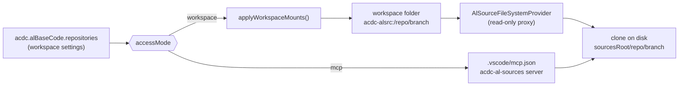
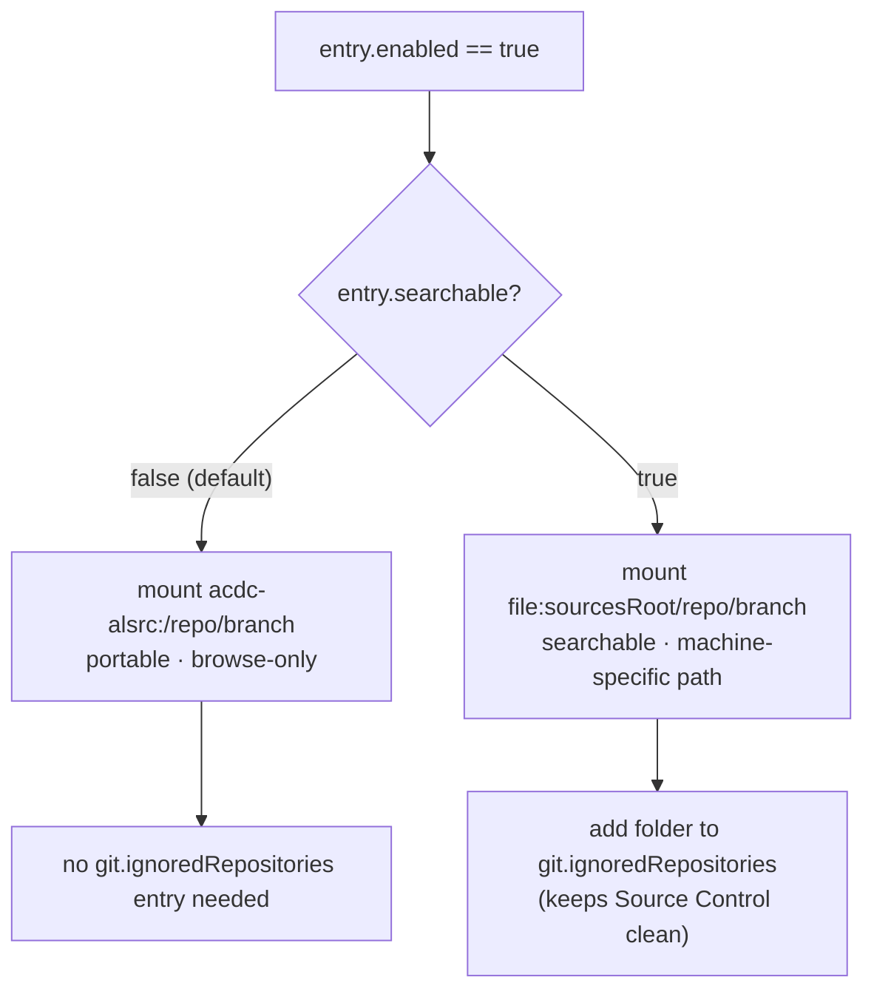
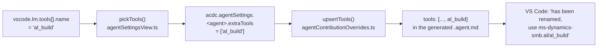
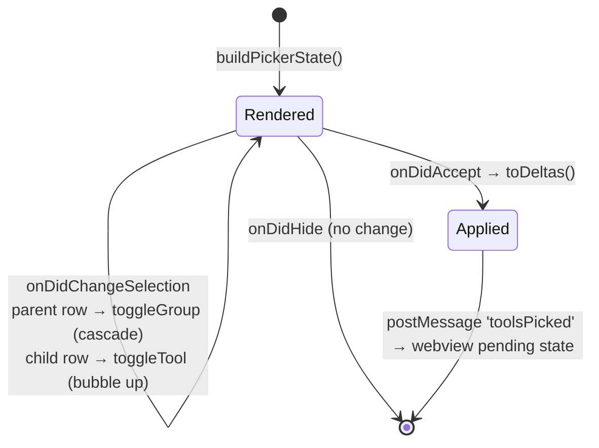

# PROJECT_BRIEF.md - AC⚡DC (Agentic Coding⚡Direct Coding)

> Last updated: 2026-09-10

## 1. Goal and Users

Internal VS Code extension (`theframework.acdc`) that ships AI agent skills, chat instructions,
workflows, and language-model tools for Business Central (AL) development. Users are AL
developers and the ALDC agent roster (Angus, Phil, Malcolm, Bon, Wrench) running in VS Code
chat/agent mode.

One of its features — **AL Base Code / ISV Code** — clones read-only AL source repositories
(Microsoft BC base app, ISV products such as Continia) and exposes them to agents so answers
are grounded in real AL code instead of model recall.

## 2. Current Scope

**Work item 1 — Restore search over mounted AL sources.** Done, implemented and verified by
the maintainer (see §3.2/§3.3 for the architecture, kept as the record of why).

**Work item 2 — Release-facing documentation.** See §11.

**Work item 3 — Agent tool picker: grouped selection + qualified tool IDs.** See §12.

**Out of scope**
- Changing how sources are cloned, pulled, or which repositories ship as defaults.
- The `mcp` access mode contract (unchanged).
- Making the `acdc-alsrc:` virtual scheme itself searchable — impossible on stable API (see §3).

## 3. Stack and Architecture

- Runtime/language: Node 20, TypeScript, VS Code extension API `^1.95.0`
- Build: esbuild (`node esbuild.js`), lint: ESLint 8/9 flat config
- Data/services: workspace + user settings, git CLI, `.vscode/mcp.json`
- Tests/checks: **no automated test harness exists today** (`package.json` has no `test` script,
  no `*.test.ts`). Verification is currently `npm run compile` + `npm run lint` + manual F5.
- Deployment: `npm run vsix` / `vsce package`, versioned via `automation/scripts/Cut-Release.ps1`

### 3.1 AL source mounting — how it works today



### 3.2 Root cause of the search regression

Commit `f5219791` ("Migrate to portable AL Base Code layout") replaced `file:` workspace folders
with the virtual `acdc-alsrc:` scheme so that a committed `.code-workspace` no longer contains a
machine-specific absolute path. The trade-off was not identified at the time:

| Capability | Path taken | Works on `acdc-alsrc:`? |
|---|---|---|
| `list_dir`, `read_file`, opening a file in the editor | `FileSystemProvider` | Yes |
| `grep_search`, VS Code Search view | ripgrep over `file:` roots only | **No** |
| `file_search` glob | VS Code file indexer (`file:` roots only) | **No** |

VS Code only searches non-`file:` schemes when an extension registers a `FileSearchProvider` /
`TextSearchProvider`. Both are **proposed API** — confirmed absent from `@types/vscode` at our
pinned `^1.95.0` — so a marketplace-distributed extension cannot use them. The virtual scheme can
therefore *never* be made searchable; the only fix is to mount searchable sources as `file:`.

Secondary defect: the failure is silent. `grep_search` returns the generic
"excluded by search.exclude" message, so an agent burns many turns rationalising a wrong
conclusion (observed: ~15 turns hunting Continia codeunit `6175283`) instead of learning the mount
is browse-only.

### 3.3 Target architecture

Introduce a **per-entry** opt-in rather than a single global switch, because the trade-off differs
per repository:

- A small ISV source (Continia Document Output, a few hundred files) is genuinely worth grepping.
- The StefanMaron BC history repo is not: text search over it timed out and hung the chat even
  back when it *was* a `file:` mount. Keeping BC portable/browse-only and ISVs searchable is the
  correct default split.



#### Structural contract

```ts
// src/alBaseCode.ts
export interface AlSourceEntry {
  repository: string;
  branch: string;
  folder: string;
  enabled: boolean;
  /**
   * Mount as a real `file:` folder so VS Code text/file search can reach it.
   * Costs portability: the resolved absolute path lands in the workspace file.
   * Default false — keep large sources (BC base app) on the portable scheme.
   */
  searchable: boolean;
}
```

```ts
// src/alSourceMountPlan.ts  — NEW, must not import "vscode"
export type MountScheme = "virtual" | "file";

export interface PlannedMount {
  /** Stable identity: virtual path for "virtual", normalized fsPath for "file". */
  key: string;
  scheme: MountScheme;
  name: string;
}

export interface MountedFolder {
  uriString: string;
  scheme: string;
  fsPath?: string;
  name: string;
}

export interface MountPlan {
  add: PlannedMount[];
  /** Indices into the supplied `mounted` array, caller removes highest-first. */
  removeIndices: number[];
}

export function planWorkspaceMounts(
  desired: PlannedMount[],
  mounted: MountedFolder[],
  mountPrefix: string
): MountPlan;
```

`applyWorkspaceMounts` in [src/alBaseCode.ts](src/alBaseCode.ts#L656) becomes a thin adapter:
resolve entries → build `desired` → call `planWorkspaceMounts` → call
`vscode.workspace.updateWorkspaceFolders`. This is what makes the regression testable at all
(the current logic is untestable because it is fused to the VS Code API).

## 4. Key Files

| Area | Path | Purpose |
|---|---|---|
| Settings schema | `package.json` (`acdc.alBaseCode.*`, ~L1268) | Add `searchable` item property |
| Mount logic | `src/alBaseCode.ts` | `applyWorkspaceMounts`, `virtualUriFor`, `effectiveFolder`, `clearOurGitIgnoredRepositories` |
| Mount planning | `src/alSourceMountPlan.ts` (new) | vscode-free, unit-testable decision logic |
| Virtual FS | `src/alSourceFileSystemProvider.ts` | Read-only proxy for `acdc-alsrc:` |
| Migration | `src/alBaseCodeMigration.ts` | Must not "repair" an intentional `file:` mount |
| UI | `src/views/alBaseCodePanel.ts` | Source table editor — add Searchable column |
| Docs | `assets/help/settings-help.md`, `CHANGELOG.md` | User-facing explanation of the trade-off |

## 5. How to Work

- Setup: `npm install`
- Build: `npm run compile` · Watch: `npm run watch` (VS Code task `npm: watch`)
- Lint: `npm run lint`
- Test: `npm test` — **to be introduced by this work item** (see §7)
- Package: `npm run vsix`
- Repository rules: [.github/copilot-instructions.md](.github/copilot-instructions.md)

## 6. Safety and Constraints

- **No proposed VS Code API.** The extension must stay installable from a VSIX/marketplace.
- **No machine-specific path is ever written to a workspace file unless the user opted in.**
  `searchable: true` is that opt-in and must be surfaced as such in the UI and settings text.
- `acdc.alBaseCode.sourcesRoot` stays `"scope": "machine"` — unchanged.
- **Backward compatible by default.** An existing workspace with no `searchable` key keeps
  today's behaviour (virtual mounts); no silent rewriting of committed `.code-workspace` files.
- Mounted sources are read-only mirrors that `git reset --hard` overwrites on sync — never write
  to them, never let them appear in Source Control.
- Follow the existing `resolveConfigTarget` pattern when writing settings; do not hardcode
  `ConfigurationTarget.Workspace`.

## 7. Testing Strategy

The repository has **zero** automated tests today. Proportional approach: do not pull in
`@vscode/test-electron` (slow, heavyweight). Instead extract the decision logic into a
vscode-free module and cover it with Node 20's built-in runner.

- Add `"test": "tsc -p tsconfig.test.json && node --test out-test/**/*.test.js"` (or equivalent
  minimal wiring — Dev picks the exact form, but it must run in CI without a VS Code instance).
- Unit-test **only** `src/alSourceMountPlan.ts`. Anything touching `vscode.workspace` stays
  manually verified.

### Test cases — `planWorkspaceMounts`

| # | Given | When | Then |
|---|---|---|---|
| T1 | no mounted folders, one desired virtual mount | plan | `add` = that mount, `removeIndices` empty |
| T2 | virtual mount already present, same entry desired | plan | no-op (`add` and `removeIndices` empty) |
| T3 | virtual mount present, entry now `searchable: true` | plan | remove the virtual index, add the `file:` mount |
| T4 | `file:` mount present, entry now `searchable: false` | plan | remove the `file:` index, add the virtual mount |
| T5 | mount present, entry disabled | plan | remove it, add nothing |
| T6 | a `file:` folder present that is **not** ours (no `[AL Src] ` prefix) but same path | plan | never removed |
| T7 | two entries toggled at once | plan | `removeIndices` are valid and safe to apply highest-first (descending, no duplicates) |
| T8 | path casing differs on Windows (`C:\X` vs `c:\x`) | plan | treated as the same mount, not duplicated |

### Manual verification (Dev must report evidence)

- M1: enable a small ISV source with `searchable: true` → `grep_search` for a known string finds
  it; the folder appears in the VS Code Search view.
- M2: same source with `searchable: false` → still browsable via `list_dir` / `read_file`; the
  `.code-workspace` entry stays `{"uri": "acdc-alsrc:/…"}`.
- M3: a `searchable: true` mount does **not** appear in Source Control.
- M4: toggling `searchable` remounts without re-cloning (no network, no delete on disk).
- M5: opening a pre-existing workspace triggers no migration prompt and no folder churn.

## 8. Acceptance Criteria

- [ ] `acdc.alBaseCode.repositories[].searchable` exists, defaults to `false`, and is documented
      in `package.json`, `assets/help/settings-help.md`, and `CHANGELOG.md`.
- [ ] Enabled + `searchable: true` mounts as `file:`; enabled + `searchable: false` mounts as
      `acdc-alsrc:`; both directions migrate in place without a re-clone (M4).
- [ ] `grep_search` and `file_search` return results inside a `searchable: true` source (M1).
- [ ] A `searchable: false` source remains browsable and its workspace URI stays portable (M2).
- [ ] `searchable: true` folders are added to `git.ignoredRepositories`; `searchable: false`
      folders are not, and stale entries are still scrubbed (M3).
- [ ] `alBaseCodeMigration` does not flag or "repair" an intentional `file:` mount (M5).
- [ ] The AL Base Code panel exposes the toggle with a one-line statement of the trade-off
      (searchable vs portable).
- [ ] `npm test` exists and T1–T8 pass; `npm run compile` and `npm run lint` are clean.

## 9. Current State

**Working**
- Cloning/pulling sources, `sourcesRoot`, virtual mounts, `mcp` access mode, migration prompt.
- **Search over mounted AL/ISV sources** — `searchable` per-entry opt-in, implemented and
  confirmed working by the maintainer (M1–M5 passed). T1–T8 green.

**Known issues**
- Automated coverage exists only for `src/alSourceMountPlan.ts`; the rest of the extension has
  none.
- `npm test` uses a glob form that requires Node ≥ 22. Confirm before wiring it into CI.

**Next**
- Work item 2 (§11): README audit + surface release notes after an update.
- Work item 3 (§12): grouped tool picker + qualified tool IDs in the Agent Settings panel.

**Known issues (work item 3)**
- **B2 (open): the Tools summary counts tokens, not tools.** Selecting the AL group stores one
  token (`ms-dynamics-smb.al/*`) so the panel reports "1 added" instead of 10.
  `renderToolsSummary` must use an expanded count; `expandToolTokens` already exists in the model
  but the webview never receives the expansion.
- **B3 (root cause found 2026-09-10 by runtime dump; VS Code 1.137.0, 139 runtime tools).**
  Two independent defects were conflated under one symptom. Split them:

  **B3-i — real picker bug (built-in vocabulary).** The frontmatter token vocabulary and the
  runtime tool-name vocabulary are disjoint, and we only have a manifest for extension-contributed
  tools. VS Code's own toolsets are contributed by no extension, so nothing maps them:

  | Declared token | Runtime tool that IS present | Landed in |
  |---|---|---|
  | `vscode/askQuestions` | `vscode_askQuestions` | orphan + `unknown` bucket |
  | `search/usages` | `vscode_listCodeUsages` | orphan + `unknown` bucket |
  | `todo` | `manage_todo_list` | orphan + `unknown` bucket |

  The same tool appears twice — once as an unmatched token, once as an unowned runtime entry —
  which is why `unknown` holds 35 tools. The two vocabularies must be reconciled.

  **B3-ii — NOT a picker bug; our agent files hardcode MCP names that vary per VS Code profile.**
  MCP config is **per profile**, and the maintainer's 10 profiles name the same logical server
  differently. Enumerated 2026-09-10:

  | Profile | `servers` keys |
  |---|---|
  | BC AL Development | `microsoftdocs/mcp`, `bc-code-intel`, `al-go-docs`, `github`, `context7`, `markitdown`, `bc-word-layout` |
  | BC19 AL Development | `microsoft.docs.mcp`, **`al-symbols-mcp`**, `al-go-docs`, `github`, `azure-devops`, `bc-code-intel` |
  | BC Controll Add-in | `microsoft.docs.mcp`, `github`, `dhtmlx-gantt`, **`al-symbols-mcp`**, `al-go-docs` |
  | Web MKDocs | `microsoftdocs/mcp`, `com.microsoft/nuget`, `io.github.github/github-mcp-server` |
  | Web Development | `microsoft/markitdown`, `com.supabase/mcp` |
  | BC AL Clean · BC AL Prerelease · BC AL Dev (DevOps) · Default | **no `mcp.json` at all** |

  Corrections to earlier producer claims:
  - **`al-symbols-mcp` is real** — configured in 2 of 5 BC profiles. The earlier "no such server
    anywhere" was wrong; it was absent only from the profile whose config was pasted.
  - The Microsoft docs server is spelled `microsoftdocs/mcp` *or* `microsoft.docs.mcp` depending on
    profile. Tokens `microsoft-learn/*`, `microsoft-docs/*`, `upstash/context7/*`,
    `microsoft/markitdown/*` and `azure-mcp/*` match **no** configured server in **any** profile —
    those are genuinely dead.

  This vindicates the existing design note in `automation/scripts/Normalize-AgentTools.ps1`:
  *"MCP server IDs … vary per user profile and are managed dynamically by the extension via
  mcpDiscoveryService."* Hardcoding any MCP namespace into an agent file is a **design violation**,
  not a typo. The fix is to strip dead MCP tokens in normalization, not to repoint them.
- **B3-iv — the weekly sync WILL clobber naive fixes.** `package.json → contributes.chatAgents`
  ships `assets/generated/aldc-community/agents/*`, which `Sync-ExternalSources.ps1` regenerates
  from `javiarmesto/ALDC-AL-Development-Collection`. Edits made directly there are lost. Only two
  places survive a sync: `automation/overlays/aldc-community/**` and the `$CoreTools` /
  `$DeprecatedTools` tables in `Normalize-AgentTools.ps1` (which runs after the sync).
- **B3b RETRACTED.** `.github/agents/**` is the dev-time copy and is **not shipped and not
  normalized**; `vscode.mermaid-chat-features/renderMermaidDiagram` is already in
  `$DeprecatedTools` and is correctly absent from the shipped generated agent. The real issue is
  narrower: `.github/agents/**` has drifted from what normalization produces.
- **B3-v — AL MCP server prerequisites (verified on this machine).** .NET 8.0.31 present. `altool`
  is **not on PATH**; it lives at
  `C:\Users\JobLouage\.vscode\extensions\ms-dynamics-smb.al-18.0.2732683\bin\altool.exe`. That path
  embeds the extension version, so any hardcoded absolute path breaks on the next AL update.
- **B3b (new, real defect in a shipped agent file)**: `angus.agent.md` declares
  `vscode.mermaid-chat-features/renderMermaidDiagram`, but the installed extension id is
  `vscode.mermaid-markdown-features`. That token has never resolved.
- **B4 (blocker, must not merge)**: `src/tools/toolCatalogDump.ts` — whose own first line reads
  `TEMPORARY DIAGNOSTIC — Delete before handoff` — is imported and called from `extension.ts`
  activation (`scheduleToolCatalogDump(context)`). It is gated on a `tmp/DUMP_TOOLS` marker so
  runtime risk is low, but diagnostic code must not ship.
- **B5 (hygiene, blocker)**: `.gitignore` covers only `tmp/external-sources/` and
  `tmp/mcp-knowledge-sources/`, so a **124 MB** Extension Development Host profile (`tmp/edh-udd`)
  plus `tmp/harness`, `tmp/DUMP_TOOLS` and `tmp/tool-dump*.json` are all sitting untracked and
  git-visible. Ignore `tmp/` properly and clean the artifacts.
- **B4 RESOLVED** — `toolCatalogDump.ts` deleted and its activation call removed from
  `extension.ts`.
- **B5 RESOLVED** — `.gitignore` now ignores `tmp/*` with a re-include for the tracked
  `tmp/agentic-coding-al-TrainingMaterial.md`; the 124 MB `tmp/edh-udd` and the dump artifacts are
  gone (tmp is down to 1 file / 82 KB).
- **Work item 3 hands-on verification COMPLETE (2026-09-10).** The webview tree is confirmed
  working. The D23 provider is confirmed end to end: the output channel logged
  `[MCP] Contributing 'al' from …\ms-dynamics-smb.al-18.0.2732683\bin\altool.exe` (resolved the
  **18.0** install, not the 8.1 one per D27, with no hardcoded version), `al` appears in
  `MCP: List Servers` attributed to *AC⚡DC — AL Tools*, and the server **starts and reaches
  `AL MCP Server ready (STDIO mode)`**.
- **B6 RESOLVED and verified by the maintainer (2026-09-10).** The `al` server now launches with
  resolved projects. Observed:
  - single folder → `Loading 1 project(s)… Successfully loaded project: …\AL\acdc\demo`
  - multi-root → `Loading 19 project(s)…`, all real AL projects, no `[AL Src]` paths
  - `Discovered 16 tools` after a full `initialize` → `tools/list` handshake
  - the server stopped and restarted with a **different** project set when the window changed,
    confirming `onDidChangeWorkspaceFolders` drives `onDidChangeMcpServerDefinitions`

  Mount exclusion is verified **indirectly** in the live logs (no `[AL Src]` path appears); direct
  proof is test B7, which exercises a real `file:`-scheme mount carrying a root `app.json`.

  **Original symptom, for the record.** The server used to start with zero projects
  (`No projects specified at startup. Use the al_addproject tool to add projects.`). The
  `launchmcpserver <projects>` positional argument is **optional** — the earlier concern was not a
  blocker — but tools needing a project (`al_compile`, `al_symbolsearch`, …) were useless until one
  was added. **Decision (maintainer): resolve projects from the window and pass them at launch.**
  Resolution rules:

  | Window state | Signal | Projects passed |
  |---|---|---|
  | no folder open | `workspaceFolders === undefined` | none (blank) |
  | single folder | `workspaceFile === undefined` | that folder, if it has `app.json` |
  | saved multi-root | `workspaceFile.scheme === "file"` | every qualifying folder |
  | unsaved multi-root | `workspaceFile.scheme === "untitled"` | every qualifying folder |

  `vscode.workspace.workspaceFile` is confirmed present in the pinned types (index.d.ts:13875).
  **The table above is descriptive, not a parameter.** All four rows reduce to the same per-folder
  predicate, so `workspaceFile` is deliberately *not* threaded into the resolver — carrying an
  unread field would be worse than omitting it. Recorded here for the reasoning, not the signature.

  **Two hard constraints:**
  - **Exclude AL Base Code mounts.** Folders named with `MOUNT_PREFIX = "[AL Src] "`
    (`src/alBaseCode.ts:37`) are read-only mirrors of the BC base app / ISV sources and contain
    *hundreds* of `app.json` files. Feeding them to the MCP server would be catastrophic. Note the
    second-order effect: in this extension a multi-root workspace frequently exists **because of**
    those mounts, so `workspaceFile !== undefined` does **not** imply multiple real AL projects.
  - **Probe `app.json` at the folder root only**, never `**/app.json` — nested test apps and
    `.alpackages` would otherwise be picked up as projects.

  Zero qualifying folders → pass nothing. The definition becomes workspace-dependent, so
  `onDidChangeMcpServerDefinitions` must also fire on `onDidChangeWorkspaceFolders`.

  **Two defects found during implementation (2026-09-10), both now fixed and tested:**
  - The `[AL Src] ` exclusion was genuinely necessary and was **missing**: filtering on
    `scheme === "file"` alone is insufficient, because a *searchable* mount (D1) is deliberately a
    real `file:` folder. An ISV mirror with a root `app.json` would have been passed to the server.
    Proven against live folders: `[AL Src] ISV Product` is `file:` **with** a root `app.json` and is
    excluded only by the name filter (test B7).
  - `AL_SOURCE_MOUNT_PREFIX` was defined in **three** places; B6 cited one of them as authoritative.
    Now exported once from the vscode-free `alSourceMountPlan.ts`.

  **Known lossiness (accepted):** `AlToolchain.layout` is a single field describing two binaries.
  `alc` and `altool` could in principle resolve in different layouts; today 8.1 has no `altool`, so
  it is harmless, but the field is lossy by construction.
- `package-lock.json` shows two field changes only, both benign: `@types/vscode` `^1.95.0` →
  `^1.101.0` (D23; resolves to 1.120.0, which is why the 1.101 MCP API was already in the `.d.ts`),
  and the root `version` `1.3.0` → `2.6.0` — the lockfile catching up to a long-stale
  `package.json` version. No packages added, removed or downgraded.
- D16 means any tool id stored before that fix may carry a runtime name instead of a reference
  name. Rule 1 repairs it on the next pass, but this is only proven by unit test U12.
- Manual checks M1, M2 (new picker), M3, M5, M6 remain unperformed — a native QuickPick is not
  reachable by any automation available to the agents, so these are maintainer-only.

**Verified by the maintainer (2026-09-10)** — W2 closed. Adding `al_build` and `al_getnextobjectid`
to Angus through the picker, then restarting, produced
`ms-dynamics-smb.al/al_build, ms-dynamics-smb.al/al_getnextobjectid` in the agent file with no
rename warning (M2), and the pre-existing `'al-symbols-mcp/*'` / `'upstash/context7/*'` wildcards
round-tripped untouched (M5).

## 10. Team and Handoff

- Producer: scope, architecture contracts, acceptance criteria, merge
- Dev: implementation, unit tests, manual verification evidence, PR
- QA: not engaged for this work item

**Material decisions**
- D1: per-entry `searchable` flag, not a global mount-scheme switch — the BC history repo must
  stay unsearchable (search over it previously hung the chat), while ISV sources benefit.
- D2: proposed `FileSearchProvider` / `TextSearchProvider` rejected — unavailable on stable API.
- D3: extract `planWorkspaceMounts` into a vscode-free module so the regression is testable.
- D4 (work item 3): the bare-tool-ID warning is **our** defect, not the AL extension's — the
  shipped `.agent.md` files already use the qualified form; our picker overwrites it.
- D5 (work item 3): a selected parent group persists the **wildcard** token, not an enumeration
  of its children — this is what makes "select the parent" meaningful rather than cosmetic.
- D6 (work item 3): no proposed API and no tree QuickPick exists; the tree is simulated on
  `createQuickPick`.
- D7 (work item 3): the fallback is a **two-step QuickPick** (pick groups → narrow within a
  group), not a webview tree. Simulated tree is timeboxed to one day; both share the reducers.
- D8 (work item 3): wildcard auto-widening accepted, no opt-out — but the write-capable warning
  must become wildcard-aware.
- D9 (work item 3): the bare→qualified settings migration runs silently at User scope.
- D10 (work item 3): prose references to bare tool names in `.github/skills/**` stay as-is.
- D11 (work item 3): MCP groups are keyed off `mcp.json` server ids via `getAvailableMcpServerIds`,
  matched *forward* onto flattened `mcp_<id>_` tool prefixes. Unmatched MCP tools go in a flat
  bucket with no wildcard. Supersedes the original "parse the server id out of the tool name".
- D12 (work item 3): on a duplicate tool name the lexicographically smallest extension id wins, so
  the index never depends on `extensions.all` ordering. Accepted as implemented.
- D13 (work item 3): `resolveToolOwner(id, index)` is part of the §12.4 contract — it was missing,
  and U7 could not be expressed without it.
- D14 (work item 3): the migration keys off `vscode.extensions.all` (complete at activation), not
  `vscode.lm.tools` (racy per S1). Supersedes the "after `lm.tools` is populated" wording above.
- D15 (work item 3): `VSCODE_BUILTIN_PREFIXES` gains `vscode` and moves into the vscode-free
  module. Consequence accepted: `agentWorkflowService` now treats a `vscode/*` requirement as
  built-in rather than reporting it missing — which was the intended behaviour all along.
- D16 (work item 3): the qualified token uses the contributed **`toolReferenceName`**, not the
  runtime `name`. Verified against the installed AL extension 18.0.2726309: 9 of its 10 tools have
  identical values, but `al_getdiagnostics` → **`al_get_diagnostics`**. The shipped agent files
  already declare `ms-dynamics-smb.al/al_get_diagnostics`, confirming reference-name is the
  frontmatter form. The original §12.4 rule 3 would have emitted the runtime name and reintroduced
  the rename warning for exactly that tool.
- D17 (work item 3): **toolset membership outranks extension ownership.** `copilot_readFile`
  qualifies as `read/readFile`, not `GitHub.copilot-chat/copilot_readFile`. Resolves O1; the
  producer's original rule 3 was wrong for every tool that belongs to a built-in toolset.
- D18 (work item 3): **D7 invoked — the simulated tree is withdrawn**, replaced by the two-step
  QuickPick. `onDidChangeSelection` is removed entirely; selection is read once from
  `quickPick.selectedItems` at accept or drill, and each step applies a **diff against what was
  rendered** rather than an absolute checked set — so a partial group, which a QuickPick can only
  draw unchecked, is never read as a deselection. `items` is assigned once, before `show()`.
  Reducers live in the vscode-free `src/tools/toolPickerSteps.ts` (tests S1–S7).
- D19 (work item 3): **cancel means cancel.** Escaping step 1 discards step-2 edits made during
  that session. Ratifies the implementer's judgement call; a partial commit on Escape would be
  more surprising than losing the edit.
- D20 (work item 3): **the QuickPick is abandoned; the picker becomes a dedicated editor-tab
  webview with a real tree.** Evidence: VS Code's own tool picker is not a QuickPick at all — since
  1.103 it uses `IQuickInputService.createQuickTree()` (`chatToolPicker.ts`, `showToolsPicker`),
  whose `IQuickTreeItem` carries `children`, `collapsed` and **`checked: boolean | 'mixed'`**
  (true tri-state). That service is workbench-internal: searching `src/vscode-dts` — which holds
  `vscode.d.ts` and every `vscode.proposed.*.d.ts` — for `QuickTree` and `quickTree` returns
  **zero** results. It is not public and not proposed. A hierarchical tree is therefore
  unreachable from any QuickPick API, and D7's two-step fallback was chasing an impossible target.
  Maintainer chose the **editor-tab webview** over the sidebar panel, for width.
- D21 (work item 3): the model layer (`toolIdentity.ts`, `toolPickerModel.ts`) survives the UI
  change untouched — only presentation is replaced. `toolPickerSteps.ts` becomes dead and is
  removed with its tests; `toggleExpanded` / `expanded` come back into use for the tree.
- D22 (work item 3): tri-state is now expressible, so a **partial group renders as `mixed`**
  rather than unchecked-with-a-description. That capability gap was the real reason the QuickPick
  approaches felt wrong.
- D23 (work item 3): **AC⚡DC registers the AL MCP server itself** via
  `vscode.lm.registerMcpServerDefinitionProvider` + `contributes.mcpServerDefinitionProviders`
  (present in the pinned `@types/vscode` at index.d.ts:20843). The server is named **`al`** (per
  Microsoft's own sample) and its command is resolved at activation from
  `vscode.extensions.getExtension("ms-dynamics-smb.al").extensionPath` → `bin/altool.exe`, so it
  follows AL extension upgrades instead of embedding a version in a path. This replaces the plan to
  hand-edit `mcp.json` in six BC profiles, and it self-heals for profiles created later.
  **`engines.vscode` bumps `^1.95.0` → `^1.101.0`** (approved by the maintainer); that API was
  finalized in 1.101.
- D24 (work item 3): the third-party **`al-symbols-mcp` (`npx al-mcp-server`) is retired.** It is
  configured identically in the BC19 and BC Controll Add-in profiles and is *not* Microsoft's
  `altool` server, so the name must not be reused for it. The D23 provider supplies `al` in every
  profile instead.
- D25 (work item 3): agent/prompt files must **not** name MCP servers at all — dead tokens are
  stripped in `Normalize-AgentTools.ps1` so the weekly sync cannot reintroduce them. Per-profile
  discovery stays the job of `mcpDiscoveryService`, as that script's own design note already says.
- D26 (work item 3): **D25 is NOT widened to extension namespaces.** `sshadowsdk.al-lsp-for-agents/*`
  (11 shipped files) and `ms-vscode.vscode-websearchforcopilot/*` stay as declared even though those
  extensions are not installed here. Unlike the invented MCP names, these are real marketplace
  extensions a user may legitimately install; the "extensions not installed" warning is accepted as
  informational. Do not add extension namespaces to the strip list.
- D27 (work item 3): **the AL 8.1.540594 install is intentional** — it is required for BC19  development in the BC19 AL Development profile. Do not uninstall or treat it as stale.
  Consequence to accept: `altool` (and therefore the D23 `al` MCP server) ships only with AL 17.0+,
  so in any profile where 8.1 is the active AL extension the provider correctly resolves
  `no-binary` and contributes nothing. **BC19 will have neither `al` nor the retired
  `al-symbols-mcp`.** If that becomes a problem, the options are to restore an MCP server in that
  profile or to improve the `no-binary` log to say "AL extension predates altool" rather than
  printing a bare path.

**Security (maintainer action, not an agent's)**
- **RESOLVED 2026-09-10.** The plaintext `AZURE_DEVOPS_PAT` in
  `…\Code\User\profiles\3fd38bb0\mcp.json` (BC19 AL Development) was replaced by hand with
  `${env:AZURE_DEVOPS_PAT}`. No agent read or edited that file. **The old token value was exposed
  on disk and should still be rotated in Azure DevOps** — replacing the reference does not
  invalidate the leaked secret.
- **RESOLVED 2026-09-10.** `al-symbols-mcp` removed by hand from the profiles that carried it,
  per D24. The D23 provider now supplies `al` instead.

**Open before step 4 (not blocking step 3)**
- **O1 — RESOLVED 2026-09-10, and the original rule 3 was wrong twice.** See D16/D17. The fix is
  in `toolIdentity.ts` with tests U11/U12, per the instruction to fix it in the vscode-free module
  rather than special-case it in the view.

**Next action**: `@ai-team-dev` replaces the picker with the D20 editor-tab webview tree and fixes
B2 and B3. Work item 2 (§11) remains open against §11.4. Do not merge.

**Agreed sequencing (2026-09-10)**: B6 (§9, D28) and Work Item 4 (§13) first, **then** Work Item 2
(§11 README + release notes).

- D28 (B6): the `al` server is launched **with the AL projects of the current window** rather than
  by auto-invoking `al_addproject`. Rationale: `al_addproject` is an MCP tool, invoked by the model;
  MCP servers start lazily, so there is nothing to invoke at activation. Launch args reach the same
  end state with no lifecycle dependency. **Rule** (producer's reading of the maintainer's
  instruction — correct if wrong): a workspace folder counts as an AL project when it contains
  `app.json`; the resulting folder paths are appended to `AL_MCP_SERVER_ARGS`. No qualifying folder
  (or no folder open) → no positional args, exactly as today. Applies identically to single-folder
  and multi-root windows.

---

## 13. Work Item 4 (proposed) — expose the resolved AL toolchain to agents

### 13.1 Why

Observed 2026-09-10: asked to build, Phil **globbed** `~/.vscode/extensions/ms-dynamics-smb.al-*\bin\win32\alc.exe`,
hit the **8.1** compiler, failed on `runtime: 17.0`, then re-globbed and retried against 18.0. Three
wasted terminal round-trips and a red herring ("build failed") that was really a toolchain problem.
Agents should never guess the compiler path — the extension already knows it.

### 13.2 Contract

Extend the existing vscode-free `src/tools/alMcpServer.ts` resolution (rename the module if it
outgrows its name) and surface it as an LM tool alongside `acdc_get_sdd_config`:

```ts
export interface AlToolchain {
  extensionId: string;      // "ms-dynamics-smb.al"
  version: string;          // "18.0.2732683" — parsed from the folder name
  extensionPath: string;
  alc?: string;             // resolved compiler, undefined when absent
  altool?: string;          // undefined on AL < 17
  /** Layout actually found; 8.1 uses bin/win32, 18.x uses bin. */
  layout: "bin" | "bin/win32";
}
```

`acdc_get_al_toolchain` returns this, or a clear "AL extension not active" result.

### 13.3 Two traps that make this non-trivial

- **T1 — "active" is not "newest".** `vscode.extensions.getExtension()` returns whatever VS Code
  resolved for that ID. With two versions installed (D27: 8.1 is *intentional* for BC19), that may
  be 8.1. The tool must therefore report the **version**, not just a path, so an agent can compare
  it against the project's `app.json → runtime` and fail fast with a useful message instead of
  after a red build.
- **T2 — CORRECTED 2026-09-10. Probe order is part of the contract, not an implementation detail.**
  The original wording ("8.1 → `bin/win32/alc.exe`; 18.x → `bin/alc.exe`; probe both") was
  materially wrong: **AL 8.1 ships `alc.exe` in BOTH locations**, and `bin/alc.exe` is a 17,344-byte
  stub while `bin/win32/alc.exe` is the real 152,008-byte compiler. Measured on this machine; AL
  18.0 has no `bin/win32` at all. A `bin`-first probe therefore returns the **wrong binary** on
  exactly the install D27 keeps around — the precise failure §13.1 exists to prevent.
  **Required order: `["bin/win32", "bin"]`.** Covered by test C8.

### 13.4 Agent-side change

Update the AL agents' instructions: resolve the toolchain via the tool, never glob the extensions
folder. Must go in the layer that survives the weekly sync (`Normalize-AgentTools.ps1` /
`automation/overlays/**`), per D25's precedent.

### 13.5 Explicitly rejected

Pinning a versioned `alc.exe` path into `.vscode/tasks.json` — suggested by Phil in the same
session. It bakes `…al-18.0.2732683\…` into a committed file and breaks on the next AL update. This
is the exact anti-pattern D23 exists to avoid.

---

## 11. Work Item 2 — Release-facing documentation

### 11.1 Goal

The README no longer describes what the extension does, and nothing tells a user that an update
landed. Close both gaps: bring the README current, and surface the release notes after an update.

### 11.2 README audit — confirmed gaps

Audited [README.md](README.md) against `package.json` contributions and `CHANGELOG.md` 2.2.x → Unreleased.

| # | Gap | Since |
|---|---|---|
| R1 | **No AL Base Code / ISV Code section.** The feature only appears as two rows in the Commands and Settings tables, despite being the largest subsystem in the extension (clone cache, portable mounts, `workspace` vs `mcp` access, searchable mounts). BCQuality custom layers get a full section; this gets none. | pre-existing |
| R2 | Commands table missing **AC/DC: Migrate AL Base Code Settings to Portable Layout** (`acdc.migrateAlBaseCodeSettings`) | 2.3.0 |
| R3 | Commands table missing **AC/DC: Apply Agent Settings to Chat** (`acdc.applyAgentSettingsToChat`) | 2.4.0 |
| R4 | Commands table missing **AC/DC: Reset Agent Override Baselines** (`acdc.resetAgentOverrideBaselines`) | 2.4.0 |
| R5 | Settings table missing **`acdc.alBaseCode.sourcesRoot`** — the machine-scoped clone root, and the single most likely thing a new user needs to set | 2.3.0 |
| R6 | Settings table missing the per-source **`searchable`** flag and its trade-off | Unreleased |
| R7 | Agent Settings panel section does not mention **Reasoning effort** (`low`…`max`, requires VS Code 1.136+) | 2.4.0 |
| R8 | Agent Settings panel still says "the disabled **tools**". Tools are now a full multi-select picker stored as deltas (`disabledTools` + `extraTools`) with a warning when a write-capable tool is granted to an agent that does not declare one | 2.4.0 |
| R9 | Requirements section says "VS Code 1.95 or higher" with no note that reasoning effort needs 1.136+ | 2.4.0 |

Not gaps (verified accurate): the 8-agent roster, the `#acdcCodingStandard` tool, the BCQuality
custom-layers section, the routing guide, the weekly-sync section.

### 11.3 Release notes after an update

`src/update/` exists and is empty — the intended home. Nothing currently reads the installed
version, so an update is invisible to the user.

Rejected: `contributes.walkthroughs`. VS Code opens a walkthrough on **install**, not on update,
so it does not answer the requirement.

#### Contract

```ts
// src/update/releaseNotes.ts
export type ReleaseNotesTrigger = "never" | "minor" | "always";

/** Compares the running version against globalState and decides what to surface. */
export function decideReleaseNotesAction(
  previousVersion: string | undefined,
  currentVersion: string,
  trigger: ReleaseNotesTrigger
): { kind: "none" } | { kind: "welcome" } | { kind: "update"; auto: boolean };

/** Activation hook: fire-and-forget, must never block or throw into activate(). */
export function showReleaseNotesOnUpdate(
  context: vscode.ExtensionContext
): void;
```

- Version comparison is semver-ish on `major.minor.patch`; a **downgrade or an unparsable value
  never auto-opens**.
- `previousVersion === undefined` (fresh install) → `welcome` → open **README.md** preview.
- Version increased → `update`. `auto: true` for a major/minor bump under the default trigger
  (`"minor"`), or for any bump under `"always"`; patch-only bumps notify without stealing focus.
- `auto: true` → open the **CHANGELOG.md** markdown preview, plus a non-modal notification
  `AC⚡DC updated to v<x.y.z>` with actions `What's New` / `README` / `Don't show again`
  (the last writes `acdc.showReleaseNotesOnUpdate = "never"` at Global scope).
- `auto: false` → notification only.
- `context.globalState` key `acdc.lastSeenVersion` is written **after** the decision, in every
  branch including `none`, so an update is announced at most once.
- Reuse the existing `markdown.showPreview` → `openTextDocument` fallback pattern already used
  for `settings-help.md` in [src/extension.ts](src/extension.ts#L262).
- Skip entirely when `context.extensionMode === vscode.ExtensionMode.Development`.

New setting:

| Setting | Default | Values |
|---|---|---|
| `acdc.showReleaseNotesOnUpdate` | `"minor"` | `"never"`, `"minor"`, `"always"` |

### 11.4 Acceptance criteria

- [ ] R1–R9 are addressed in [README.md](README.md), matching the existing voice and table style.
- [ ] The new AL Base Code section explains: clone cache + `sourcesRoot`, `workspace` vs `mcp`
      access mode, and portable vs `searchable` mounts with the trade-off stated in one line.
- [ ] Every command in `contributes.commands` appears in the README Commands table, and every
      `acdc.*` setting in `contributes.configuration` appears in the Settings table (including
      the new `acdc.showReleaseNotesOnUpdate`).
- [ ] Fresh install opens the README preview once; a subsequent activation opens nothing.
- [ ] A minor/major version bump opens the CHANGELOG preview once and shows the notification;
      a patch bump notifies only; `"never"` does neither.
- [ ] `Don't show again` persists `acdc.showReleaseNotesOnUpdate = "never"` in User settings.
- [ ] Unit tests cover `decideReleaseNotesAction`: fresh install, patch bump, minor bump, major
      bump, same version, downgrade, unparsable version, and each of the three trigger values.
- [ ] `npm run compile`, `npm run lint`, `npm test` clean.
- [ ] Activation is not blocked or slowed; failures are swallowed and logged to the AC⚡DC output
      channel.

### 11.5 Verification

- Automated: the `decideReleaseNotesAction` unit tests above.
- Manual: clear the `acdc.lastSeenVersion` global-state key (or use a scratch profile), reload,
  and observe welcome → no-op → update behaviour across a bumped `package.json` version.
- Independent review: not needed. QA: not needed — documentation plus one activation-time,
  user-dismissible notification.

### 11.6 Risks

- Auto-opening a preview on every update is intrusive if mistuned. Mitigated by defaulting to
  major/minor only and shipping a one-click opt-out.
- README drift will recur. Out of scope now, but a follow-up check that diffs
  `contributes.commands` / `contributes.configuration` against the README tables would prevent it.

---

## 12. Work Item 3 — Agent tool picker: grouped selection + qualified tool IDs

### 12.1 Goal

Two defects in the Agent Settings panel's **Tools** control
([src/views/agentSettingsView.ts](src/views/agentSettingsView.ts#L199)):

| # | Defect | Impact |
|---|---|---|
| W1 | The gear opens a **flat** multi-select of every registered tool. VS Code's own *Configure Tools* control groups tools under a collapsible parent, and selecting the parent grants the whole group. | Configuring an agent with ~170 tools is impractical; users cannot express "all AL tools". |
| W2 | Picked tools are persisted using the **runtime name** (`al_build`) instead of the **qualified ID** (`ms-dynamics-smb.al/al_build`). | VS Code warns `Tool or toolset 'al_build' has been renamed…` on the customized-agents page, and the tool may silently not bind. |

#### W2 root cause (confirmed, not assumed)

The shipped agent definitions are already correct — `.github/agents/phil.agent.md` and friends
declare `ms-dynamics-smb.al/al_build`. The bare form is introduced by **our own picker**:



Secondary symptom of the same gap: `pickTools` looks declared tokens up in the runtime map by the
qualified token (`registered.get("ms-dynamics-smb.al/al_build")`), which never matches — so every
declared tool renders with an empty description.

### 12.2 Constraint that shapes the design

`LanguageModelToolInformation` exposes only `name`, `description`, `inputSchema`, `tags` — **no
owning extension, no display name, no group**. Verified against the pinned `@types/vscode`.
There is also **no tree-shaped QuickPick** on stable API; VS Code's *Configure Tools* control is
internal (`IQuickInputService` + a bespoke list) and is not exposed to extensions.

Everything below is therefore built on two public facts:

1. `vscode.extensions.all[].packageJSON.contributes.languageModelTools[].name` gives
   `runtimeName → extensionId` and `displayName`.
2. `vscode.window.createQuickPick()` gives item buttons, live `items` replacement, and
   `selectedItems` — enough to *simulate* a collapsible tree in one list.

### 12.3 Task 0 — mandatory spike before any implementation

The mapping from `vscode.lm.tools[].name` to the token namespace used in `tools:` frontmatter is
**only proven for extension-contributed tools**. For VS Code built-ins (`read/readFile`,
`edit/editFiles`, `vscode/memory`) and MCP tools (`al-symbols-mcp/*`, `upstash/context7/*`) the
runtime name may or may not already carry its namespace.

Dev must first dump the live data and record it in the PR before designing the grouping:

- A throwaway command (or debug console snippet) that logs, for every `vscode.lm.tools` entry:
  `name`, `tags`, and the owning `extensionId` resolved via the index in 12.4.
- Report: the exact runtime name for at least one built-in (`readFile`), one AL tool (`al_build`),
  one MCP tool (`al-symbols-mcp`), and one of our own tools (`acdc_get_sdd_config`).

**If the observed shape contradicts §12.4/§12.5, stop and hand back to the Producer** rather than
bending the design around a guess.

#### Spike result (2026-09-10, VS Code 1.137.0) — §12.4 confirmed, §12.5 corrected

| Case | Observed runtime `name` | Owner from `extensions.all` |
|---|---|---|
| "built-in" readFile | `copilot_readFile` | `GitHub.copilot-chat` |
| AL Language | `al_build` | `ms-dynamics-smb.al` |
| MCP | `mcp_github_mcp_se_get_me` | **none** |
| ours | `acdc_get_sdd_config` | `theframework.acdc` |

Only 5 extensions contribute tools (68 of 148 registered). Three facts that change the design:

- **S1 — tool registration is racy.** 68 tools at `activate()`, 148 twenty seconds later. Nothing
  may depend on `vscode.lm.tools` being complete at activation (see D14).
- **S2 — MCP tools are not slash-namespaced at runtime.** `mcp_github_mcp_se_get_me`, not
  `github-mcp-se/get_me`. The server id is flattened into an underscore prefix and is **not**
  recoverable from the tool name alone. §12.5's "group MCP by server" cannot be built from
  `vscode.lm.tools` (see D11).
- **S3 — no built-in toolset name (`read`, `edit`, …) exists as a runtime tool name.** They are
  frontmatter tokens only, so rule 2 only ever fires against already-stored settings values.
  Correct as written, but it is not a live-tool concern.

### 12.4 Structural contract — tool identity

New **vscode-free** module, unit-testable per the boundary in [AGENTS.md](AGENTS.md):

```ts
// src/tools/toolIdentity.ts — NEW, must not import "vscode"

export type ToolOwnerKind = "builtin" | "extension" | "mcp" | "unknown";

/** A parent node in the picker; also the wildcard namespace for that node. */
export interface ToolOwner {
  kind: ToolOwnerKind;
  /** Qualifier prefix and group key: "ms-dynamics-smb.al" | "al-symbols-mcp" | "read" | "". */
  id: string;
  /** Human label shown on the parent row: "AL Language" | "al-symbols-mcp" | "Built-In". */
  label: string;
  /** Token persisted when the parent row is selected, e.g. "ms-dynamics-smb.al/*". */
  wildcardId?: string;
}

export interface ToolCatalogEntry {
  /** Raw name as reported by vscode.lm.tools, e.g. "al_build". */
  runtimeName: string;
  /** Token persisted in settings and frontmatter, e.g. "ms-dynamics-smb.al/al_build". */
  qualifiedId: string;
  label: string;
  description: string;
  owner: ToolOwner;
}

/** Minimal projection of vscode.extensions.all — keeps this module vscode-free. */
export interface ContributingExtension {
  id: string;               // "ms-dynamics-smb.al"
  displayName?: string;     // "AL Language"
  toolNames: string[];      // contributes.languageModelTools[].name
}

export function buildOwnerIndex(extensions: ContributingExtension[]): Map<string, ToolOwner>;

/**
 * Idempotent. Returns the id unchanged when it is already qualified, is a wildcard,
 * or has no known owner — never invents a prefix.
 */
export function qualifyToolId(id: string, index: Map<string, ToolOwner>): string;

/** Migration helper: qualifies a stored list, de-duplicates, preserves order. */
export function normalizeStoredToolIds(ids: string[], index: Map<string, ToolOwner>): string[];

/** Comparison used by the write-capable warning; qualifier-insensitive. */
export function toolIdMatches(a: string, b: string): boolean;
```

**Qualification rules (in order):**

1. Contains `/` → **re-resolve** rather than trust it. An id qualified with the *runtime* name
   (`ms-dynamics-smb.al/al_getdiagnostics`) is repaired to the reference name
   (`ms-dynamics-smb.al/al_get_diagnostics`); an MCP token or a wildcard passes through.
2. Is a known VS Code built-in toolset name (`edit`, `search`, `read`, `todo`, `web`, `agent`,
   `execute`, `changes`, `new`, `browser`, `vscode`) → return unchanged.
3. Is a member of a contributed **toolset** → the toolset wins over the extension:
   `copilot_readFile` → `read/readFile`, **not** `GitHub.copilot-chat/copilot_readFile`.
4. Found in the owner index → return `` `${owner.id}/${referenceName}` `` — the
   **`toolReferenceName`**, not the runtime `name` (see D16).
5. Otherwise → return unchanged, and mark the entry `owner.kind = "unknown"` so the picker can
   render it under *Unavailable / unknown owner* instead of silently mangling it.

### 12.5 Structural contract — picker model

Also vscode-free. `agentSettingsView.ts` becomes a thin adapter over it (same pattern as D3 /
`planWorkspaceMounts` in §3.3).

```ts
// src/tools/toolPickerModel.ts — NEW, must not import "vscode"

export type NodeState = "checked" | "unchecked" | "partial";

export interface ToolPickerGroup {
  owner: ToolOwner;
  children: ToolCatalogEntry[];
  state: NodeState;
  expanded: boolean;
  /** True when the agent declares the group wildcard (e.g. "al-symbols-mcp/*"). */
  wildcardSelected: boolean;
}

export interface ToolPickerState {
  groups: ToolPickerGroup[];
  /** Stored ids whose owner is not currently registered — shown, never dropped silently. */
  orphans: string[];
}

export function buildPickerState(
  catalog: ToolCatalogEntry[],
  declaredTools: string[],
  disabledTools: string[],
  extraTools: string[]
): ToolPickerState;

export function toggleGroup(state: ToolPickerState, ownerId: string, checked: boolean): ToolPickerState;
export function toggleTool(state: ToolPickerState, qualifiedId: string, checked: boolean): ToolPickerState;
export function toggleExpanded(state: ToolPickerState, ownerId: string): ToolPickerState;

/** Projects the state back onto the delta model the settings already persist. */
export function toDeltas(
  state: ToolPickerState,
  declaredTools: string[]
): { disabledTools: string[]; extraTools: string[] };
```

**Selection semantics (the contract that answers W1):**

| Parent state | Persisted as |
|---|---|
| Parent checked, group has a `wildcardId` | the single wildcard token `ms-dynamics-smb.al/*` — children are **not** enumerated |
| Parent partial | only the individually checked children, as qualified IDs |
| Parent unchecked | nothing from that group |
| Built-in group parent checked | the bare toolset name (`read`), not `read/*` — matches existing frontmatter |

Checking the parent therefore *collapses* an enumeration into a wildcard, which is exactly the
form the shipped agent files already use (`'al-symbols-mcp/*'`, `'upstash/context7/*'`). W1 and
W2 are one problem: the picker had no concept of a namespace.

**MCP grouping (D11), superseding the original assumption.** Because of S2 the server id must come
from **`mcp.json`**, not from the tool name. Reuse `getAvailableMcpServerIds()` in
`mcpDiscoveryService.ts`, then match in the recoverable direction only:

```
serverId "github-mcp-se"  →  flattened prefix "mcp_github_mcp_se_"  →  matches mcp_github_mcp_se_get_me
```

i.e. derive the prefix *from the known id* and test tool names against it; never try to parse an
id back out of a tool name. A tool matching no known server falls into a flat **"MCP tools
(unknown server)"** bucket — listed, individually selectable, **no wildcard parent**. The wildcard
emitted for a matched server is the `mcp.json` id form (`al-symbols-mcp/*`), which is what the
shipped agent files already use.

**Auto-widening is accepted (D8).** A checked parent grants tools the owner ships *later*, not
just the ones registered today. This matches VS Code's own wildcard semantics and is the point of
the feature — no "expand to explicit IDs" opt-out is in scope. The one consequence Dev must
handle: `warnOnNewWriteCapableTools` has to evaluate **wildcards**, not only literal IDs, or
granting a whole extension to a read-only agent (Bon, Wrench) will pass unwarned.

### 12.6 Interaction design — simulated tree on `createQuickPick`



- Parent rows use `$(chevron-right)` / `$(chevron-down)` **item buttons** for expand/collapse and
  the checkbox for selection, so the two gestures never collide.
- Groups start **collapsed**, except groups the agent already declares tools from.
- The existing separator sections (*Declared by this agent* / *Available tools* / *Unavailable*)
  are replaced by grouping; "declared" becomes a `description` badge on the row.
- Save path is unchanged: the picker still only posts `toolsPicked` back to the webview; nothing
  is written to settings from the picker. Do not add a second write path.

**Known implementation risk (must be handled, not discovered):** replacing `quickPick.items`
resets `selectedItems`. Every re-render must re-apply selection by stable id, and must guard
against the resulting `onDidChangeSelection` re-entering the reducer (a `suppressEvents` flag or
equivalent).

**Approved fallback (D7).** If the simulated tree proves unstable, do **not** build a webview
checkbox tree. Fall back to a **two-step QuickPick**:

1. Step 1 — pick groups. One row per owner, `canPickMany`, pre-checked to the group's current
   state. Accepting a group here selects the whole group (the wildcard, per §12.5).
2. Step 2 — for each group the user wants to narrow, a second `canPickMany` over that group's
   children only. Reached via a per-row `$(list-selection)` item button on step 1, so the common
   "grant the whole extension" path stays one click.

The fallback consumes the **same** `toolPickerModel.ts` reducers (§12.5) — only the presentation
changes. Timebox the simulated tree to one day, then switch without asking.

### 12.7 Migration of already-stored settings

Users already have bare IDs in `acdc.agentSettings.*.extraTools`. Follow the existing
`alBaseCodeMigration` shape:

- Run once at activation off `vscode.extensions.all`, guarded by a `globalState` flag. **Not**
  off `vscode.lm.tools` — that list is still filling when `activate()` returns (S1, D14).
- Apply `normalizeStoredToolIds` to `extraTools` **and** `disabledTools` for every agent entry.
- Write back only when the normalized list differs; never touch entries with unknown owners.
- Silent — no prompt. This is a lossless rename, not a behaviour change. Approved by the
  maintainer (D9): the migration may write User-scope settings without asking.
- `warnOnNewWriteCapableTools` must compare with `toolIdMatches`, or granting `edit` will stop
  warning once IDs are qualified.

**Not in scope (D10).** `.github/skills/**/SKILL.md` and the other docs mention `al_build` in
prose. Those are documentation, never parsed as frontmatter, and do not trigger the rename
warning. Leave them untouched.

### 12.8 Key files

| Area | Path | Change |
|---|---|---|
| Tool identity | `src/tools/toolIdentity.ts` (new) | vscode-free qualification + owner index |
| Picker model | `src/tools/toolPickerModel.ts` (new) | vscode-free grouping, cascade, delta projection |
| Picker UI | `src/views/agentSettingsView.ts` | `pickTools` → `createQuickPick` adapter over the model |
| Settings migration | `src/agentSettingsService.ts` or a new `src/tools/toolIdMigration.ts` | normalize stored IDs once |
| Frontmatter writer | `src/agentContributionOverrides.ts` | no logic change — verify it round-trips qualified IDs and wildcards untouched |
| Discovery | `src/tools/mcpDiscoveryService.ts` | reuse `VSCODE_BUILTIN_PREFIXES` as the rule-2 built-in list; do not duplicate it |
| Docs | `README.md`, `CHANGELOG.md` | R8 in §11.2 already flags this section as stale — update it in the same PR |

### 12.9 Testing strategy

Unit tests (`node --test` over `out-test/`) cover the two new vscode-free modules only. The
`createQuickPick` wiring and the migration's settings write are **manual**, per the boundary in
[AGENTS.md](AGENTS.md).

#### `toolIdentity.ts`

| # | Given | Then |
|---|---|---|
| U1 | `al_build`, index maps it to `ms-dynamics-smb.al` | → `ms-dynamics-smb.al/al_build` |
| U2 | `ms-dynamics-smb.al/al_build` (already qualified) | unchanged (idempotent) |
| U3 | `ms-dynamics-smb.al/*` (wildcard) | unchanged |
| U4 | `edit`, `search`, `read` (built-in toolsets) | unchanged |
| U5 | `read/readFile` (namespaced built-in) | unchanged |
| U6 | `al-symbols-mcp/search` (MCP form) | unchanged |
| U7 | unknown name with no owner | unchanged, `owner.kind === "unknown"` |
| U8 | two extensions contributing the same tool name | deterministic winner + no crash; document which wins |
| U9 | `normalizeStoredToolIds(['al_build','ms-dynamics-smb.al/al_build'])` | de-duplicated to one entry, order preserved |
| U10 | `toolIdMatches('edit', 'ms-x.y/edit')` | true; `toolIdMatches('edit','editFiles')` false |

#### `toolPickerModel.ts`

| # | Given | When | Then |
|---|---|---|---|
| P1 | agent declares `ms-dynamics-smb.al/*`, extension has 9 tools | `buildPickerState` | group `state = "checked"`, `wildcardSelected = true`, 9 children checked |
| P2 | agent declares 2 of 9 AL tools | `buildPickerState` | group `state = "partial"` |
| P3 | partial group | `toggleGroup(checked: true)` | `toDeltas` yields the wildcard, **not** 9 individual IDs |
| P4 | wildcard-checked group | `toggleTool(one child, false)` | group becomes `partial`; deltas enumerate the remaining 8, wildcard dropped |
| P5 | declared tool unchecked | `toDeltas` | appears in `disabledTools`, absent from `extraTools` |
| P6 | undeclared tool checked | `toDeltas` | appears in `extraTools` as a **qualified** ID |
| P7 | stored ID whose extension is uninstalled | `buildPickerState` | listed in `orphans`, still checked, survives a round-trip unchanged |
| P8 | `toggleExpanded` | — | changes only `expanded`; `toDeltas` output is byte-identical |
| P9 | built-in group checked | `toDeltas` | emits `read`, not `read/*` |
| P10 | build → no interaction → `toDeltas` | — | returns the input deltas unchanged (no churn on open+cancel) |

#### Manual verification (Dev must report evidence, with the exact strings observed)

- M1: gear → picker shows collapsed parents (`AL Language`, `al-symbols-mcp`, `Built-In`, …), not
  a flat 170-row list.
- M2: check the `AL Language` parent → Apply → the generated `.agent.md` contains
  `ms-dynamics-smb.al/*` and the customized-agents page shows **no** rename warning.
- M3: expand `AL Language`, check only `al_build` and `al_debug` → frontmatter contains
  `ms-dynamics-smb.al/al_build, ms-dynamics-smb.al/al_debug`.
- M4: with a pre-existing bare `al_build` in `acdc.agentSettings`, reload → the setting is
  rewritten to the qualified form once, and not touched again on the next reload.
- M5: an agent declaring `'upstash/context7/*'` opens, round-trips through Apply, and the
  wildcard is still present verbatim.
- M6: granting `edit` to a read-only agent (Bon) still raises the write-capable warning.
- M7: granting a whole write-capable group by wildcard to Bon also raises the warning (D8).

### 12.10 Acceptance criteria

- [ ] Task 0 spike output is in the PR description; the design matches the observed runtime data.
- [ ] The picker groups tools by owning extension / MCP server / built-in category, with
      expand-collapse and a selectable parent (M1).
- [ ] Selecting a parent persists the group **wildcard**, not an enumeration of children (P3, M2).
- [ ] Every tool ID this extension writes to settings or frontmatter is qualified; the
      `Tool or toolset '<x>' has been renamed` warning no longer appears for AC⚡DC-managed agents (M2).
- [ ] Existing bare IDs in `acdc.agentSettings` are migrated once, silently, losslessly (M4).
- [ ] Wildcards and MCP tokens already present in agent files round-trip untouched (M5, P7).
- [ ] Declared tools render with their description in the picker (the `registered.get` lookup bug).
- [ ] `warnOnNewWriteCapableTools` still fires after qualification (M6, U10) **and** when a
      write-capable group is granted via a wildcard (M7).
- [ ] `toolIdentity.ts` and `toolPickerModel.ts` import nothing from `vscode`; U1–U10 and P1–P10 pass.
- [ ] README §Agent Settings panel and `CHANGELOG.md` updated (closes R8 from §11.2).
- [ ] `.github/skills/**` prose references to bare tool names are left untouched (D10).
- [ ] Full gate green and pasted into the handoff: `npm run compile`, `npm run lint`,
      `npx tsc --noEmit -p tsconfig.json`, `npm test`.

### 12.11 Risks

| Risk | Mitigation |
|---|---|
| No stable-API tree QuickPick; the simulated tree may feel wrong or flicker on re-render | Timeboxed to one day, then the approved two-step QuickPick fallback (D7) — same reducers, no hand-back needed |
| The runtime→frontmatter namespace mapping is only proven for extension tools | Task 0 spike is a hard gate (§12.3) |
| Wildcard expansion silently widens an agent's permissions as owners ship new tools | Accepted (D8); mitigated by making the write-capable warning wildcard-aware (M7) |
| VS Code may change the qualified-ID format again | Qualification lives in one vscode-free function with tests; a format change is a one-line edit |
| Migration corrupts a hand-edited settings entry | Write back only on difference, never touch unknown owners, no deletion |

### 12.12 Sequencing

W2 first, W1 second — the picker's grouping is defined in terms of the owner index that W2
introduces, and W2 alone already removes the warning the user is seeing.

1. Task 0 spike (§12.3) → report back.
2. `toolIdentity.ts` + U1–U10 + migration (§12.7) → **W2 closed, shippable on its own**.
3. `toolPickerModel.ts` + P1–P10.
4. `agentSettingsView.ts` `createQuickPick` adapter → **W1 closed**.
5. README + CHANGELOG.
