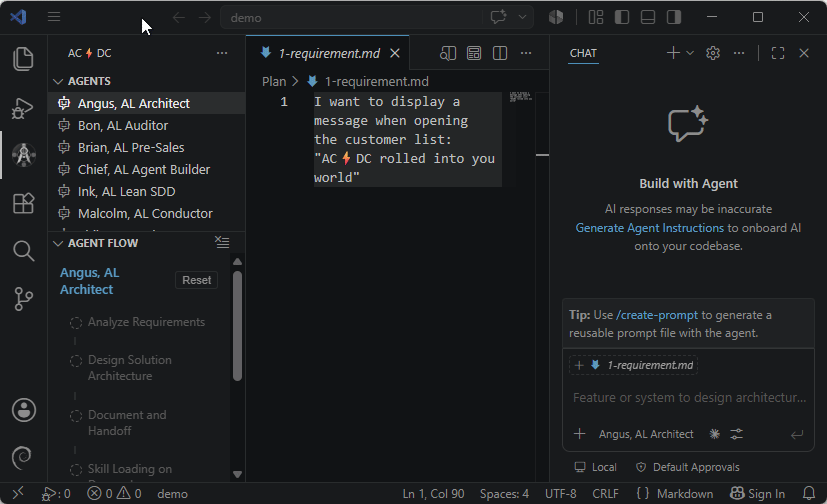

# Agentic Coding ⚡ Direct Coding

> Spec-driven, TDD-orchestrated AI development for **Microsoft Dynamics 365 Business Central** — powered by GitHub Copilot agent mode.

[](https://marketplace.visualstudio.com/items?itemName=theframework.acdc)
[](https://marketplace.visualstudio.com/items?itemName=theframework.acdc)
[](./LICENSE)

Stop generating AL code ad-hoc. AC⚡DC gives GitHub Copilot a full team of specialized agents, pre-loaded coding standards, and structured workflows — so every feature starts from a spec, follows TDD, and passes a review gate before it lands.

No files are copied into your workspace. Install once, works everywhere.

---



---

## Requirements

- **VS Code** 1.95 or higher
- **GitHub Copilot** (with agent mode enabled)
- **AL Language extension** (`ms-dynamics-smb.al`) — for Business Central development

---

## Quick Start

1. Install the extension from the Marketplace.
2. Open your **AL project** in VS Code.
3. Open the chat panel and switch to **Agent mode**.
4. Pick an agent from the **AC⚡DC sidebar** (or press `Ctrl+Shift+P` → **AC/DC: Use Agent**).
5. Describe your requirement — the agent guides you from spec to working code.


---

## What You Get

Everything is delivered automatically through the extension — no `.github/` setup, no file copies.

**8 specialized agents** — each a named persona with a distinct role:

| Agent | When to use |
|-------|-------------|
| **Angus, AL Architect** | Design a solution, model data, plan integrations |
| **Phil, AL Developer** | Implement a feature, fix a bug, quick code edits |
| **Malcolm, AL Conductor** | Full TDD cycle: plan → implement → review → commit |
| **Brian, AL Pre-Sales** | Estimate effort, SWOT analysis, project proposals |
| **Bon, AL Auditor** | Independent read-only code audit against BCQuality |
| **Chief, AL Agent Builder** | Build BC agents with the Agent SDK or Designer |
| **Wrench, AL Triage** | Diagnose a bug, reproduce it, get a fix recommendation |
| **Ink, AL Documenter** | Write or update technical documentation |

**Auto-applied coding standards** — instructions that activate automatically based on the file you edit (table, codeunit, page, test, query). No manual setup.

**Composable skills** — domain knowledge modules (API, events, performance, testing, permissions, pages, debug, and more) loaded on demand by the agents.

**`#acdcCodingStandard` tool** — agents can look up your company's AL coding standard mid-conversation. Also invokable directly in chat: `#acdcCodingStandard`.

---

## Routing Guide

Not sure which agent to start with? Use this table:

| Complexity | Route | Example |
|------------|-------|---------|
| **Low** | `@Phil, AL Developer` directly | Add a field, fix a validation |
| **Medium** | `@Angus, AL Architect` → `@Malcolm, AL Conductor` | New document flow, event-driven feature |
| **High** | `@Angus, AL Architect` → `@Malcolm, AL Conductor` | Multi-module integration, AppSource feature |
| **Bug / incident** | `@Wrench, AL Triage` | Reproduce → root-cause → minimal fix |
| **Code quality** | `@Bon, AL Auditor` | Audit changes vs main, BCQuality findings |

**Not sure?** Start here:

```
@Angus, AL Architect

I need to [describe your requirement]
```

Angus will assess the complexity and recommend the right workflow.

---

## TDD Orchestration with Malcolm

When you route through `@Malcolm, AL Conductor`, each feature goes through a structured cycle:

<!-- SCREENSHOT: Add a GIF or screenshot showing Malcolm's multi-phase output in chat — e.g. Phase 1 planning summary, then Phase 2 test creation, then the HITL approval prompt. -->

1. **Plan** — research context, define phases
2. **RED** — write failing tests first
3. **GREEN** — minimal code to pass tests
4. **REFACTOR** — apply AL patterns and standards
5. **Review gate** — code review subagent validates against spec
6. **Your approval** — human-in-the-loop before moving to the next phase

---

## Commands

All commands are under the **AC/DC** category (`Ctrl+Shift+P` → type `AC/DC`).

| Command | What it does |
|---------|--------------|
| **AC/DC: Use Agent** | Pick an agent from a list — activates it in chat and enables its tools |
| **AC/DC: Reload Agent List** | Refresh the Agents sidebar after adding custom agents |
| **AC/DC: Reset Agent Flow** | Clear the current phase shown in the Agent Flow sidebar |
| **AC/DC: Set Agent Placeholder…** | Configure which persona names are used in agent cross-references |
| **AC/DC: Pick SDD Plans Root Folder…** | Set where spec/architecture/plan files are stored |
| **AC/DC: Show Settings Reference** | Open the full settings reference in a Markdown preview |
| **AC/DC: Manage AL Base Code / ISV Code** | Configure mounted BC base app or ISV source repositories |
| **AC/DC: Sync AL Base Code / ISV Code** | Clone or pull the configured BC/ISV repositories |
| **AC/DC: Manage BCQuality Custom Layers** | Open the table editor for customer/partner BCQuality forks |
| **AC/DC: Sync BCQuality Custom Layers** | Clone or refresh every enabled custom layer |
| **AC/DC: Clear BCQuality Custom Layers** | Remove every imported custom layer from extension globalStorage |

---

## Settings

| Setting | Default | Description |
|---------|---------|-------------|
| `acdc.plansRoot` | `.github/plans` | Where spec, architecture, and plan files are stored |
| `acdc.agents.enableHooksOverlay` | `false` | Enable deterministic agent lifecycle events in the sidebar |
| `acdc.bcquality.customLayers` | `[]` | Ordered list of customer/partner BCQuality forks to import (see below) |
| `acdc.bcquality.syncOnStartup` | `false` | Re-sync all enabled custom layers when VS Code starts (no-op when SHA is unchanged) |
| `acdc.bcquality.registerInstructionsLocation` | `true` | Register the custom-layer instructions folder with `chat.instructionsFilesLocations` so Copilot Chat auto-discovers the rules |

> Updates are delivered automatically through the VS Code Marketplace — no manual configuration needed.

---

## Agent Flow Sidebar

The **Agent Flow** panel shows which agent is active and what phase it is in. It updates automatically as agents report their progress. To see it, open the AC⚡DC sidebar from the activity bar.

<!-- SCREENSHOT: Add a screenshot of the Agent Flow sidebar showing an active Malcolm orchestration with phase indicators. -->

---

## Source & Weekly Sync

The agents, skills, and coding standards bundled in this extension are sourced from the **[ALDC — AL Development Collection](https://github.com/javiarmesto/AL-Development-Collection-for-GitHub-Copilot)** community framework and the **[microsoft/BCQuality](https://github.com/microsoft/BCQuality)** knowledge base.

Both sources are synced automatically on a weekly schedule. Updates land in the next extension release — no manual steps needed on your end.

---

## Bring Your Own Rules — BCQuality Custom Layers

On top of Microsoft's bundled BCQuality knowledge, you can attach private **BCQuality forks** — "custom layers" — that carry your customer's or partner's house rules (naming conventions, prefix policies, security checks, etc.). Layers are pulled from git into the extension's per-user **globalStorage**; nothing is written into your AL workspace.

### 1. Add a layer

Run **AC/DC: Manage BCQuality Custom Layers** to open the table editor. Each row is one fork:

| Column | Notes |
|--------|-------|
| **Id** | Short lowercase namespace (`^[a-z][a-z0-9-]{1,31}$`) — used as the file prefix. Example: `comp-a` |
| **Name** | Human-readable label shown in the sync summary |
| **Repository** | Git URL of the fork (`https://…` or SSH) |
| **Ref** | Branch / tag / SHA — picker populated via `git ls-remote` |
| **Token secret key** | *(optional)* SecretStorage key holding a PAT for private forks |
| **Enabled** | Uncheck to keep the row but skip it during sync |
| **Status** | Resolved SHA + rule/skill counts once installed |

Save & Sync runs the same interactive install as **AC/DC: Sync BCQuality Custom Layers**.

### 2. Fork layout

Only files under `custom/` are imported (the fork's Microsoft mirror is ignored):

```
custom/
  knowledge/**/*.md      -> Copilot rules  (<layer-id>__*.instructions.md)
  skills/<name>.md       -> action skill   (<layer-id>__<name>/SKILL.md)
  skills/<name>/SKILL.md -> folder skill   (agentskills.io layout)
```

All names are prefixed with `<layer-id>__` so a custom layer can never shadow a bundled Microsoft/community namespace.

### 3. Where to find the imported content

- **Rules** show up automatically in the VS Code **Copilot Chat instructions picker** — the extension registers the layer's `instructions/` folder with `chat.instructionsFilesLocations`.
- **Skills** are NOT in the chat Skills picker (that surface is a static package.json manifest and has no runtime-registration API). Instead, review/audit agents (`@Bon, AL Auditor`, `@Wrench, AL Triage`, the AL Code Review Subagent) consult them automatically via four language-model tools:

  | Tool | Purpose |
  |------|---------|
  | `#acdc_list_bcquality_custom_rules` | List every imported rule |
  | `#acdc_get_bcquality_custom_rule` | Read a rule by qualified name |
  | `#acdc_list_bcquality_custom_skills` | List every imported skill |
  | `#acdc_get_bcquality_custom_skill` | Read a skill by qualified name |

  You can invoke them yourself in chat — e.g. `#acdc_list_bcquality_custom_skills` prints a Name / Layer / Description table.

### 4. Priority on conflict

`custom > community > microsoft`. A finding raised by a custom-layer skill outranks the bundled equivalents.

See [assets/help/settings-help.md](assets/help/settings-help.md) for the full setting reference.

---

## License

MIT — See [LICENSE](LICENSE) for details.
