# Agentic Coding ⚡ Direct Coding

> Spec-driven, TDD-orchestrated AI development for **Microsoft Dynamics 365 Business Central**, powered by GitHub Copilot agent mode.

[](https://marketplace.visualstudio.com/items?itemName=theframework.acdc)
[](https://marketplace.visualstudio.com/items?itemName=theframework.acdc)
[](./LICENSE)

Stop generating AL code ad-hoc. AC⚡DC gives GitHub Copilot a full team of specialized agents, pre-loaded coding standards, and structured workflows, so every feature starts from a spec, follows TDD, and passes a review gate before it lands.

No files are copied into your workspace. Install once, works everywhere.

## Requirements

- **VS Code** 1.101 or higher (**1.136+** for the per-agent *reasoning effort* override)
- **GitHub Copilot** (with agent mode enabled)
- **AL Language extension** (`ms-dynamics-smb.al`), for Business Central development

---

## Quick Start

1. Install the extension from the Marketplace.
2. Open your **AL project** in VS Code.
3. Open the chat panel and switch to **Agent mode**.
4. Pick an agent from the **AC⚡DC sidebar** (or press `Ctrl+Shift+P` → **AC/DC: Use Agent**).
5. Describe your requirement, the agent guides you from spec to working code.

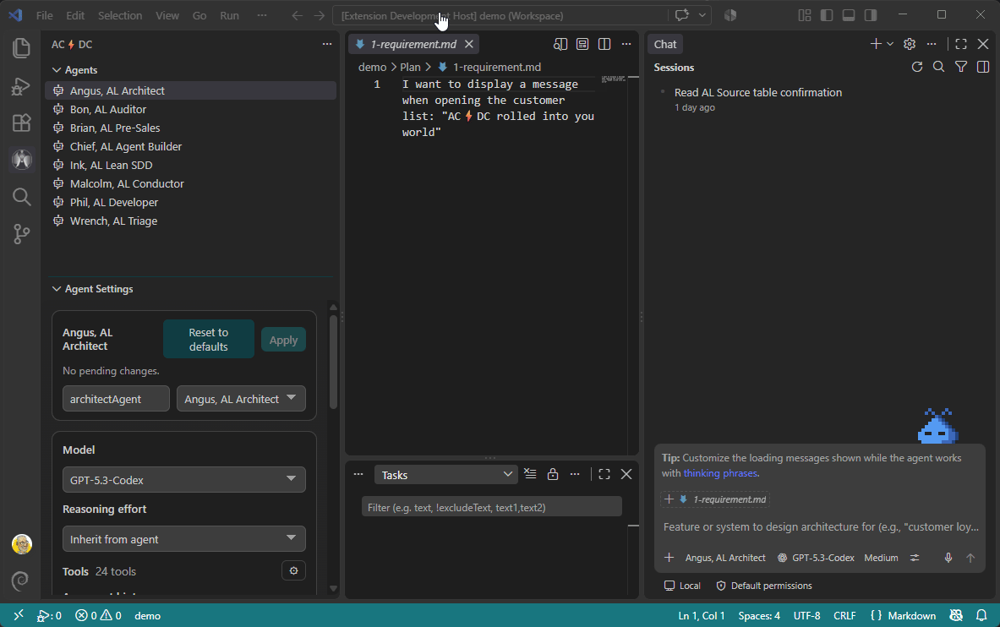

---

## What You Get

Everything is delivered automatically through the extension, no `.github/` setup, no file copies.

**8 specialized customizable agents**, each a named persona with a distinct role:

| Agent | When to use |
|-------|-------------|
| **Angus, AL Architect** | Design a solution, model data, plan integrations |
| **Phil, AL Developer** | Implement a feature, fix a bug, quick code edits |
| **Malcolm, AL Conductor** | Full TDD cycle: plan → implement → review → commit |
| **Brian, AL Pre-Sales** | Estimate effort, SWOT analysis, project proposals |
| **Bon, AL Auditor** | Independent read-only code audit against BCQuality |
| **Chief, AL Agent Builder** | Build BC agents with the Agent SDK or Designer |
| **Wrench, AL Triage** | Diagnose a bug, reproduce it, get a fix recommendation |
| **Ink, AL Documenter** | Write or update technical documentation |

**Auto-applied coding standards**, instructions that activate automatically based on the file you edit (table, codeunit, page, test, query). No manual setup.

**Composable skills**, domain knowledge modules (API, events, performance, testing, permissions, pages, debug, and more) loaded on demand by the agents.

**`#acdcCodingStandard` tool**, agents can look up your company's AL coding standard mid-conversation. Also invokable directly in chat: `#acdcCodingStandard`.

---

## Agent Settings panel

Select an agent in the **Agents** sidebar to open the **Agent Settings** panel, where you can override, per agent:
- The language **model**

   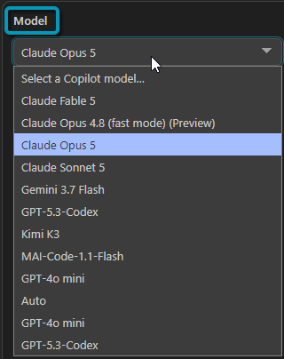

- The **reasoning effort**: `low`, `medium`, `high`, `xhigh` or `max`. Requires **VS Code 1.136+** and only takes effect on the agent-host path; older hosts ignore it.

   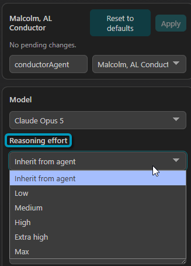

- The **tools**: a grouped picker over every tool registered in the window. Tools are listed under their owner — the contributing extension (*AL Language*), the MCP server from your `mcp.json` (`al-symbols-mcp`), or the built-in toolset (`read`, `edit`, …). Use the chevron to expand a group and pick individual tools, or check the group itself to grant **all** of it, now and in the future: a checked group is stored as its wildcard (`ms-dynamics-smb.al/*`, or the bare toolset name for a built-in one), not as a snapshot of today's tools. Groups the agent already picks tools from open expanded; everything else starts collapsed.

   Choices are stored as *deltas* (`disabledTools` + `extraTools`) rather than a frozen list, so tools added in a future release still reach an agent you already overrode. Tool ids are stored **qualified** (`ms-dynamics-smb.al/al_build`, `read/readFile`) — the form VS Code expects in `tools:` frontmatter; ids stored bare by earlier versions are rewritten once, silently, at User scope. A tool whose owner is no longer installed is listed under **Unavailable**, stays checked, and is only removed if you uncheck it.

   Granting a write-capable tool (`edit`, `execute`, `runCommands`, `runInTerminal`, `runTasks`) to an agent that does not declare one raises a non-blocking warning — including when the grant is made by checking a whole group.

   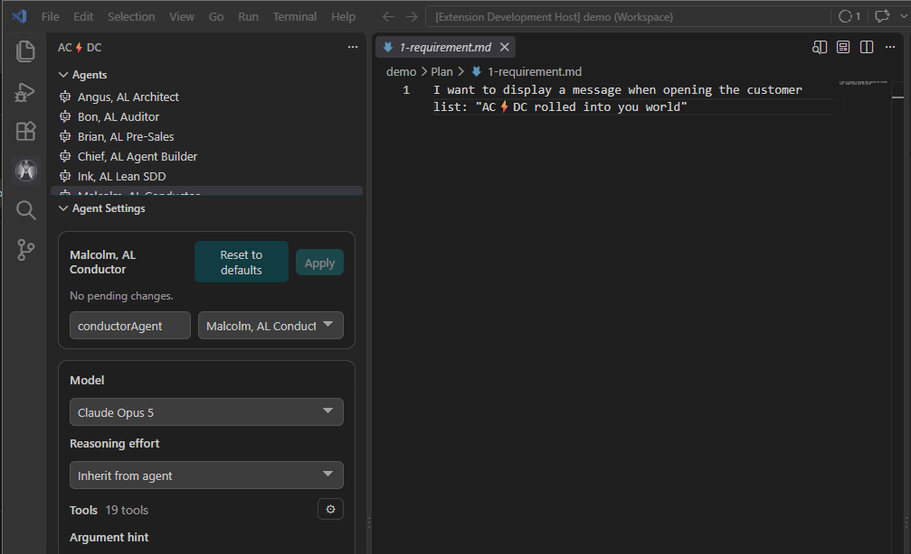

- The **argument hint**

   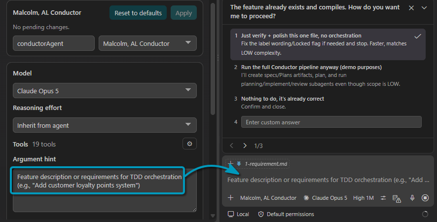

- The **review specialist**

   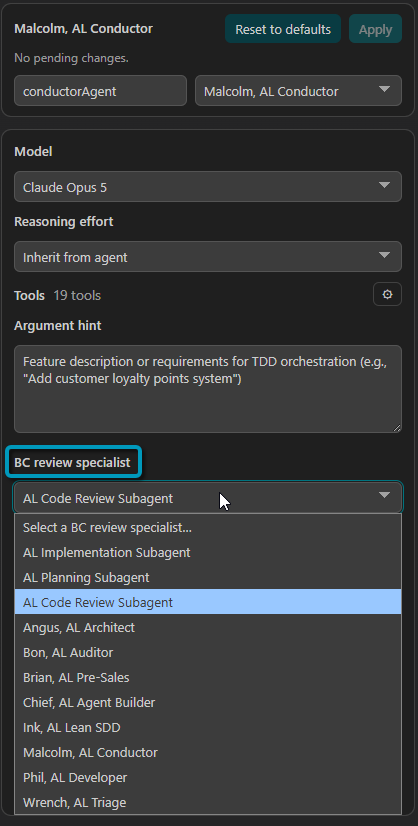

- The **handoffs**: Each handoff row includes an optional **Handoff Prompt** that is sent when that handoff is taken.

   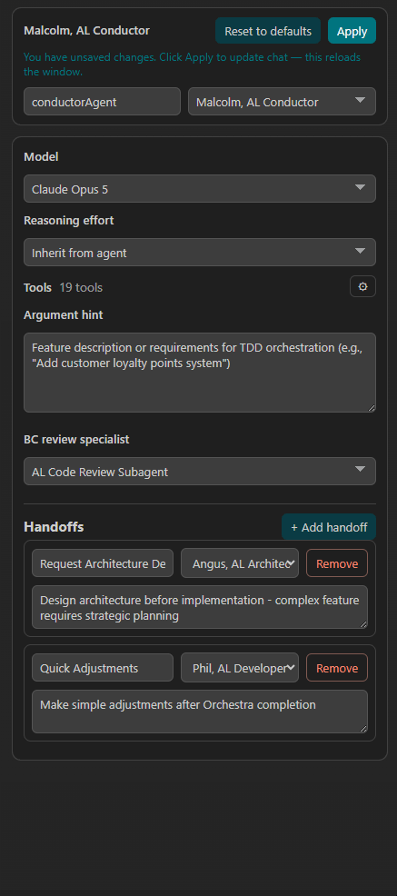

Edits are staged locally and are **not** applied automatically.
The **Apply** button enables only once you change a setting; clicking it writes the overrides and **reloads the window** so chat picks them up.
The panel warns you before the reload.
Overrides are stored in `acdc.agents.settings` and are scoped per agent, so an override configured on one agent never leaks into another.

When an agent is selected in side panel, the customizable settings are shown in the panel below.

---


## AL Base Code / ISV Code

Agents answer better when they can read the real AL source instead of recalling it. AC⚡DC clones **read-only** AL repositories, the Microsoft BC base app and any ISV product you have access to, and exposes them to the agents. Nothing is ever written back: the clones are mirrors that a sync overwrites.

Run **AC/DC: Manage AL Base Code / ISV Code** to open the table editor, then **AC/DC: Sync AL Base Code / ISV Code** to clone or pull the enabled rows.

### 1. One clone cache per machine

Sources are cloned under `acdc.alBaseCode.sourcesRoot`, resolved as `<sourcesRoot>/<repo>/<branch>` (default: `%LOCALAPPDATA%\acdc-sources`). Several projects therefore share one cache while each keeps its own branch or localization.

The setting is **machine-scoped**, VS Code only accepts it in User settings, so a developer-specific path can never land in a shared `.code-workspace` file. Only `repository`, `branch` and `enabled` are per-workspace.

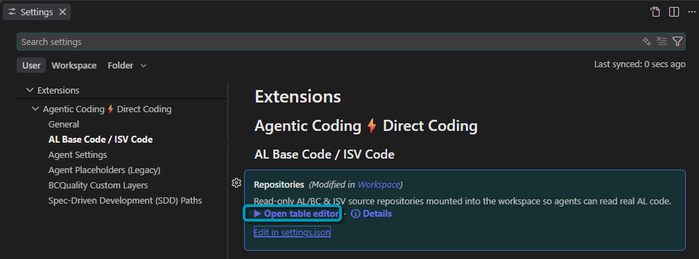

### 2. Two access modes

`acdc.alBaseCode.accessMode` decides how the clones reach the agents. Only one mode is active per workspace; switching asks for confirmation and migrates immediately.

| Mode | What happens |
|------|--------------|
| `workspace` *(default)* | Sources are added as read-only workspace folders (prefixed `[AL Src] `) and show up in the Explorer |
| `mcp` | Sources are exposed through a filesystem MCP server (`acdc-al-sources`) registered in the workspace's `.vscode/mcp.json`, available to agents with no Explorer clutter |

### 3. Searchable or portable

In `workspace` mode each source carries a **Searchable** toggle, off by default:

| Searchable | Mounted as | Trade-off |
|------------|-----------|-----------|
| **off** *(default)* | `acdc-alsrc:/<repo>/<branch>` | Portable, every developer resolves it locally, but **browse-only**: open and read work, text and file search do not |
| **on** | `file:<sourcesRoot>/<repo>/<branch>` | Reachable by VS Code text search, file search and the Search view, at the cost of writing the absolute, machine-specific path into the workspace file |

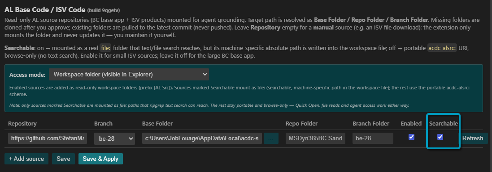

One line to remember: **searchable buys you `grep`, portability buys you a committable workspace file.** Turn it on for small ISV sources that are worth grepping, leave it off for the huge BC base app. Toggling remounts in place, nothing is re-cloned, and searchable folders are kept out of Source Control automatically.

---

## Bring Your Own Rules, BCQuality Custom Layers

On top of Microsoft's bundled BCQuality knowledge, you can attach private **BCQuality forks**, "custom layers", that carry your customer's or partner's house rules (naming conventions, prefix policies, security checks, etc.). Layers are pulled from git into the extension's per-user **globalStorage**; nothing is written into your AL workspace.

### 1. Add a layer

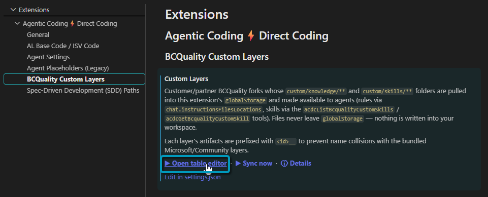

Run **AC/DC: Manage BCQuality Custom Layers** to open the table editor. Each row is one fork:

| Column | Notes |
|--------|-------|
| **Id** | Short lowercase namespace (`^[a-z][a-z0-9-]{1,31}$`), used as the file prefix. Example: `comp-a` |
| **Name** | Human-readable label shown in the sync summary |
| **Repository** | Git URL of the fork (`https://…` or SSH) |
| **Ref** | Branch / tag / SHA, picker populated via `git ls-remote` |
| **Token secret key** | *(optional)* SecretStorage key holding a PAT for private forks |
| **Enabled** | Uncheck to keep the row but skip it during sync |
| **Status** | Resolved SHA + rule/skill counts once installed |

Save & Sync runs the same interactive install as **AC/DC: Sync BCQuality Custom Layers**.

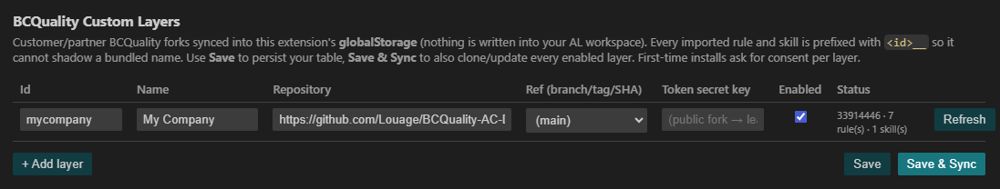

### 2. Fork layout

Only files under `custom/` are imported (the fork's Microsoft mirror is ignored):

```
custom/
  knowledge/**/*.md      -> Copilot rules  (<layer-id>__*.instructions.md)
  skills/<name>.md       -> action skill   (<layer-id>__<name>/SKILL.md)
  skills/<name>/SKILL.md -> folder skill   (agentskills.io layout)
```

All names are prefixed with `<layer-id>__` so a custom layer can never shadow a bundled Microsoft/community namespace.

### 3. Where to find the imported content

- **Rules** show up automatically in the VS Code **Copilot Chat instructions picker**, the extension registers the layer's `instructions/` folder with `chat.instructionsFilesLocations`.
- **Skills** are NOT in the chat Skills picker (that surface is a static package.json manifest and has no runtime-registration API). Instead, review/audit agents (`@Bon, AL Auditor`, `@Wrench, AL Triage`, the AL Code Review Subagent) consult them automatically via four language-model tools:

  | Tool | Purpose |
  |------|---------|
  | `#acdc_list_bcquality_custom_rules` | List every imported rule |
  | `#acdc_get_bcquality_custom_rule` | Read a rule by qualified name |
  | `#acdc_list_bcquality_custom_skills` | List every imported skill |
  | `#acdc_get_bcquality_custom_skill` | Read a skill by qualified name |

  You can invoke them yourself in chat, e.g. `#acdc_list_bcquality_custom_skills` prints a Name / Layer / Description table.

### 4. Priority on conflict

`custom > community > microsoft`. A finding raised by a custom-layer skill outranks the bundled equivalents.

See [assets/help/settings-help.md](assets/help/settings-help.md) for the full setting reference.

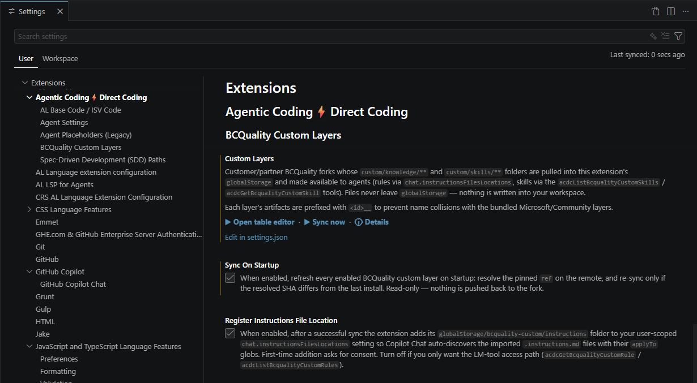


---

## Routing Guide

Not sure which agent to start with? Use this table:

| Complexity | Route | Example |
|------------|-------|---------|
| **Low** | `@Phil, AL Developer` directly | Add a field, fix a validation |
| **Medium** | `@Angus, AL Architect` → `@Malcolm, AL Conductor` | New document flow, event-driven feature |
| **High** | `@Angus, AL Architect` → `@Malcolm, AL Conductor` | Multi-module integration, AppSource feature |
| **Bug / incident** | `@Wrench, AL Triage` | Reproduce → root-cause → minimal fix |
| **Code quality** | `@Bon, AL Auditor` | Audit changes vs main, BCQuality findings |

**Not sure?**
- Select the Architect agent in you chat agent dropdown or in the sidepanel
- add the requirement / issue file to the chat context
- Start you question:

```
I need to implement or fix this...
```

The agent will assess the complexity and recommend the right workflow.

---

## TDD Orchestration with Malcolm

When you route through `@Malcolm, AL Conductor`, each feature goes through a structured cycle:

1. **Plan**, research context, define phases
2. **RED**, write failing tests first
3. **GREEN**, minimal code to pass tests
4. **REFACTOR**, apply AL patterns and standards
5. **Review gate**, code review subagent validates against spec
6. **Your approval**, human-in-the-loop before moving to the next phase

---

## Commands

All commands are under the **AC/DC** category (`Ctrl+Shift+P` → type `AC/DC`).

| Command | What it does |
|---------|--------------|
| **AC/DC: Use Agent** | Pick an agent from a list, activates it in chat and enables its tools |
| **AC/DC: Reload Agent List** | Refresh the Agents sidebar after adding custom agents |
| **AC/DC: Apply Agent Settings to Chat** | Write the staged per-agent overrides into the agent files so chat picks them up (same as the panel's **Apply**). Under the Extension Development Host (`F5`) this writes nothing and shows why, because it would otherwise rewrite committed source files — test overrides with an installed VSIX instead |
| **AC/DC: Reset Agent Override Baselines** | Discard the stored agent-override backups, the installed agent files become the new baseline |
| **AC/DC: Set Agent Placeholder…** | Configure which persona names are used in agent cross-references |
| **AC/DC: Pick SDD Plans Root Folder…** | Set where spec/architecture/plan files are stored |
| **AC/DC: Manage AL Base Code / ISV Code** | Configure mounted BC base app or ISV source repositories |
| **AC/DC: Sync AL Base Code / ISV Code** | Clone or pull the configured BC/ISV repositories |
| **AC/DC: Migrate AL Base Code Settings to Portable Layout** | Repair leftovers from the pre-2.3.0 layout (per-entry `folder`, legacy `file:` mount, stale `git.ignoredRepositories` entry) |
| **AC/DC: Manage BCQuality Custom Layers** | Open the table editor for customer/partner BCQuality forks |
| **AC/DC: Sync BCQuality Custom Layers** | Clone or refresh every enabled custom layer |
| **AC/DC: Clear BCQuality Custom Layers (globalStorage)** | Remove every imported custom layer from extension globalStorage |

---

## Settings

| Setting | Default | Description |
|---------|---------|-------------|
| `acdc.showReleaseNotesOnUpdate` | `minor` | When to surface the release notes after an update: `never`, `minor` (notify on every update, open the changelog for a major/minor bump) or `always`. Unless set to `never`, a fresh install opens the README once |
| `acdc.alBaseCode.repositories` | *(1 disabled sample)* | Read-only AL/BC & ISV source repositories mounted so agents can read real AL code. Each entry carries `repository`, `branch`, `enabled` and `searchable`. Edited from the **AL Base Code** table editor |
| `acdc.alBaseCode.repositories[].searchable` | `false` | Mount that source as a real `file:` folder so text/file search reaches it, at the cost of writing its machine-specific path into the workspace file. Off keeps the portable `acdc-alsrc:` URI, which is browse-only |
| `acdc.alBaseCode.sourcesRoot` | *(`%LOCALAPPDATA%\acdc-sources`)* | Clone root **on this machine**; each source resolves to `<sourcesRoot>/<repo>/<branch>`. Machine-scoped, so it never lands in a shared workspace file |
| `acdc.alBaseCode.syncOnStartup` | `false` | Clone missing and pull existing AL source folders on startup (read-only, never pushed) |
| `acdc.alBaseCode.accessMode` | `workspace` | Expose AL sources as read-only `workspace` folders, or via an `mcp` filesystem server registered in `.vscode/mcp.json` |
| `acdc.agents.settings` | `{}` | Per-agent overrides (model, reasoning effort, argument hint, review specialist, tool deltas, and handoffs, each handoff can carry its own prompt). Edited from the **Agent Settings** sidebar; raw JSON is supported for power users |
| `acdc.agents.placeholders` | *(see panel)* | Maps `${placeholder}` tokens used in agent prose/prompts/skills to concrete agent display names |
| `acdc.plansRoot` | `.github/plans` | Where spec, architecture, and plan files are stored |
| `acdc.specFolderFormat` | `{req_name}` | Template for per-requirement folder names under `plansRoot` (supports date/time, sequence, identity, and `{req_name}` / `{slug}` variables) |
| `acdc.specFileFormat` | `{req_name}.{type}.md` | Template for spec file names (`{type}` is `spec`, `architecture`, `test-plan`, `plan`, or `delivery`) |
| `acdc.branchFormat` | `feature/{slug}` | Template for git branch names for a spec-driven requirement |
| `acdc.bcquality.customLayers` | `[]` | Ordered list of customer/partner BCQuality forks to import (see below) |
| `acdc.bcquality.syncOnStartup` | `false` | Re-sync all enabled custom layers when VS Code starts (no-op when SHA is unchanged) |
| `acdc.bcquality.registerInstructionsFileLocation` | `true` | Register the custom-layer instructions folder with `chat.instructionsFilesLocations` so Copilot Chat auto-discovers the rules |

> Updates are delivered automatically through the VS Code Marketplace, no manual configuration needed. After an update AC⚡DC tells you what landed: a notification with **What's New** / **README** / **Don't show again**, plus the changelog preview on a major or minor bump. Tune or silence it with `acdc.showReleaseNotesOnUpdate`.

---


## Claude Code

The same agents, prompts and skills that power GitHub Copilot chat also ship as a **Claude Code
plugin**, generated from this extension's `package.json` contributions:

- 13 agents (`claude-plugin/agents/`), invoked as `@agent-acdc:phil`, `@agent-acdc:malcolm`, …
- 11 prompts as commands (`claude-plugin/commands/`), run as `/acdc:al-build`, `/acdc:al-spec-create`, …
- 41 skills (`claude-plugin/skills/`), including the bundled Microsoft BCQuality review skills

They're mapped onto Claude Code's own shape: Copilot's chat-mode `tools:` become Claude Code's
built-in tools only (`Read`, `Grep`, `Glob`, `Edit`, `Write`, `Bash`, `PowerShell`, `WebFetch`,
`WebSearch`, `Agent`, `Skill`, `TodoWrite`) — AL-specific tools (the AL extension's own tools, the
AL Language Server tools, this extension's `acdc_*` language-model tools) have no Claude Code
equivalent and are dropped, so those agents lose AL-aware tool calls in Claude Code today.
`handoffs` become a prose **Handoffs** section, and Malcolm's subagent allowlist becomes a
**Subagents** section, since Claude Code has no native equivalent for either. BCQuality skills
carry a note explaining they ship without the bundled instruction corpus in Claude Code, so
findings are labelled reduced-confidence there.

The plugin surface (`.claude-plugin/marketplace.json` + `claude-plugin/`) is generated by
`npm run emit:claude-plugin` and committed, the same way `assets/generated/` is: `npm run
check:claude-plugin` fails the build if it ever drifts from its sources. `npx vsce ls` shows it's
part of the packaged VSIX.

**Registration is automatic.** If a Claude Code config folder (`~/.claude`, or `CLAUDE_CONFIG_DIR`)
already exists, AC⚡DC points a stable path — `~/.acdc/claude-marketplace`, a directory junction on
Windows or a symlink on macOS/Linux — at wherever it's currently installed, and registers *that*
stable path once in Claude Code's `settings.json`, enabling `acdc@acdc-vscode`. Because only the
stable path is ever registered, an update re-points the link instead of touching your settings
again, and Stable/Insiders/multiple profiles never fight over it (the newer installed version wins
the link; a tie keeps whichever linked first). On a remote window (WSL/SSH) this uses the remote
home, matching where Claude Code itself runs.

**After an update**, start a new Claude Code session, or run `/reload-plugins` in one that's
already open, so it picks up the new agents/commands/skills — Claude Code has nothing to
re-download or re-cache, it just needs to re-read the (unchanged) marketplace path. Check what's
loaded with `claude plugin details acdc@acdc-vscode` (not `claude plugin list`, which stays empty
for a settings-enabled directory plugin like this one).

Turn registration off with `acdc.claudeCode.autoRegister` (on by default). *AC⚡DC: Register Claude
Code Plugin* and *AC⚡DC: Unregister Claude Code Plugin* register or remove it by hand — Register
also bypasses the kill-switch. Neither command, nor the automatic registration on startup, ever
runs in the Extension Development Host (`F5`), and neither ever creates `~/.claude` if it doesn't
already exist.

AC⚡DC doesn't yet clean up automatically when the extension itself is uninstalled (planned for a
follow-up release) — run *AC⚡DC: Unregister Claude Code Plugin* first, or afterwards remove the
`acdc-vscode` entry and the `acdc@acdc-vscode` key from `~/.claude/settings.json` and delete
`~/.acdc/claude-marketplace` by hand.

If the older, standalone `aldc@aldc-marketplace` (ALDC) plugin is also enabled, a one-time notice
suggests disabling it — the two use different namespaces (`aldc:` vs `acdc:`), so nothing breaks,
but Claude Code will otherwise show two similar copies of most agents. AC⚡DC never disables it for
you.

---

## Source & Weekly Sync

The agents, skills, and coding standards bundled in this extension are sourced from the **[ALDC, AL Development Collection](https://github.com/javiarmesto/AL-Development-Collection-for-GitHub-Copilot)** community framework and the **[microsoft/BCQuality](https://github.com/microsoft/BCQuality)** knowledge base.

Both sources are synced automatically on a weekly schedule. Updates land in the next extension release, no manual steps needed on your end.

---

## License

MIT, See [LICENSE](LICENSE) for details.
